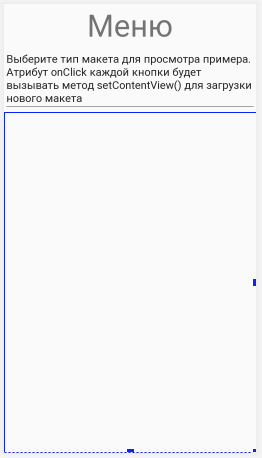
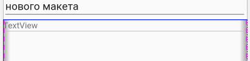
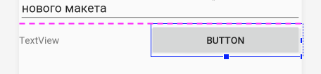
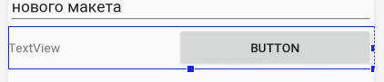
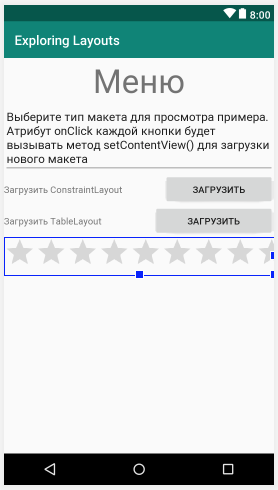

Решением для размещения элементов с отлищающейся ориентацией заключается в размещении раскладки внутри другой. Вот как это сделать.

Из категории **Layouts** панели **Palette** перетащите LinearLayout (horizontal) на панель **Component Tree**, поместив его чуть ниже многострочного текста. Обратите внимание, что все пространство под многострочным текстом стало занято синей рамкой



Это указывает на то, что наш новый LinearLayout (horizontal) заполняет пространство. Помните об этой синей области границы, так как именно в нее мы поместим следующий элемент нашего пользовательского интерфейса.

Теперь перенесите TextView внутрь LinearLayout, что мы только что добавили. Обратите внимание, как TextView удобно сидит в верхнем левом углу



Это на первый взгляд ничего отличающегося от того, что происходило с предыдущим вертикальным LinearLayout. Но посмотрите, что произойдет, когда мы добавим кнопку.

>Термин, используемый для обозначения добавления раскладок в раскладки - вложенность. Термин применяемый к любому элементу, который появляется в пользовательском интерфейсе (кнопки, текст) - это представление (**view**), а все, что содержит представления - это группа представлений (**view group**).

Из катерогии **Buttons** перетащите **Button** на правую сторону от предыдущего **TextView**. 



Затем, выберите LinearLayout (horizontal), кликнув по пустой его части. Найдите атрибут **layout_height** и задайте значение ```wrap_content```. Заметьте, что LinearLayout занимает теперь столько места, сколько ему нужно.



Давайте настроим атрибуты **text** для **TextView** и **Button**, прежде чем мы добавим следующую часть пользовательского интерфейса. Измените атрибут **text** кнопки на ```Загрузить```, а у TextView на ```Загрузить ConstraintLayout```.

>Думаю теперь вы хорошенько познакомились с редактированием атрибутов представлений Adnroid. Дальше я буду давать более краткие инструкции о том, как строить макеты пользовательского интерфейса, что сделает ваше становление Android-ниндзя намного быстрее.

Теперь мы можем повторить и добавить еще один **TextView** и **Button** в другом **LinearLayout (horizontal)** чуть ниже того, который мы только что закончили.

1. Добавьте **LinearLayout (horizontal)** чуть ниже предыдущего
2. Добавьте в него **TextView**
3. Измените атрибут **text** для **TextView** на ```Загрузить TableLayout```
4. Добавьте **Button** справа от **TextView** и задайте ее атрибуту **text** значение ```Загрузить```
5. Измените размер LinearLayout установив значение ```wrap_content``` атрибуту **layout_height**

Просто для удовольствия и большего знания панели **Palette**, найдите категорию **Widgets** и перетащите **RatingBar** чуть ниже поеследнего LinearLayout. Теперь ваш пользовательский интерфейс должен выглядеть очень похоже на следующий скриншот



Осталось только добавить несколько визуальных завершающих штрихов к макету. 
