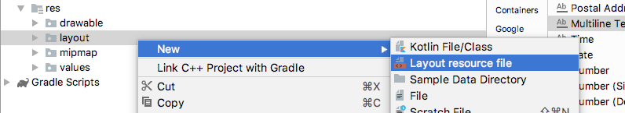
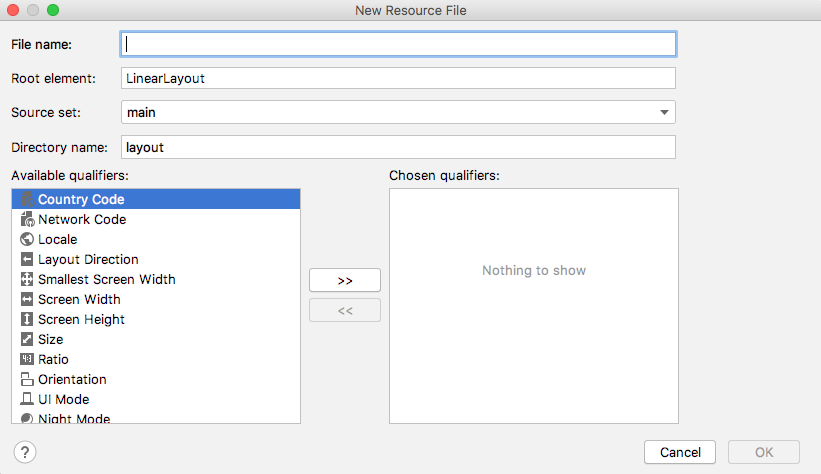
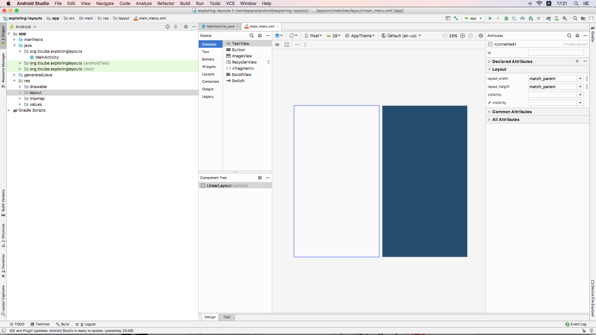
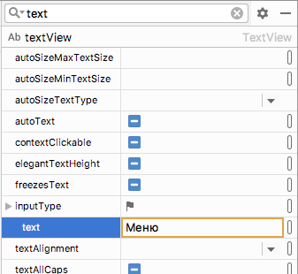
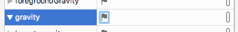
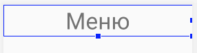

LinearLayout, вероятно, самый простой макет, который предлагает Android. Как следует из названия, все элементы пользовательского интерфейса в нем расположены линейно. У вас есть только два варианта: вертикальный и горизонтальный. Добавив следующую строку кода (или отредактировав ее через окно атрибутов), вы можете настроить LinearLayout так, чтобы его элементы располагались вертикально
```xml
android:orientation="vertical"
```
Затем вы можете (как вы, вероятно, догадались) изменить ```vertical``` на ```horizontal```, чтобы разложить элементы по горизонтали.

Прежде чем мы сможем что-либо сделать с LinearLayout, нам нужно добавить его в файл макета. И, поскольку мы строим три макета в этом проекте, нам нужен новый файл макета.

## Добавление макета в проект
В окне проекта разверните папку **res**. Теперь щелкните правой кнопкой мыши на папке **layout** и выберите **New**. Обратите внимание, что существует опция для файла ресурсов макета, как показано на следующем снимке экрана



Выберите **Layout resource file** и вы увидите диалоговое окно **New Resource File**



В поле **File name** введите main_menu. Название произвольное, но этот макет будет нашим главным меню, которое используется для выбора других макетов, поэтому название кажется подходящим.  
В поле **Root element** указывается корневой элемент, напишите LinearLayout.

Нажмите кнопку **OK**, и Android Studio создаст новый LinearLayout в XML-файле под названием main_menu и поместит его в папку layout. Android Studio также откроет конструктор пользовательского интерфейса с палитрой слева и окном атрибутов справа.

## Подготовка рабочего пространства
Отрегулируйте окна, перетаскивая и изменяя размер их границ (как это можно сделать в большинстве оконных приложений), чтобы сделать панель палитры, превью и атрибуты как можно более четкими, но не больше, чем необходимо. Этот небольшой снимок экрана показывает приблизительные пропорции окон, которые я выбрал, чтобы сделать проектирование нашего пользовательского интерфейса и изучение XML максимально ясным. 



Обратите внимание, что я сделал панели проекта, палитры и атрибутов как можно более узкими, но не скрывая. Я также закрыл окно Build/Logcat в нижней части экрана, в результате чего у меня есть хороший чистый холст, на котором можно построить пользовательский интерфейс.

## Изучение сгенерированного XML
Нажмите на вкладку **Text**, и мы посмотрим на текущее состояние XML-кода, который формирует наш дизайн на данном этапе. Я чуток поправил его, чтобы он более четко отображался на странице.
```xml
<?xml version="1.0" encoding="utf-8"?>
<LinearLayout xmlns:android="http://schemas.android.com/apk/res/android"
    android:orientation="vertical" 
    android:layout_width="match_parent"
    android:layout_height="match_parent">

</LinearLayout>
```
У нас есть обычные открывающие и закрывающие теги ```<LinearLayout>``` и ```</LinearLayout>```. Дочерних элементов пока нет, но есть три атрибута. Они являются атрибутами, а не потомками LinearLayout, потому что они расположены внутри открывающего тега, до первого закрытия ```>```

Первый атрибут - это ```android:orientation```, для краткости мы будем просто ссылаться на атрибуты без префикса android:. Атрибут **orientation** имеет значение **vertical**. Это означает, что когда мы начнем добавлять элементы в этот макет, он будет располагать их вертикально сверху вниз. Мы могли бы изменить значение с вертикального на горизонтальное, и он станет располагать элементы слева направо.

Следующие два атрибута: ```layout_width``` и ```layout_height```. Они определяют размер **LinearLayout**. Значение, присвоенное обоим атрибутам, равно ```match_parent```. Родительским элементом макета является все доступное пространство. Таким образом, сопоставляя родительский элемент по горизонтали и вертикали, макет заполнит все доступное пространство.

## Добавление TextView
Переключитесь назад на вкладку **Design** и мы добавим несколько элементов.

Сперва, найдите TextView на панеле **Palette**. Это можно найти как в общих (**Common**), так и в текстовых категориях. Щелкните левой кнопкой мыши и перетащите TextView в пользовательский интерфейс и обратите внимание, что он аккуратно расположен в верхней части LinearLayout.

Посмотрите на XML на вкладке **Text**, чтобы удостовериться, что это дочерний элемент LinearLayout и что он имеет один отступ, чтобы сделать это ясным. Вот код виджета TextView, без окружающего его элемента родителя LinearLayout
```xml
    <TextView
        android:id="@+id/textView"
        android:layout_width="match_parent"
        android:layout_height="wrap_content"
        android:text="TextView" />
```
Обратите внимание, что он имеет четыре атрибута: **id** (идентификатор) в случае, если нам нужно обратиться к нему из другого элемента пользовательского интерфейса или из нашего кода Java;  **layout_width**, установленный в match_parent, что означает, что TextView растягивается по всей ширине LinearLayout; **layout_height**, установленный в wrap_content, что означает, что TextView будет высок на столько, чтобы содержать текст внутри него; и **text**, который определяет фактический текст, который он будет отображать, сейчас там установлено "TextView".

Переключитесь назад на вкладку **Design** и мы сделаем несколько изменений.

Мы хотим, чтобы этот текст был текстом заголовка этого экрана, который является экраном меню. В панели **Attributes** щелкните значок поиска и введите ```text``` в поле поиска, а затем измените значен ие атрибута text на ```Menu```


> Вы можете найти любой атрибут, выполнив поиск или просто прокрутив варианты. Когда вы нашли атрибут, который хотите изменить, щелкните на него левой кнопкой мыши, чтобы выбрать его, а затем нажмите клавишу Enter на клавиатуре, чтобы сделать его доступным для редактирования.

Далее, найдите атрибут **textSize** и установите его значение равным 50sp. Когда вы введете это новое значение, размер текста увеличится.

Sp - масштабируемые пиксели (scalable pixels). Это означает, что когда пользователь изменяет настройки размера шрифта на своем устройстве Android, шрифт будет динамически масштабироваться.

Теперь найдите атрибут **gravity** и разверните список вариантов, нажав на маленький флажок



выберите значение ```center_horizontal```  

Атрибут **gravity** относится к гравитации внутри самого **TextView**, и наше изменение имеет эффект перемещения фактического текста внутри текстового представления к центру.

На данный момент мы у TextView изменили текст, увеличили его размер и выровняли его по горизонтали. Теперь наш макет должен выглядеть следующим образом



Взглянем на вкладку **Text**, чтобы увидеть XML-код изменений
```xml
    <TextView
        android:id="@+id/textView"
        android:layout_width="match_parent"
        android:layout_height="wrap_content"
        android:gravity="center_horizontal"
        android:text="Меню"
        android:textSize="50sp" />
```
У элемента TextView появились новые атрибуты: **gravity**, который установлен в ```center_horizontal``` и **textSize**, который установлен в ```50sp```. Атрибут **text** изменил значение на ```Menu```.
>Если вы запустите приложение, вы можете не увидеть то, что ожидали. Это происходит потому, что мы не вызывали setContentView в нашем Java-коде, для загрузки пользовательского интерфейса. Скоро мы исправим это.

## Добавление многострочного TextView

Переключитесь обратно на вкладку **Design**, найдите **Multiline Text** в категории **Text** на панеле **Palette** и перетащите его в **Component Tree** чуть ниже TextView, который мы добавили минуту назад.

Установите атрибуту **text** значение ```Выбирите тип макета для просмотра примера. Атрибут onClick каждой кнопки будет вызывать метод setContentView() для загрузки нового макета```.

Но ваш XML-код будет дополнен другим дочерним элементом в LinearLayout, после TextView. Я немного подправил его с целью представления на странице
```xml
    <EditText
        android:id="@+id/editText"
        android:layout_width="match_parent"
        android:layout_height="wrap_content"
        android:ems="10"
        android:gravity="start|top"
        android:inputType="textMultiLine"
        android:text="Выбирите тип маке...узки нового макета" />
```
Был вставлен элемент **EditText**, указывающий, что этот текст можно редактировать. Есть так же атрибут ```inputType="textMultiLine"```, указывающий, что текстовое поле будет многострочным. И еще один атрибут, который мы не видели раньше, это **ems**. Атрибут ems определяет, сколько символов может быть введено в строку, и значение ```10``` было выбрано автоматически Android Studio. Однако другой атрибут ```layout_width="match_parent"``` переопределяет это значение, поскольку он заставляет элемент расширяться, чтобы соответствовать своему родителю.
>Когда вы запустите приложение (в следующем разделе), вы увидите, что текст действительно доступен для редактирования, хотя в нашем случае это и
 не имеет практической цели.
