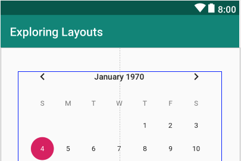
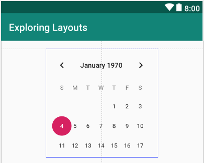
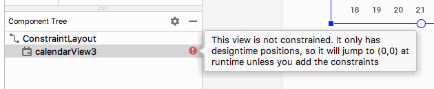
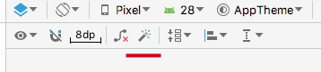
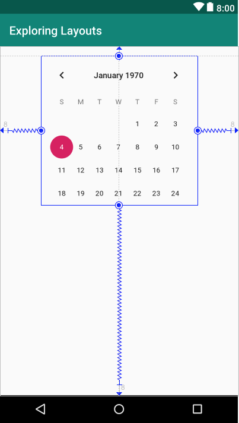
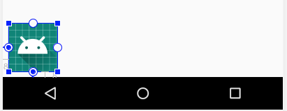
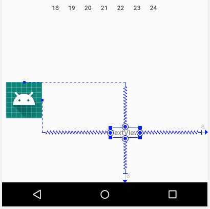
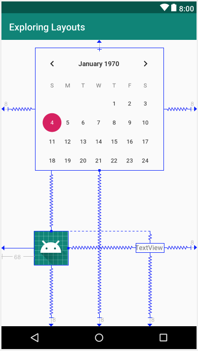

Откройте ConstraintLayout, который был автоматически сгенерирован при создании проекта. Вероятно, он уже открыт и его вкладка видна в среди открытых файлов. Если нет, то он находится в папке ```res/layout```. Его имя **activity_main.xml**.

Проверьте XML на вкладке **Text** и обратите внимание, что в нем ничего нет, кроме **TextView**, содержащего текст ```Hello World!```. Вернитесь на вкладку **Desing**, щелкните левой кнопкой мыши на **TextView**, чтобы выбрать его, и нажмите клавишу Delete, чтобы избавиться от него.

Теперь мы можем построить себе простой, но изощренный макет. ConstraintView очень полезен, когда вы хотите расположить части вашего пользовательского интерфейса очень точно относительно других частей.

## Добавление CalendarView
Для начала загляните в категорию **Widgets** панели **Palette** и найдите CalenderView. Перетащите CalenderView рядом с верхней и горизонтально центральной областью. Когда вы перетаскиваете CalenderView вокруг, обратите внимание, что он прыгает/привязывается к определенным местам.

Также обратите внимание на тонкие пунктирные линии-подсказки, которые показывают, когда представление выровнено каким-либо образом. На скриншоте видна линия-подсказка горизонтального выравнивания.



Отпустите его, когда он находится в горизонтальном центре. Теперь мы изменим его размер.

## Изменение размера представления в ConstraintLayout
Чтобы уменьшить размер CalenderView, щелкните левой кнопкой мыши один из угловых квадратов, которые появляются когда CalenderView выбран, и поперемещайте мышку, чтобы уменьшить размер CalenderView.

Уменьшите размер примерно наполовину и поставьте CalenderView так, чтобы появились верхняя и горизонтально-центральная линии-подсказки.



## Использование окна Component Tree
Теперь посмотрите на панель **Component Tree**, которое находится ниже **Palette**. Дерево компонентов - это визуализация компоновки XML, но без всех деталей.

Мы видим, что CalenderView имеет отступ к ConstraintLayout и, следовательно, является дочерним. Скоро мы увидим, что иногда нам можно использовать дерево компонентов для построения пользовательского интерфейса.

А пока я просто хочу, чтобы вы обратили внимание, что у нашего календаря есть предупреждающий знак.



Ошибка говорит, что представление без привязок. Она сохраняет свое расположение только в вкладке **Design**, и переместится в координаты (0,0) во время выполнения, если вы не добавите привязки. <!-- Помните, когда в главе 2 (First Contact), мы впервые добавили кнопки на экран, они просто появились в верхнем левом углу? -->
<!-- >Запустите приложение сейчас и нажмите на кнопку ```Загрузить``` c надписью ```Загрузить ConstraintLayout```, если вы забыли про эту проблему. -->

Мы могли бы исправить это, нажав на кнопку **Infer constraints**
<!-- , которую мы использовали в главе 2 (First Contact-Java) -->


Но стоит научиться добавлять привязки вручную, потому что это дает нам больше возможностей и гибкости. И поскольку, ваши макеты становятся все более сложными, всегда найдется элемент или два, которые ведут себя не так, как вы хотите, и почти всегда придется исправлять это вручную.

## Добавление привязок вручную
Выберите **CalendarView**, и обратите внимание на четыре небольших круга.

Это ручки привязывания. Мы можем кликнуть и перетаскивая связать их с другими частями пользовательского интерфейса или сторонами экрана. Привязав **CalenderView** к четырем краям экрана, мы можем зафиксировать его в нужном положении при запуске приложения.

По очереди кликните и перетащите привязки: верхнюю к верхней части макета, нижнюю к нижней, левую к левой и правую к правой.  
Обратите внимание, что **CalenderView** стал расположен в центре. Перетащите **CalenderView** на его прежнее место, используйте линии-подсказки, чтобы убедиться представление расположено горизонтально по центру.



Можете запустить приложение, и посмотреть, что **CalenderView** расположен на том же месте как и во вкладке **Design**

Давайте добавим еще пару элементов в пользовательский интерфейс и посмотрим, как их привязать.

## Добавление привязок другим элементам
Перетащите **ImageView** из категории **Widgets** и расположите его ниже и слева от CalenderView. Когда вы разместите **ImageView**, всплывающее окно предложит вам выбрать изображение. Выберите Project | ic_launcher и нажмите кнопку ОК.

Привяжите левую и нижнюю часть **ImageView** к левой и нижней части пользовательского интерфейса соответственно. 



Изображение привязано к левому нижнему углу. Теперь возьмите верхний маркер привязки **ImageView** и привяжите его на нижний маркер привязки **CalenderView**. Ситуация станет такой


Горизонтально **ImageView** привязан только с одной стороны, поэтому он расположился слева. Вертикально **ImageView** привязан к **CalendarView** и нижней части макета, поэтому он расположен равномерно между ними.

Затем добавьте **TextView** справа от изображения. Привяжите правую сторону **TextView** к правой стороне макета, а левую сторону **TextView** к правой стороне **ImageView**. Верхнюю сторону **TextView** привяжите к верхней стороне **ImageView** а нижнюю сторону **TextView** к нижней стороне макета. Теперь у вас получится нечно следующее:



Обратите внимание, что все предупреждения на панели **Component Tree** о непривязанных компонентах изчезли.

>Там только предупреждения о жестко закодированных строках, потому что мы добавляем текст непосредственно в элементы макета вместо файла strings.xml, и предупреждение об отсутствии атрибута **contentDescription**. Атрибут **contentDescription** следует использовать для добавления текстового описания изображений, чтобы слабовидящие пользователи могли получить его устно. Мы пока будем игнорировать эти два предупреждения и рассмотрим их позже.

Вы можете перемещать три элемента пользовательского интерфейса и выстраивать так, как вам угодно. Обратите внимание, что при перемещении **ImageView**, **TextView** перемещается вместе с ним, потому что **TextView** привязан к **ImageView**. Также обратите внимание, что вы можете перемещать **TextView** независимо, и где вы его оставляете, будет его новым привязаным положением относительно **ImageView**.  
Расположите **ImageView** и **TextView** как вам больше нравится, я сделал это следующим образом:



>ConstraintLayout - это новейший тип макета, и, хотя он сложнее чем другие, он самый мощный, а также работает лучше всего на устройствах пользователей. Стоит потратить больше времени на его изучение. На [Start Android](https://startandroid.ru/ru/uroki/vse-uroki-spiskom/489-urok-180-constraintlayout-osnovy.html) есть хорошие уроки, плюс можно посмотреть на Youbute, так как по видео очень хорошо изучать **ConstraintsLayout**

## Делаем текс кликабельным
Мы почти закончили с нашим **ConstraintsLayout**. Осталось реализовать ссылку назад к экрану главного меню. Это хорошая возможность продемонстрировать, что **TextView** (и большинство других элементов пользовательского интерфейса) также являются кликабельными. На самом деле, кликабельный текст, более распространен в современных приложениях для Android, чем обычные кнопки.

Измените знаение атрибута **text** у **TextView** на ```Назад в меню```. Теперь, найдите атрибут **onClick** и введите ```loadMenuLayout```. 

Теперь добавьте такой метод в файл MainActivity.java, сразу после метода **loadTableLayout**
```java
    public void loadMenuLayout(View v) {
        setContentView(R.layout.main_menu);
    }
```
Теперь, когда пользователь нажмет по тексту ```Назад в меню```, метод **loadMenuLayout** будет вызван, и метод **setContentView** загрузит макет main_menu.xml

Вы можете запустить приложение и нажимать туда и обратно между главным меню (LinearLayout) и макетом c календарем (ConstraintLayout).

Давайте построим последний макет.
