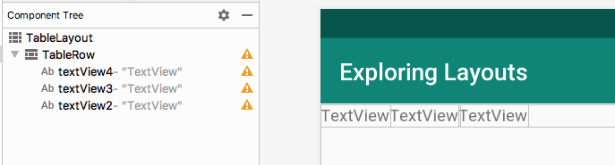
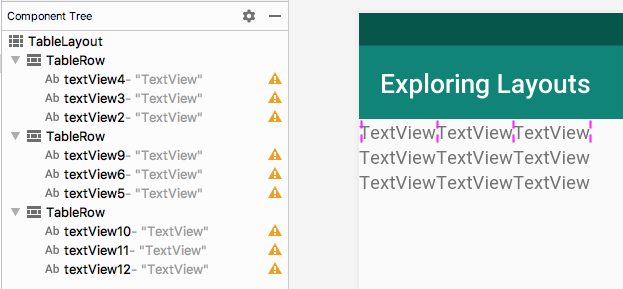
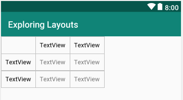

В окне **Project** разверните папку res. Кликните правой кнопкой мыши на папке layout и выберите **New**. Выберите **Layout resource file**. 

В поле **File name** введите ```my_table_layout```. Такое же имя мы использовали при вызове **setContentView** внутри метода **loadTableLayout**.  
В поле **Root element** введите ```TableLayout```

Нажмите кнопку **OK**, и Android Studio создаст новый макет, с корневым элементом TableLayout, в XML-файле под названием my_table_layout и поместит его в папку layout. Android Studio также откроет конструктор пользовательского интерфейса для созданного файла.

Теперь мы можете раскомментировать строчку в методе **loadTableLayout**
```java
    public void loadTableLayout(View v) {
        setContentView(R.layout.my_table_layout);
    }
```
Теперь вы можете запустить приложение и переключиться на макет c **TableLayout**, хотя в данный момент он пуст.

## Добавление TableRow в TableLayout
Перетащите элемент TableRow из категории **Layouts** в графическое представление макета. Обратите внимание, что внешний вид этой новой таблицы практически незаметен. В верхней части макета появилась только тонкая синяя линия. Это произошло потому, что **TableRow** свернулся вокруг своего содержимого, которого еще нет.

Можно перетащить нужные нам элементы интерфейса на эту тонкую синюю линию, но это не очень удобно и даже противоречит интуиции. Кроме того, когда мы имеем несколько элементов **TableRow** рядом, то становится сложно попасть в нужный. Решение лежит в использовании панели **Content Tree**, которое мы кратко представили при построении **ConstraintLayout**.

## Использование Component Tree, когда визуальный конструктор не подходит
Смотрим на **Component Tree** и что **TableRow** дочерний элемент для **TableLayout**. Мы можем перетащить нужный нам элемент интерфейса непосредственно на TableRow в **Component Tree**. Перетащите три элемента **TextView** на **TableRow** в панели **Component Tree** и вы получите следующий макет.



Добавте еще два элемента **TableRow**. А в них по три элемента **TextView**.
Это будет проще всего сделать с помощью панели **Component Tree**. Ваш макет должен получится как на следующем скриншоте:



Давайте сделаем нашу таблицу более похожей на настоящую таблицу данных, изменив некоторые атрибуты.

На элементе **TableLayout**, установите атрибутам **layout_width** и **layout_height** значение ```wrap_content```.  
Измените цвет текста на черный, для крайних левых и крайних верхних элементов **TextView**, с помощью атрибута **textColor**.
Измените цвет всех внешних (вдоль верхней и вниз левой стороны) объектов TextView на черный, отредактировав атрибут textColor. (Для выбора черного начинайте писать ```black``` и выбираем из списка ```android:color/black```.

Отредактируйте внутренний отступ для каждого **TextView** изменив значение атрибута **padding** на ```10sp```.

>На графическом представлении макета или в панели **Component Tree**, вы можете выделять несколько элементов, с помощью зажатой клавиши Ctrl (⌘ на MacOS), и менять значение атрибута для всех выделенных. Profit :)

## Организация колонок таблицы
На данный момент может показаться, что мы закончили, но нам нужно лучше организовать данные. Наша таблица, как и многие другие таблицы, будет иметь пустую ячейку в левом верхнем углу, чтобы разделить заголовки столбцов и строк. Чтобы достичь этого, пронумеруем все ячейки таблицы с помощью атрибута **layout_column**.

>Номера ячеек начинают нумероваться слевой стороны с нуля.

Начните с удаления верхнего левого **TextView**. Обратите внимание, что элемент **TextView**, который был правее, переместился в левое верхнее положение.

Далее, у текущего левого верхнего **TextView** измените значение атрибута **layout_column** на ```1```. Это приравняет его второй ячейке, потому что первая ячейка равна 0. Для следующего элемента **TextView** измените значение атрибута layout_column на 2.

Измените у элементов **TextView**, следующих двух строДля значение атрибута **layout_column** слева направо от ```0``` до ```2```.



## Возврат в главное меню
Наконец, для этого макета мы добавим кнопку, которая возвращает обратно в меню. Добавьте еще один **TableRow**. Перетащите в него элемент **Button**. Измените у кнопки значения атрибутов **text** на ```В меню``` и **onClick** на ```loadMenuLayout```.

Теперь вы можете запустить приложение и переключаться между различными макетами.

Если вы хотите, вы можете изменить заголовки и данные в таблице на более значимые, отредактировав атрибут **text** у всех **TextView**.

В заключение подумайте о приложениях, которые представляют табличные данные. Скорее всего, данные будут вставляться в таблицу динамически, не разработчиком во время разработки, как мы только что делали. Скоро мы будем разбирать, как динамически вставлять данные в различные типы макетов с помощью адаптеров.
