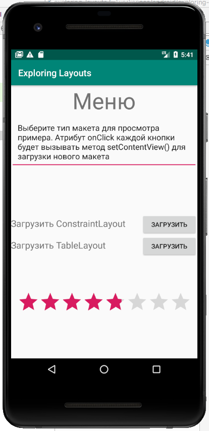

В этом разделе мы рассмотрим некоторые дополнительные атрибуты, которые управляют более тонкими деталями пользовательского интерфейса. Вы, вероятно, заметили, что наш макет выглядит немного раздавленным и несимметричным. По мере того, как мы будем продвигаться, мы будем постоянно что-нибудь добавлять в наш репертуар, чтобы улучшить наши макеты.

1. Выберите **EditText**, а затем разверните атрибут **padding**. Установить все параметр на ```15sp```. Это создало внутренний отступ, аккуратную область пространства вокруг внешней стороны текста.
2. Чтобы сделать внешний отступ под многострочным текстом, найдите и разверните атрибут **layout_margin** и установите layout_marginBottom значение ```100sp```
3. На обоих **TextView**, которые связаны с кнопками, установите атрибут **textSize** в ```20sp```, **layout_gravity** в ```center_vertical```, **layout_width** в ```0dp``` и **layout_weight** в ```.7``` (это эквивалентно 0.7).
4. На обеих кнопках установите **layout_width** в ```0dp``` а **layout_weight** в ```.3```. Обратите внимание, как обе кнопки теперь занимают ровно 0.3 а текст 0.7 от ширины LinearLayout, делая весь внешний вид более приятным.
5. На **RatingBar** найдите атрибут **layout_margin**, а затем установите слева и справа значение ```15sp```, а сверху ```75sp```.

Теперь вы можете запустить приложение и увидеть наш первый макет во всей красе



Обратите внимание, что вы можете выставить значение рейтингу, но оно не будет сохраняться, когда приложение закрывается.

>В качестве самостоятельной задачи, найдите один или два атрибута, которые могли бы улучшить внешний вид текста ```Загрузить ConstraintLayout``` и ```Загрузить TableLayout```. Они сильно прижаты к экрану.

К сожалению, кнопки все еще ничего не делают. Давайте это исправим.
