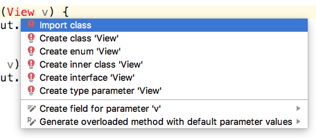

Для достижения интерактивности в приложении, мы сделаем три вещи:
1. Мы вызовем setContentView() из метода onCreate(), чтобы показать прогресс нашего пользовательского интерфейса при запуске приложения
2. Мы напишем еще два собственных метода, и каждый из них будет вызывать setContentView с другим макетом (которые нам еще предстоит разработать)
3. Затем, мы сделаем возможность загружать макеты с помощью нажатия кнопки.

>Поскольку дальше мы будем строить макеты с ConstraintLayout и TableLayout, мы назовем наши новые методы loadConstraintLayout и loadTableLayout соответственно.

Внутри метода **onCreate**, с помощью метода setContentView(), мы добавим код загружающий пользовательский интерфейс, надо которым мы сейчас работаем.
```java
    @Override
    protected void onCreate(Bundle savedInstanceState) {
        super.onCreate(savedInstanceState);
        setContentView(R.layout.main_menu);
    }
```
Теперь вы можете запустить приложение, чтобы увидеть следующие результаты


Добавьте эти два новых метода внутри класса **MainActivity** после метода **onCreate**
```java
    public void loadConstraintLayout(View v) {
        setContentView(R.layout.activity_main);
    }

    public void loadTableLayout(View v) {
        setContentView(R.layout.my_table_layout);
    }
```
Появились ошибки. В первом методе одна, во втором две. Первый мы можем поправить, добавив инструкцию import, чтобы Android Studio знала о классе View. Щелкните левой кнопкой мыши на слове View. Удерживая нажатой клавишу Alt, нажмите клавишу Enter.



Выберите **Import class**. В начале файла, в секции импортов, появилась новая строчка 
```java
import android.view.View;
```
А Android Studio больше не помечает класс View ошибкой.

Однако второй метод все еще содержит ошибку. Проблема заключается в том, что вызывается метод **setContentView** для загрузки нового макета ```R.layout.my_table_layout```. Поскольку этот макет еще не существует, выдается ошибка. Вы можете закомментировать этот вызов, чтобы удалить ошибку, пока мы не создадим файл и не разработаем макет пользовательского интерфейса. Добавьте двойную косую черту ```//``` перед кодом на этой строчке. 
```java
    public void loadTableLayout(View v) {
//        setContentView(R.layout.my_table_layout);
    }
```
Теперь мы добавим кнопки, которые мы сможем нажимать, чтобы вызывать наши  методы и загружать наши макеты, которые мы будем строить в ближайшее время. Но добавить пару кнопок с текстом слишком просто, мы уже делали это раньше. То, что мы хотим сделать, это выстроить какой-то текст с кнопкой справа от него. Проблема в том, что наш LinearLayout имеет атрибут ориентации, установленный в вертикальное положение, и, как мы видели, все новые части, которые мы добавляем в макет, будут выстроены вертикально.
