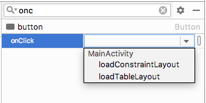

Выберите кнопку рядом с текстом ```Загрузить ConstraintLayout```. Найдите атрибут onClick и присвойте ему значение ```loadConstraintLayout```.

>Мы уже добавили эти методы в класс активности. Поэтому можем их просто выбрать из списка.


Выберите кнопку рядом с текстом ```Загрузить TableLayout```. Найдите атрибут onClick и присвойте ему значение ```loadTableLayout```.

Теперь кнопки будут вызывать указаные методы. Но код внутри метода **loadTableLayout** закомментирован, чтобы избежать ошибок. Не стесняйтесь запустить приложение и посмотреть, что вы можете переключиться на ConstraintLayout, нажав соответствующую кнопку. Но все, что в нем есть - это надпись ```Hello world!```.

Давайте исправим эту ситуацию.
