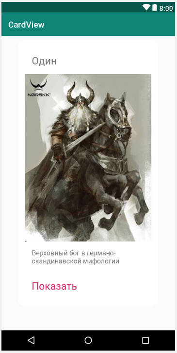

Создайте новый проект обычным способом. Выберите шаблон проекта **Empty Activity** и укажите название проекта ```CardView```.

Мы создадим наш шедевр CardView внутри элемента ScrollView, который, как следует из названия, позволяет пользователю прокручивать свое содержимое.

Создадим новый макет. На панели **Project**, ресурсах (папка res), кликните правой кнопкой мыши по папке **layout** и выберите **New** | **Layout resource file**, и вы увидите диалоговое окно **New Resource File**.

В поле **File name** файла введите ```main_layout```. Название произвольное, но этот макет будет нашим основным макетом, поэтому название делает это понятным.

В поле корневого элемента **Root element** впишите ```ScrollView```. Этот тип макета работает так же, как и LinearLayout, за исключением того, что, когда на экране слишком много контента, он позволяет пользователю прокручивать контент, проводя пальцем.

Нажмите кнопку **OK**, и Android Studio создаст новый ScrollView в XML-файле под названием main_layout и откроет его в конструкторе пользовательского интерфейса.

## Установка макета с помощью Java
Как мы уже делали раньше, теперь мы загрузим файл **main_layout.xml** в качестве макета для нашего приложения, вызвав метод **setContentView** в **MainActivity.java**.

Выберите вкладку MainActivity.java. Если она не открыта, вы можете найти ее в на панели **Project** в разделе ```java/your_package_name```, где ```your_package_name``` имя пакета, которое было указано при создании проекта.

Измените код в методе onCreate, поменяв значение аргумента передаваемого в **setContentView**
```java
setContentView(R.layout.main_layout);
```
Можете запустить приложение, но там пока ничего нет, кроме пустого ScrollView.  
Файл **main_activity.xml** можете удалить.

## Добавление ресурсов изображений
Нам понадобятся следующие изображения для этого проекта. Если они вам не нравятся, можете использовать свои. 
* [odin.jpg](assets/odin.jpg)
* [tyr.jpg](assets/tyr.jpg)
* [hel.jpg](assets/hel.jpg)
Скачайте их на свою рабочую станцию.

Чтобы добавить их в проект, выполните следующие действия:
1. Найдите файлы изображений с помощью проводника вашей операционной системы.
2. Выделите их все и нажмите ```Ctrl + C```, чтобы скопировать их.
3. В панели **Project** выберите папку **res/drawable**, щелкните на ней левой кнопкой мыши и выберите **Paste**.
4. Во всплывающем окне, предлагающем выбрать каталог назначения, выберите **res/drawable** и нажмите кнопку **ОК**.
5. Нажмите кнопку **ОК** еще раз, чтобы скопировать указанные файлы.

Теперь вы можете видеть свои изображения в папке drawable, а также несколько других файлов, которые Android Studio поместила туда, когда создавался проект, как показано на следующем скриншоте


Прежде чем мы перейдем к **CardView**, давайте спроектируем, что мы поместим внутрь.

## Создание контента для карточек
Следующее, что нам нужно сделать, это создать контент для наших карточек. Имеет смысл отделить содержимое от итоговогомакета. Мы создадим три отдельных макета, которые будут называться **card_contents_1**, **card_contents_2** и **card_contents_3**. Каждый из них будет содержать **LinearLayout**, который сам будет содержать фактическое изображение и текст.

Давайте создадим еще три макета с LinearLayout в их корне:
1. Кликните правой кнопкой мыши на папке **layout** и выберите **New layout resource file**.
2. Назовите файл ```card_contents_1``` и выберите LinearLayout в качестве корневого элемента.
3. Нажмите кнопку **ОК**, чтобы добавить файл в папку **layout**.   
>Повторите шаги с 1 по 3 еще два раза, для ```card_contents_2``` и ```card_contents_3```


Теперь выберите вкладку card_contents_1.xml и перетащите следующие элементы в макет, чтобы получить базовую структуру, а затем мы поменяем некоторые атрибуты, чтобы они выглядели красиво.

1. Перетащите **TextView** в верхнюю часть макета
2. Перетащите в **ImageView** на макет, ниже элемента **TextView**. Во всплывающем окне **Resources** выберите **Project | odin** и нажмите кнопку **ОК**
3. Перетащите еще два TextView ниже изображения  
Вот как теперь должен выглядеть ваш card_contents-1.xml:


Теперь давайте используем некоторые рекомендации Material Design, чтобы сделать макет более привлекательным.
> Возможно, что по мере выполнения этих изменений, элементы в нижней части макета могут исчезнуть из видимости конструкторского представления. Если это произойдет с вами, помните, что вы всегда можете выбрать любой элемент пользовательского интерфейса из панели **Component Tree**. Или обратитесь к следующему совету.

Еще один способ минимизировать проблему - использовать больший экран, как описано ниже:

> Я изменил устройство по умолчанию для **design view** на ```Pixel 2 XL```, чтобы создать предыдущее изображение. Это предоставляет больше пикселей на макете, и мне этот макет легче будет завершить. Если вы хотите сделать то же самое, посмотрите на строку меню над **design view**, щелкните раскрывающийся список устройств и выберите устройство **design view**, как показано на следующем скриншоте:


1. Установите у верхнего **TextView** для атрибута **textSize** значение ```24sp```, атрибута **layout_margin** значение ```16dp``` и для атрибута **text** значение ```Один```.
2. У **ImageView** для **layout_width** и **layout_height** задайте ```wrap_content```. Атрибуту **layout_gravity** установите ```center_horizontal```.
3. У **TextView** после **ImageView** установите: **textSize** ```16sp```, **layout_margin** ```16dp```, **text** ```Верховный бог в германо-скандинавской мифологии```
4. У нижнего **TextView** установите: **text** ```Показать```, **layout_margin** ```16dp```, **textSize** ```24sp```, **textColor** ```@color/colorAccent```.
5. У **LinearLayout** установите внутренний отступ **padding** ```15dp```.

В этот момент ваш макет будет выглядеть очень похоже на следующее изображение:


Теперь наполните два других файла (```card_contents_2``` и ```card_contents_3```) с точно такими же размерами и цветами. Тексе для заголовка и краткого описания, можете придумать свой или взять из Википедии.

> Обратите внимание, что все размеры и цвета были получены c веб-сайта [Material Design](https://material.io/design/introduction) и [руководство по пользовательскому интерфейсу для Android](https://developer.android.com/guide/topics/ui/look-and-feel). Этот материал желательно осваивать параллельно.

Теперь мы можем перейти к **CardView**

## Определение размеров для CardView
Кликните правой кнопкой мыши на папке values и выберите **New | Values resource file**. Укажите **File name** dimens.xml (сокращение от dimensions - размеры) и нажмите кнопку **OK**. Мы будем использовать этот файл для создания некоторых общих значений, которые CardView будет использовать.

Чтобы достичь этого, мы будем непосредственно редактировать XML. Измените файл dimens.xml так, чтобы он включал в себя следующие рессурсы:
```xml
    <dimen name="card_corner_radius">16dp</dimen>
    <dimen name="card_margin">10dp</dimen>
```
Мы определили два ресурса, первый называется card_corner_radius, со значением 16dp, и второй называется card_margin, со значением 10dp.

Мы будем ссылаться на эти ресурсы в файле main_layout и использовать их для последовательной настройки наших трех элементов **CardView**.

## Добавление CardView в макет
Переключитесь на вкладку **main_layout.xml** в режиме конструктора. Вы, вероятно, помните, что корневой элемент у этого макета ScrollView, который будет прокручивать содержимое нашего приложения, как веб-браузер прокручивает содержимое веб-страницы, которая не помещается на одном экране.

ScrollView имеет ограничение — он может иметь только один прямой дочерний макет. Мы хотим, чтобы он содержал три виджета CardView.

Чтобы устранить эту проблему, поместим внутрь него **LinearLayout**, в нашем случае **LinearLayout (vertical)**.

Мы добавим наши три **CardView** внутрь **LinearLayout**, и тогда все это будет прокручиваться красиво и плавно без каких-либо ошибок.

**CardView** можно найти в категории **Containers** на панели **Palette**. Перетащите **CardView** на **LinearLayout**, и вы получите всплывающее сообщение от Android Studio.


Нажмите **OK**, и Android Studio выполнит некоторую работу за кулисами и добавит в проект еще несколько классов, в частности, классы, предоставляющие функции **CardView** более старым версиям Android, которые в противном случае не имели бы их.

После всего, у вас должен появиться элемент **CardView** внутри **LinearLayout**. До тех пор, пока в нем не появится какое-либо содержимое, **CardView** будет виден только на панели **Component Tree**.

В текстовом режиме конструктора интерфейсов, у элемента **CardView**, настройте следующие атрибуты:
- **layout_width**=```wrap_content```
- **layout_gravity**=```center```
- **layout_margin**=```@dimens/card_margin```
- **cardCornerRadius**=```@dimens/card_corner_radius```
-  **cardEleveation**=```2dp```

Проблема в том, что в данный момент наш **CardView** пуст. Давайте исправим это, добавив в него содержимое card_contents_1.xml

## Включение макета в другой макет
Нам нужно немного изменить код, добавив элемент include внутрь **CardView**. Элемент include вставит содержимое из макета card_contents_1.xml. Проблема в том, что для добавления этого элемента внутрь **CardView**, нам нужно немного изменить формат записи **CardView**. Текущий формат начинает и завершает представление одним тегом, как показано ниже
```xml
        <android.support.v7.widget.CardView
            <!-- ... -->
            />
```
Нам нужно изменить формат на отдельный открывающий и закрывающий тег, вот так
```xml
<androidx.cardview.widget.CardView>
</androidx.cardview.widget.CardView>
```
Это изменение формата записи позволит нам добавить элемент **include**, и тогда наша первая карточка будет завершена. 
```xml
        <android.support.v7.widget.CardView
            android:layout_width="wrap_content"
            android:layout_height="wrap_content"
            android:layout_gravity="center"
            android:layout_margin="@dimen/card_margin"
            app:cardCornerRadius="@dimen/card_corner_radius"
            app:cardElevation="2dp">
            
            <include layout="@layout/card_contents_1"/>
        </android.support.v7.widget.CardView>
```
Теперь вы можете просмотреть main_layout в визуальном конструкторе и увидеть макет **card_contents_1.xml** внутри **CardView**. Визуальный конструктор не раскрывает истинную эстетику **CardView**. Мы скоро увидим всю прокрутку красиво в завершенном приложении.



Добавьте еще два элемента **CardView** в макет и настройте их таким же образом, как и первый, но с одним исключением. На втором **CardView** установите атрибут **cardElevation** в ```22dp```, а на третьем в ```42dp```. Также измените ссылку в элементе **include** на ```card_contents_2``` и ```card_contents_3``` соответственно.

> Вы можете сделать это очень быстро, скопировав и вставив XML **CardView** и просто изменив **cardElevation** и ссылку на макет.

Теперь мы можем запустить приложение и увидеть наши три красивых, приподнятых CardView в действии. На следующем изображении вы можете увидеть один полный вид **CardView** слева, и эффект настройки высоты, который создает очень приятную глубину, справа.


Теперь мы можем поиграться с редактированием темы приложения.
