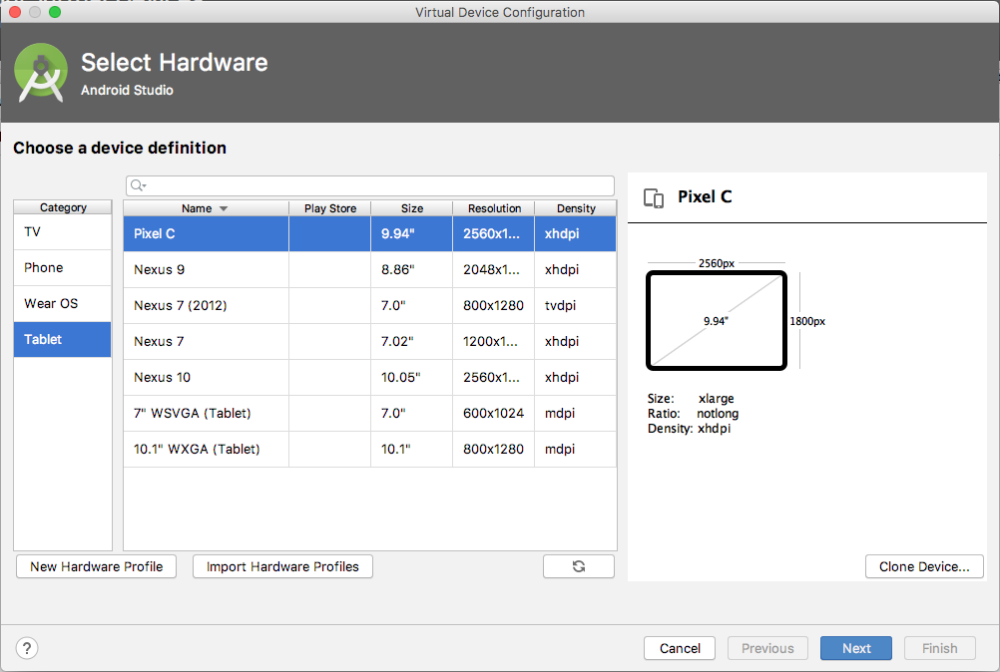
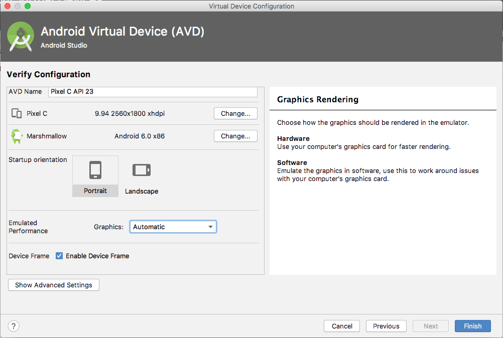
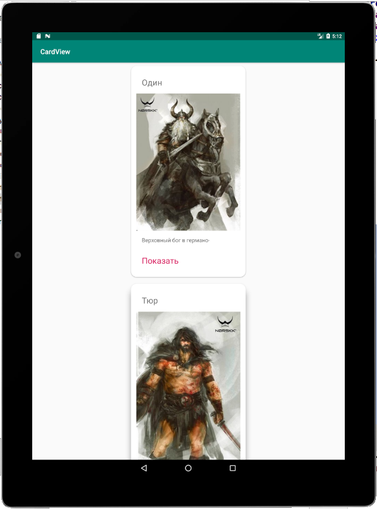
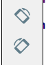

Выберите **Tools | AVD Manager** и нажмите кнопку **Create Virtual Device…** в окне **Your Virtual Devices**. Вы увидите окно **Select Hardware**:

Выберите **Tablet** из списка **Category**, а затем выделите планшет **Pixel C** из списка доступных планшетов.

> Возможность выбора **Pixel C**, может быть недоступна. Android Studio живой проект, и списки выбора планшета могут меняться в соответствии с ситуацией на рынке. В целом, выбор планшета менее важен, чем практика процесса создания эмулятора планшета и последующего тестирования наших приложений.

Нажмите кнопку **Next**. В следующем окне образа системы, можно просто нажать **Next** и выберется образ системы по умолчанию, либо выбрать необходимую версию Android.

Наконец, на экране **Android Virtual Device** вы можете изменить имя AVD (**AVD Name**) для вашего эмулятора и ориентацию запуска (**Startup Orientation**), книжная или альбомная).

Когда будете готовы, нажмите кнопку **Finish**.

Теперь, когда вы будете запускаете одно из своих приложений из Android Studio, вам будет предоставлена возможность выбрать Pixel C (или любой планшет, который вы создали). Давайте запустим наше приложение CardView на созданном эмуляторе Pixel C.

Не так уж плохо, но здесь довольно много свободного места, и это выглядит немного странно. Давайте попробуем в ландшафтном режиме. Переключите ориентацию с помощью кнопок смены ориентации

Результаты будут еще более странными.  
Из этого мы можем вынести, что нам придется разрабатывать наши макеты для экранов разного размера и для разных ориентаций. Иногда это будут умные конструкции, которые масштабируются в соответствии с различными размерами или ориентациями, но часто это будут совершенно разные макеты.
