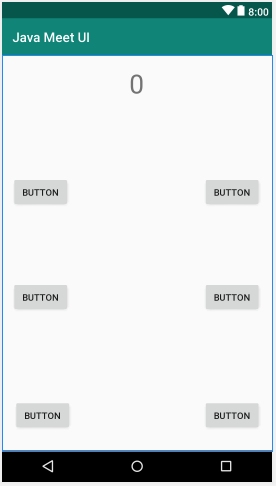
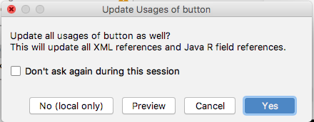
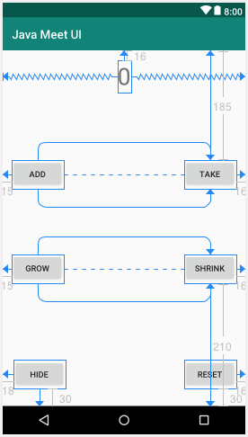
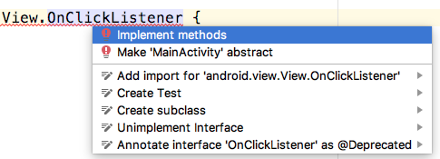

Когда наше приложение запускается и метод **setContentView** вызывается из **onCreate**, макет "надувается" (inflated) из классов пользовательского интерфейса XML и загружается в память в виде полезных объектов. Они хранятся в части памяти DVM, называемой кучей (**Heap**).

## Повторное представление ссылок
Но где же все эти UI объекты/классы? Мы же не видем их в нашем коде. И как, скажите на милость, мы до них доберемся?

DVM внутри каждого устройства Android заботится о выделении памяти для наших приложений. Кроме того, он хранит различные типы переменных в разных местах.

Переменные, которые мы объявляем и инициализируем в методах, хранятся в области памяти, известной как стек (**Stack**). Мы можем придерживаться нашей существующей аналогии со складом, когда говорим о стеке. Мы уже знаем, как можно манипулировать переменными в стеке, с помощью простых выражений. Давайте поговорим о куче и о том, что там хранится.

> Важный факт: все объекты являются переменными ссылочного типа и являются просто ссылками на фактические объекты, которые хранятся в куче. Т.е. они не являются фактическими объектами.

Думайте о куче как об отдельном участке того же самого склада. Куча имеет много места на полу для предметов странной формы, стеллажи для небольших предметов, много длинных рядов с небольшими отверстиями для ячеек и так далее. Именно здесь хранятся объекты. Проблема в том, что у нас нет прямого доступа к куче. Считайте, что это часть склада с ограниченным доступом. Вы не можете на самом деле пойти туда, но вы можете обратиться к тому, что там хранится. Давайте посмотрим, что такое ссылочная переменная на самом деле.

Ссылочные переменные - это всего лишь ссылка. Они используются как способ доступа и манипулирования объектом, но не являются самим объектом. Ссылка либо свободна (пустая) или определена как адрес, местоположение объекта. Сама ссылка хранится в стеке.

Поэтому, когда мы используем оператор доступа ".", мы просим Dalvik выполнить задачу в определенном месте - месте, которое находиться по указанной ссылке.

Ну зачем нам вообще нужна такая система?

### Небольшой перерыв, чтобы выбросить мусор
Как мы знаем, DVM отслеживает все наши объекты для нас и хранит их в специальной области нашего склада, называемой кучей. Регулярно, пока наше приложение работает, DVM будет сканировать стек, обычные стеллажи нашего склада и сопоставлять ссылки на объекты, которые находятся в куче, и любые объекты, которые он находит без соответствующей ссылки, он уничтожает – или, в терминологии Java, собирает мусор (**garbage collects**).

Представьте себе очень разборчивый мусорный автомобиль, проезжающий через середину нашей кучи, сканируя объекты, чтобы соответствовать ссылкам в стеке. Отсутствие ссылки означает, что теперь это мусор.

Если объект не имеет ссылочной переменной, мы все равно ничего не можем с ним сделать, потому что у нас нет способа получить к нему доступ, сослаться на него. Эта система сбора мусора помогает нашим приложениям работать более эффективно, освобождая неиспользуемую память.

Если бы эта задача была оставлена нам, наши приложения были бы намного сложнее в коде.

### Семь фактов о стеке и куче.
Давайте быстро посмотрим, что мы узнали о стеке и куче

1. Вы не удаляете объекты, виртуальная машина отправляет сборщик мусора, когда считает это уместным. Объект подлежит удалению, когда на него отсутствуют ссылки.
2. Локальные переменные и методы находятся в стеке, и локальные переменные являются локальными для конкретного метода, в котором они были объявлены.
3. Переменные экземпляра класса находятся в куче, со своими объектами. Но ссылка на объект (его адрес) является локальной переменной в стеке.
4. Мы контролируем то, что попадает в стек. Мы можем использовать объекты в куче, но только путем ссылки на них.
5. Куча поддерживается в чистоте и актуальном состоянии сборщиком мусора.
6. Объект собирается сборщиком, когда больше нет ссылок на него. То есть, когда ссылочная переменная удаляется из стека, связанный с ней объект становится пригодным для сборки мусора. И когда DVM решит, что время пришло (обычно очень быстро), она освободит оперативную память, чтобы избежать ее исчерпания.
7. Если мы попытаемся сослаться на объект, который не существует,мы получим исключение **NullPointerException** и приложение рухнет.

Давайте двигаться дальше и посмотрим, что именно эта информация дает нам с точки зрения контроля над нашим пользовательским интерфейсом.

## Так как же эта куча поможет мне?
Любой элемент пользовательского интерфейса, имеющий установленный атрибут **id**, может иметь ссылку от объекта в куче, получаемую с помощью метода **findViewById**, который является частью класса **Activity / AppCompatActivity**. Поскольку это часть класса, который мы расширяем во всех наших приложениях, у нас есть прямой доступ к нему:
```java
myButton = (Button) findViewById(R.id.myButton);
```
Этот код предполагает, что переменная **myButton** была объявлена ранее соответствующего типа, в данном случае **Button**. Код также предполагает, что в XML-макете есть кнопка с атрибутом **id**, установленным в ```myButton```.

Также заметьте, что метод **findViewById** полиморфен. Мы знаем это, потому что используем явное приведение **(Button)**, чтобы явно сделать возвращенный объект **Button** из его родительского типа **View**.

Это довольно захватывающе, потому что, мы можем получить ссылку на целую кучу объектов, сделанных из элементов нашего макета. Затем, мы можем начать использовать все методы, которые есть у этих объектов. Вот некоторые методы, которые мы можем использовать для объектов типа Button:
```java
myButton.setText
myButton.setHeight
myButton.setOnCLickListener
myButton.setVisibility
```
> Вообще класс Button имеет около 50 методов!

## Использование Button и TextView из нашего макета
Чтобы продолжить, создайте новый проект Android Studio, выберите пустой шаблон **Empty Activity** и назовите его Java Meet UI.

Во-первых, давайте создадим простой пользовательский интерфейс, выполнив следующие шаги:

1. Переключитесь на activity_main.xml и убедитесь, что вы находитесь на вкладке Design.
2. Удалите **TextView** с надписью ```Hello world!``` из макета.
3. Добавьте виджет TextView в верхний центр макета.
4. Установите следующие атрибуты: **text** = ```0```, **id** = ```txtValue```, **textSize**=```40sp```.
5. Перетащите шесть кнопок на макет и расположите их так, чтобы он выглядел немного похожим на следующую диаграмму. Точная планировка не имеет значения:



6. Когда макет будет таким, как вы хотите, нажмите кнопку **Infer Constraints**, для привязки всех элементов пользовательского интерфейса.
7. Пройдитесь по кнопкам слева направо, сверху вниз и задайте атрибутам **text** и **id** следующие значения:

| атрибут text | атрибут id |
|--------------|------------|
| add          | btnAdd     |
| take         | btnTake    |
| grow         | btnGrow    |
| shrink       | btnShrink  |
| hide         | btnHide    |
| reset        | btnReset   |

> При изменении атрибута **id** у некоторых кнопок, будет всплывать следующее окно  
  
Нажимайте **YES**

Когда вы закончите, ваш макет примерно будет выглядеть следующим образом:



Точное положение и текст на кнопках не очень важны, но значения, заданные атрибуту идентификатора **id**, должны быть как в таблице. Причина этого заключается в том, что мы будем использовать эти идентификаторы, чтобы получить ссылки на кнопки и TextView из Java-кода.

Переключитесь на вкладку **MainActivity.java** и измените строчку:
```java
public class MainActivity extends AppCompatActivity {
```
на следующую:
```java
public class MainActivity extends AppCompatActivity implements View.OnClickListener {
```

> Вам нужно будет импортировать класс View, если этого не сделала сама **Android Studuio**. 
```java
import android.view.View;
```
Обязательно проверьте его наличие и добавьте при отсутствии, прежде чем перейти к следующему шагу, иначе вы получите запутывающие результаты.

Обратите внимание, что вся строка, которую мы только что исправили, подчеркнута красным цветом, показывая ошибку. Теперь, поскольку мы превратили **MainActivity** в класс реализующий интерфейс **OnClickListener**, добавив его после ключевого слова **imlements**, мы должны реализовать все абстрактные методы интерфейса **OnClickListener**. Такой методов в интерфейсе **OnClickListener** один - **onClick**. Когда мы добавим такой метод в наш класс **MainActivity**, ошибка исчезнет.

Мы можем заставить Android Studio добавить его для нас, кликнув левой кнопкой мыши в любом месте строки, содержащей ошибку, а затем нажать комбинацию клавиш ```Alt + Enter```. Выберите **Implement methods** (реализовать методы)



В появившемся окне **Select methods to implement** нажмите **OK**, чтобы Android Studio добавила метод **onClick**. Ошибка исчезла, и мы можем продолжать добавлять код. У нас также появился метод **onClick**, и мы скоро увидим, что мы будем делать с ним.

Теперь мы объявим переменную экземпляра типа **int** под названием **value** и инициализируем ее в ```0```. Мы также объявим шесть переменных типа **Button** и одну типа **TextView**. Мы дадим им те же имена, что и значения атрибута **id** в макете пользовательского интерфейса. Эта ассоциация имен не является обязательной, но полезно отслеживать, какая переменная в нашем Java-коде, будет содержать ссылку на кнопку из пользовательского интерфейса.

Кроме того, мы объявляем их все с модификатором доступа **private**, потому что мы знаем, что они не будут нужны вне этого класса.

Прежде чем приступить к вводу кода, обратите внимание, что все эти переменные являются членами класса **MainActivity**. Это означает, что мы объявляем эти переменные сразу после объявления класса.

Сделав эти переменные членами класса означает, что они имеют область действия класса и что мы можем получить к ним доступ из любой точки класса **MainActivity**. Это будет полезно для этого проекта, потому что нам нужно будет использовать их все в методе **onCreate** и в новом методе **onClick**.

Введите код, который мы только что обсудили после открытия фигурной скобки { класса **MainActivity** и перед методом **onCreate**:
```java
    private int value = 0;

    private Button btnAdd;
    // дальше самостоятельно :)
```
> Не забывайте использовать комбинацию клавиш ```ALT + Enter``` для импорта классов, которые используются в вашем коде.

Далее, нам необходимо подготовить все наши переменные быть готовыми к действию. Лучшее место для этого - метод **onCreate**, потому что мы знаем, что он будет вызван Android непосредственно перед тем, как приложение будет показано пользователю. Мы будем использовать метод **findViewById**, чтобы связать каждую из наших переменных с элементом пользовательского интерфейса.

**findViewById** возвращает ссылку на объект пользовательского интерфейса в куче. Он "знает", какой из них нам нужен, потому что мы используем правильный идентификатор в качестве аргумента. Например ```(R.id.btnAdd)``` вернет ссылку на объект кнопки с текстом ADD, которую мы делали в нашем макете.

> Нопоманию, что мы используем синтаксис явного приведения типа (casting) ``` = (Button) ```, потому что метод **findViewById** полиморфен и может вернуть любой тип объекта, который является подклассом класса **View**.

Введите код инициализации, сразу после вызова **setContentView** в методе **onCreate**:
```java
        btnAdd = (Button) findViewById(R.id.btnAdd);
        // дальше самостоятельно
```

Теперь, когда у нас есть ссылки на все объекты Button и TextView, мы можем начать использовать доступные у них методы. Далее мы используем методом **setOnClickListener** для каждой переменной ссылающейся на кнопку, чтобы заставить Android вызывать метод **onClick** при каждом клике пользователя на кнопке.

Это будет работает потому, что когда мы реализовали интерфейс **View.OnClickListener**, наш класс **MainActivity** фактически стал **OnClickListener**.

Итак, все, что нам нужно сделать, это вызвать **setOnClickListener** у каждой переменной кнопки по очереди. 
```java
btnAdd.setOnClickListener(this);
```
Напомним, что `this` является ссылкой на экземпляр текущего класса, в нашем случае это ```MainActivity```. Вызов метода как бы говорит: "Эй, Android, мне нужен OnClickListener, и я хочу, чтобы это был текущий экземпляр."

Теперь Android знает, у какого экземпляра класса вызывать метод **onClick**. Этот код не работал бы, если бы мы сначала не реализовали интерфейс (код бы даже не скомпилировался). Кроме того, мы должны выполнить настройку слушателей до показа экрана пользователю, поэтому мы сделаем это в методе **onCreate**.

Напиши код добавления слушателя к кнопкам в метод **onCreate**, после кода инициализации переменных
```java
        btnAdd.setOnClickListener(this);
        // дальше самостоятельно
```

Теперь перейдем в метод **onClick**. Внутри него добавьте объявление переменной ```size``` типа **float** и пустой блок **switch**
```java
    public void onClick(View view) {
        float size;

        switch (view.getId()) {

        }
    }
```
Помните, что **switch** будет проверять **case** на соответствие условию внутри оператора **switch**.

В предыдущем коде условием переключения было ```View.getId()```. Давайте разберем. Переменная view является ссылкой на объект типа View, который был передан в метод **onClick** Android-ом:
```java
public void onClick(View view)
```
View - это родительский класс для Button, TextView и всех элементов UI. Поэтому, вызов ```view.getId()``` вернет атрибут **id** элемента пользовательского интерфейса, который был нажат и инициализировал вызов метода **onClick**.

Все, что нам нужно сделать, - это предоставить выражения **case** c соотвествующими действиями, для каждой ссылки на кнопки.

Следующий код - это инструкция case для случая, когда ```view.getId()``` = ```R.id.btnAdd```:
```java
            case R.id.btnAdd:
                value ++;
                txtValue.setText("" + value);
                break;
```
Она просто увеличивает значение value на 1, а затем *делает что-то новое*  
Мы вызываем метод **setText** для **txtValue**. Аргумент – **"" + value**, использует пустую строку и добавляет ([конкатенирует](https://ru.wikipedia.org/wiki/%D0%9A%D0%BE%D0%BD%D0%BA%D0%B0%D1%82%D0%B5%D0%BD%D0%B0%D1%86%D0%B8%D1%8F)) к ней значение хранящееся в value. Это приведет к тому, что наш **TextView** отобразит значение, сохраненное в value.  
Затем в конце case есть оператор **break**, завершающий блок **switch**, чтобы команды в case лежащих ниже не выполнялись.

Кнопка **TAKE** делает тоже самое, только единица вычитается из значения **value**. Кнопка **RESET** устанавливает значение **value** равным 0 и так же обновляет атрибут **text** у txtValue.

**Реализуйте инструкции case для этих кнопок самостоятельно**
> Код с инструкциями case вводите внутри блока **switch**

В следующие двух инструкциях case, для обработки нажатий на кнопки **SHRINK** и **GROW**, мы будем использовать более интересные методы **getTextScaleX** и **setTextScaleX**.  
Метод getTextScaleX возвращает горизонтальный масштаб текста внутри элемента, в котором он используется. Соответственно setTextScaleX устанавливает горизонтальный масштаб текста.
```java
            case R.id.btnGrow:
                size = txtValue.getTextScaleX();
                txtValue.setTextScaleX(size + 1);
                break;
``` 
При каждом нажатии **GROW** горизонтальный масштаб текста будет увеличиваться на 1 от текущего значения.  
При нажатии на **SHRINK**, маштаб должен уменьшаться на 1 от текущего. **Реализацию напишите самостоятельно**

В нашей последней инструкции case, мы будем использовать конструкцию условия if-else. Это условие потребует небольшого пояснения, поэтому сначала просто посмотрим на условие:
```java
if (txtValue.getVisibility() == View.VISIBLE) 
```
Условие, которое должно быть оценено ```txtValue.getVisibility() == View.VISIBLE```. Первая его часть, перед оператором ```==``` возвращает текущее значение атрибута **visibility** (видимости) нашего элемента **TextView**. Возвращаемое значение может быть одним из трех возможных постоянных значений (констант), определенных в классе View. **View.VISIBLE**, **View.INVISIBLE** и **View.GONE**.

Если элемент TextView виден пользователю, метод **getVisibility** возвращает View.VISIBLE, условие оценивается как true, и блок if выполняется.
```java
            case R.id.btnHide:
                if (txtValue.getVisibility() == View.VISIBLE) {
                    txtValue.setVisibility(View.INVISIBLE);
                    btnHide.setText("SHOW");
                } else {

                }
                break;
```
Внутри блока if мы используем метод **setVisibility** для txtValue и делаем его невидимым для пользователя, с помощью передачи аргумента ```View.INVISIBLE```. В дополнение к этому, мы изменяем текст у btnHide на ```SHOW```, с помощью метода **setText**.

После того, как блок if выполнится, txtValue станет невидим, и у нас будет кнопка с надписью ```SHOW```. Когда пользователь нажмет на нее, оператор if вернет false и будет выполнен блок else, в котором мы поменяем ситуацию, вернем видимость для элемента TextView и текст кнопки ```HIDE```.

**Реализацию напишите самостоятельно**.

У нас есть пользовательский интерфейс и Java-код, так что пришло время запустить приложение и понажимать на все кнопки. 

> Если у вас появились какие-нибудь сложности, можете посмотреть готовую версию проекта, доступного на [GitHub](https://github.com/it-cube-miass/java-meet-ui), и разобрать свои ошибки.

Обратите внимание, что в этом приложении не было необходимости в **Log** или **Toast**, поскольку мы, наконец, манипулируем пользовательским интерфейсом с помощью Java-кода.

## Внутренние и анонимные классы
Прежде чем мы перейдем к следующей главе и создадим приложения с множеством различных виджетов, которые будут применять на практике и усиливать все, что мы узнали в этой главе, у нас будет очень краткое введение в анонимные и внутренние классы.

Мы уже с вам видели и реализовывали классы в отдельном файле. Этот файл должен иметь то же имя, что и класс. Это способ создать обычный класс.

Но мы также можем объявлять и реализовывать классы внутри другого класса. Остается, конечно, только один вопрос: зачем нам это делать? :)

Когда мы реализуем внутренний класс, то он может получить доступ к членам внешнего класса, а внешний класс может получить доступ к членам внутреннего класса.

Это часто делает структуру нашего кода более простой. Поэтому внутренние классы - это путь, по которому иногда стоит идти.

Кроме того, мы можем объявить и реализовать внутренний класс используя немного другой синтаксис не используя имя класса. Это аннонимный класс.

Скоро мы увидим внутренние и анонимные классы в действии.

