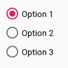

Давайте проведем вихревую экскурсию по некоторым из этих ранее не исследованных / неиспользуемых элементов из панели **Palette**, а затем мы перетащим их кучу на макет и посмотрим некоторые из методов, которые у них есть и могут быть полезны. Затем мы можем реализовать проект, чтобы использовать их все.

## EditText
Виджет **EditText** делает то, что подсказывает название. Если мы сделаем виджет EditText доступным для наших пользователей, то они действительно смогут редактировать текст в нем. Мы видели это в предыдущей главе, но никак это не использовали. Мы не рассматривали, как получить информацию из него.
```java
        EditText editText = (EditText) findViewById(R.id.editText); 
        Editable editable = editText.getText();
        String str = editable.toString();
```

## ImageView
Мы уже пару раз вставляли изображение в наш макет, но никогда не получали ссылку на него из Java-кода и ничего не делали с ним. Процесс получения ссылки на ImageView такой же, как и на любой другой виджет
```java
ImageView imageView = (ImageView) findViewById(R.id.imageView);
```
Затем, мы уж можем делать некоторые интересные вещи с нашим изображением
```java
imageView.setAlpha(.5f);
```
> Странно выглядящее f просто говорит компилятору, что переданный аргумент имеет тип float, как того требует метод **setAlpha**.

Метод **setAlpha** принимает значение от ```0``` до ```1```. 0 полностью прозрачен, 1 полностью не прозрачен.
> Существует также перегруженный метод setAlpha, который принимает значение int от 0 (полностью прозрачный) до 255 (без прозрачности). Мы можем выбрать тот, который наиболее подходит в данный момент.

## RadioButton и RadioGroup
RadioButton используется, когда у пользователя есть два или более взаимоисключающих варианта выбора. Это означает, что выбран может быть только один вариант. 



Когда пользователь делает выбор, остальные опции автоматически отменяются. Мы управляем виджетами **RadioButton**, помещая их в **RadioGroup** в нашем макете пользовательского интерфейса. Можно использовать визуальный конструктор, чтобы просто перетащить кучу **RadioButton** на **RadioGroup**. Когда мы это сделаем, XML будет выглядеть примерно так:
```xml
    <RadioGroup
        android:id="@+id/radioGroup"
        android:layout_width="wrap_content"
        android:layout_height="wrap_content">

        <RadioButton
            android:id="@+id/radioButton"
            android:layout_width="match_parent"
            android:layout_height="wrap_content"
            android:checked="true"
            android:text="Option 1" />

        <RadioButton
            android:id="@+id/radioButton2"
            android:layout_width="match_parent"
            android:layout_height="wrap_content"
            android:text="Option 2" />

        <RadioButton
            android:id="@+id/radioButton3"
            android:layout_width="match_parent"
            android:layout_height="wrap_content"
            android:text="Option 3" />
    </RadioGroup>
```
Обратите внимание, что каждый **RadioButton** и **RadioGroup** имеют свой атрибут **id** и мы сможем получить ссылку на них.
```java
RadioGroup radioGroup = (RadioGroup) findViewById(R.id.radioGroup);

RadioButton rb1 = (RadioButton) findViewById(R.id.radioButton1);
RadioButton rb2 = (RadioButton) findViewById(R.id.radioButton2);
RadioButton rbnew3 = (RadioButton) findViewById(R.id.radioButton3);
```
Однако на практике, мы увидим, что можем управлять почти всем из одной только ссылки на **RadioGroup**.
  
Для удобной работы с такими виджетами нам понадобиться некоторая помощь от Android API и Java в виде анонимных классов.
