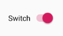
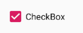
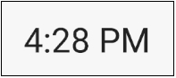

Теперь, когда мы увидели, как анонимные классы работают, особенно с RadioGroup и RadioButton, мы можем продолжить изучение панели **Palette** и посмотреть, как анонимные классы работают с некоторыми другими виджетами пользовательского интерфейса.

## Switch
Виджет Switch похож на кнопку, за исключением того, что он имеет два возможных состояния.

Очевидным использованием виджета Switch показать и скрыть что-нибудь. Помните, что в нашем приложении **Java meet UI**, мы использовали кнопку, чтобы показать и скрыть **TextView**?

Каждый раз, когда мы скрывали/показывали **TextView**, мы изменяли свойство **text** на кнопке, чтобы было понятно, что произойдет, если она будет нажата снова. Более логичным для пользователя и более простым для нас, как программистов, было бы использовать **Switch**.



Давайте посмотрим как это можно реализовать.  
Для прослушивания события изменения состояния, мы снова будем использовать анонимный класс. Однако, на этот раз, интерфейс **onCheckedChanged** возьмем не у **RadioGroup** а у **CompoundButton**.

Нам нужно реализовать метод **onCheckedChanged**, и этот метод имеет логический параметр **boolean isChecked**. Думаю можно догадаться, что этот параметр означает :)
```java
        mySwitch.setOnCheckedChangeListener(new CompoundButton.OnCheckedChangeListener() {
            @Override
            public void onCheckedChanged(CompoundButton compoundButton, boolean isChecked) {
                if (isChecked) {
                    txtValue.setVisibility(View.VISIBLE);
                } else {
                    txtValue.setVisibility(View.INVISIBLE);
                }
            }
        });
```
Если код анонимного класса все еще выглядит немного странно, не волнуйтесь. Чем чаще мы его используем, тем более знакомым он становится.

## CheckBox


С помощью флажка мы просто выставляем какое-нибудь свойство в состояние выставлено и снято. Возможно, это происходит перед совершением другого действия. Обработка изменения состояния очень похожа на **Switch**, да и интерфейс тот же самый
```java
        checkBox.setOnCheckedChangeListener(new CompoundButton.OnCheckedChangeListener() {
            @Override
            public void onCheckedChanged(CompoundButton compoundButton, boolean b) {
                if (checkBox.isChecked()) {
                    // отмечено, делаем что-нибудь
                } else {
                    // не отмечено, делаем что-нибудь другое
                }
            }
        });
```
Обратите внимание, что можно узнать текущее состояние у самого виджета, используя метод **isChecked**.

## TextClock
В нашем следующем приложении мы будем использовать виджет **TextClock**, чтобы показать некоторые из его функций. Для его добавления в xml-файл макета, нам придется вписать его руками, так как этот виджет недоступен для перетаскивания из панели **Palette**. Вот как выглядит **TextClock**



В качестве примера использования **TextClock**, установка часового пояса ```Europe/Brussels```
```java
tClock.setTimeZone("Europe/Brussels");
```

Используя всю эту информацию, давайте сделаем приложение, чтобы использовать виджеты Android более практично, чем то, что мы имеем до сих пор.
