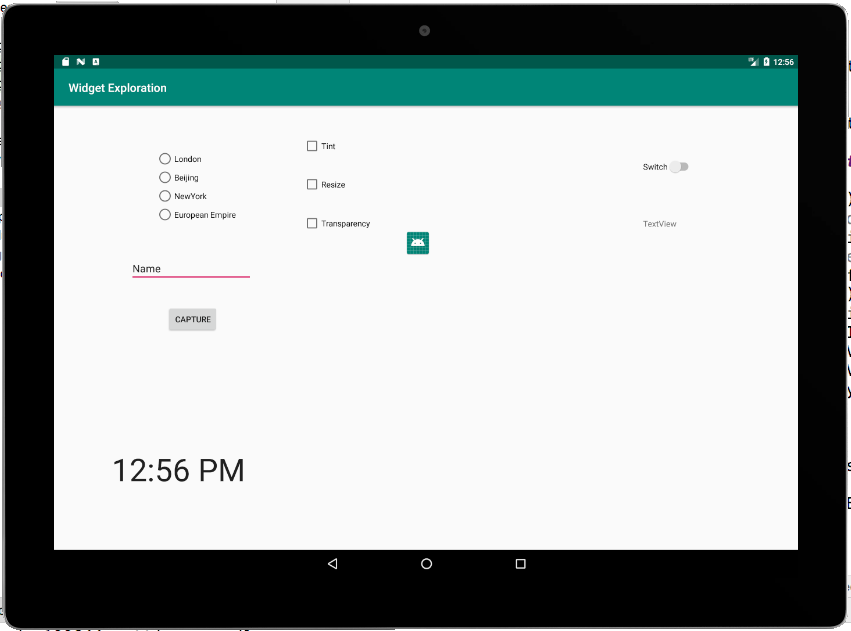
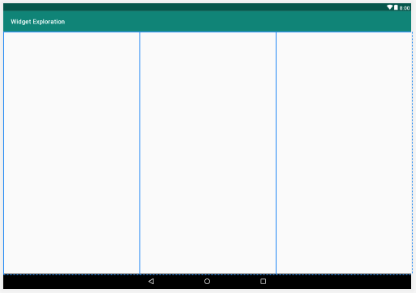
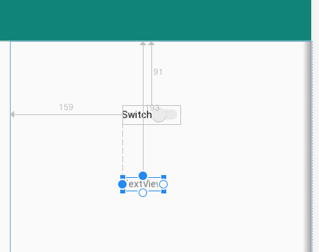
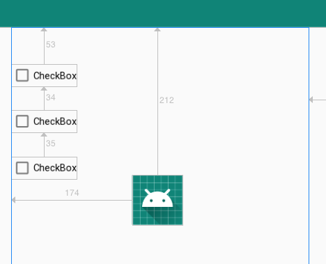
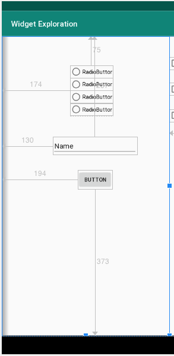
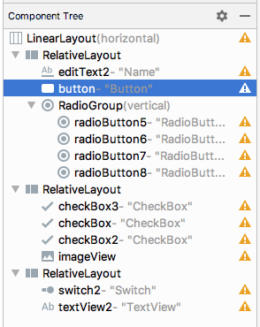
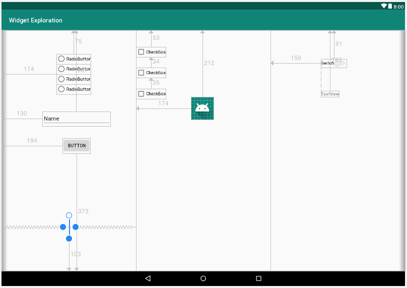

Мы только что поговорили о шести виджетах: **EditText**, **ImageView**, **RadioButton и RadioGroup**, **Switch**, **CheckBox** и **TextClock**. Давайте создадим рабочее приложение и сделаем что-то реальное с каждым из них. Мы также будем снова использовать **Button** и **TextView**.

В макете мы будем использовать **LinearLayout** как тип раскладки, который содержит все, а в **LinearLayout** мы будем использовать несколько **RelativeLayout**.

**RelativeLayout** был заменен **ConstraintLayout**, но он все еще очень часто используются, посему его стоит потрогать. При построении макетов с **RelativeLayout** вы увидите, что элементы пользовательского интерфейса ведут себя почти так же, как c **ConstraintLayout**, но XML отличается.

## Настройка проекта
Во-первых, мы создадим новый проект и подготовим макет пользовательского интерфейса. Эти шаги позволят получить все виджеты на экране и установить необходимые атрибуты. Вот так будет выглядеть наше приложение:



- **RadioButton**-ы позволяют пользователю изменять время, отображаемое на часах, выбирая из четырех часовых поясов.
- Кнопка **Capture** при нажатии изменит текст в **TextView** (справа) на тот, который в данный момент находится в **EditText** (слева).
- Три **Checkbox**-а будут добавлять и удалять визуальные эффекты для изображения робота Android, изменение размера цвветового оттенка.
- **Switch** будет включать и выключать **TextView**.

Точные положения виджетов не являются существенными.

Итак, давайте сделаем следующие шаги, чтобы настроить новый проект и подготовить макет пользовательского интерфейса:

1. Создайте новый проект под названием ```Widget Exploration``` ипользуя шаблон **Empty Activity**.
2. Cоздадим новый файл макета, поскольку мы хотим, чтобы наш макет был основан на **LinearLayout**. Щелкните правой кнопкой мыши по папке **layout** и выберите пункт **New | Layout resource file**. В окне **New resource file** в поле **File name** введите exploration_layout.xml и ```LinearLayout``` в поле **Root element**. 
3. После создания файла, поменяйте значение атрибута **orientation** у **LinearLayout** на ```horizontal```.
4. С помощью элементов управления над визуальным представлением макета, выберите планшет в альбомной ориентации.
5. Теперь мы можем приступить к созданию макета. Перетащите три макета **RelativeLayout** из категории **Legacy** панели **Palette**, чтобы создать три вертикальных подразделения. Вероятно, вам будет проще всего использовать для этого панель **Component Tree**.
6. Установите свойство **weight** каждого **RelativeLayout** по очереди на .33. Теперь у нас есть три равных вертикальных отделения, как и на следующем скриншоте:



7. Перетащите **Switch** рядом с верхним центром правого **RelativeLayout** и чуть ниже, перетащите **TextView**. Правая часть вашего макета теперь должна выглядеть примерно так:



8. Перетащите на центральный **RelativeLayout** три виджета **CheckBox**, один под другим, а затем **ImageView** под ними. В появившемся диалоговом окне **Resources** выберите **Project | ic_launcher**, чтобы использовать значок Android в качестве изображения для ImageView. Теперь центральная колонка должна выглядеть примерно следующим образом:



9. Перетащите **RadioGroup** в левый **RelativeLayout**.
Добавьте в него четыре **RadioButton**. Под **RadioGroup** перетащите **Plain Text** из категории **Text** . Несмотря на свое название, этот виджет позволяет пользователю вводить в него текст.

10. Добавьте **Button** ниже от **EditText**. Ваш левый **RelativeLayout** должен выглядеть так:



А панель **Component Tree** так



11. Теперь добавьте следующие атрибуты к виджетам, которые мы только что выложили:
> Некоторые атрибуты уже могут быть правильными по умолчанию.

| виджет              | атрибут       | значение                  |
|---------------------|---------------|---------------------------|
| RadioGroup          | id            | radioGroup                |
| RadioButton(первый) | id            | radioButtonLondon         |
| RadioButton(первый) | text          | London                    |
| RadioButton(первый) | checked       | true                      |
| RadioButton(второй) | id            | radioButtonBeijing        |
| RadioButton(второй) | text          | Beijing                   |
| RadioButton(третий) | id            | radioButtonNewYork        |
| RadioButton(третий) | text          | New York                  |
| RadioButton(нижний) | id            | radioButtonEuropeanEmpire |
| RadioButton(нижний) | text          | European Empire           |
| EditText            | id            | editText                  |
| Button              | id            | button                    |
| Button              | text          | Capture                   |
| CheckBox(первый)    | id            | checkBoxTransparency      |
| CheckBox(первый)    | text          | Transparency              |
| CheckBox(второй)    | id            | checkBoxTint              |
| CheckBox(второй)    | text          | Tint                      |
| CheckBox(третий)    | id            | checkBoxReSize            |
| CheckBox(третий)    | text          | Resize                    |
| ImageView           | id            | imageView                 |
| Switch              | id            | switch1                   |
| Switch              | enabled       | true                      |
| Switch              | clickable     | true                      |
| TextView            | id            | textView                  |
| TextView            | textSize      | 34sp                      |
| TextView            | layout_width  | match_parent              |
| TextView            | layout_height | match_parent              |

12. Теперь перейдите на вкладку **Text**, чтобы просмотреть XML макета. Найдите конец первого (левого) столбца **RelativeLayout**. Перед закрывающим ```</RelativeLayout>``` вставьте следующий XML для **TextClock**:
```xml
<TextClock
   android:id="@+id/textClock"
   android:layout_width="wrap_content"
   android:layout_height="wrap_content"
   android:layout_alignParentBottom="true"
   android:layout_centerHorizontal="true"
   android:layout_gravity="center_horizontal"
   android:layout_marginBottom="103dp" 
   android:textSize="54sp" />
```
Мы делаем это таким образом, потому что **TextClock** не доступен в панели **Palette**. 

13. Переключитесь на вкладку **Design**, ваш конечный макет должен примерно походить на следующий скриншот:



Мы поместили все необходимые виджеты в макет и настроили их атрибуты. Теперь мы можем приступить к использованию всех этих виджетов в нашем коде Java.
