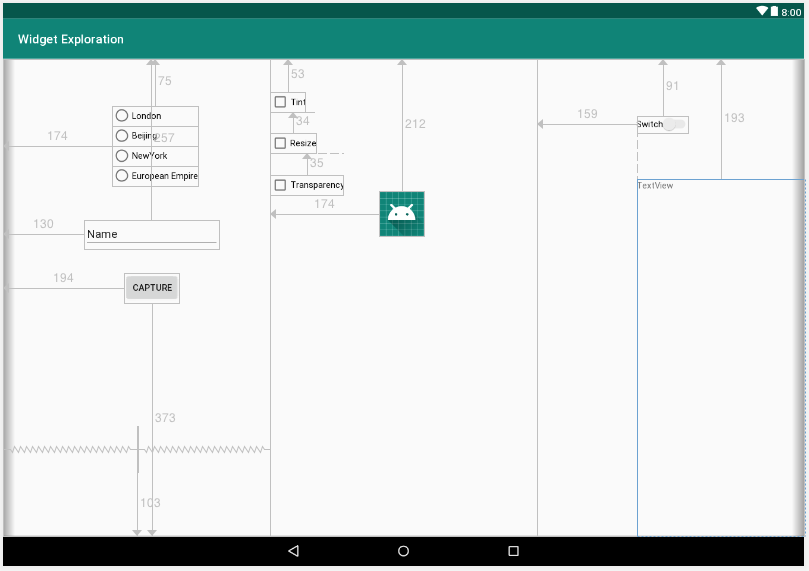

Мы только что поговорили о шести виджетах: **EditText**, **ImageView**, **RadioButton и RadioGroup**, **Switch**, **CheckBox** и **TextClock**. Давайте создадим рабочее приложение и сделаем что-то реальное с каждым из них. Мы также будем снова использовать **Button** и **TextView**.

В макете мы будем использовать **LinearLayout** как тип раскладки, который содержит все, а в **LinearLayout** мы будем использовать несколько **RelativeLayout**.

**RelativeLayout** был заменен **ConstraintLayout**, но он все еще очень часто используются, посему его стоит потрогать. При построении макетов с **RelativeLayout** вы увидите, что элементы пользовательского интерфейса ведут себя почти так же, как c **ConstraintLayout**, но XML отличается.

## Настройка проекта
Во-первых, мы создадим новый проект и подготовим макет пользовательского интерфейса. Эти шаги позволят получить все виджеты на экране и установить необходимые атрибуты. Вот так будет выглядеть наше приложение:


- **RadioButton**-ы позволяют пользователю изменять время, отображаемое на часах, выбирая из четырех часовых поясов.
- Кнопка **Capture** при нажатии изменит текст в **TextView** (справа) на тот, который в данный момент находится в **EditText** (слева).
- Три **Checkbox**-а будут добавлять и удалять визуальные эффекты для изображения робота Android, изменение размера цвветового оттенка.
- **Switch** будет включать и выключать **TextView**.

Точные положения виджетов не являются существенными.

Итак, давайте сделаем следующие шаги, чтобы настроить новый проект и подготовить макет пользовательского интерфейса:

1. Создайте новый проект под названием ```Widget Exploration``` ипользуя шаблон **Empty Activity**.
2. Cоздадим новый файл макета, поскольку мы хотим, чтобы наш макет был основан на **LinearLayout**. Щелкните правой кнопкой мыши по папке **layout** и выберите пункт **New | Layout resource file**. В окне **New resource file** в поле **File name** введите exploration_layout.xml и ```LinearLayout``` в поле **Root element**. 
3. После создания файла, поменяйте значение атрибута **orientation** у **LinearLayout** на ```horizontal```.
4. С помощью элементов управления над визуальным представлением макета, выберите планшет в альбомной ориентации.
5. Теперь мы можем приступить к созданию макета. Перетащите три макета **RelativeLayout** из категории **Legacy** панели **Palette**, чтобы создать три вертикальных подразделения. Вероятно, вам будет проще всего использовать для этого панель **Component Tree**.
6. Установите свойство **weight** каждого **RelativeLayout** по очереди на .33. Теперь у нас есть три равных вертикальных отделения, как и на следующем скриншоте:


7. Перетащите **Switch** рядом с верхним центром правого **RelativeLayout** и чуть ниже, перетащите **TextView**. Правая часть вашего макета теперь должна выглядеть примерно так:


8. Перетащите на центральный **RelativeLayout** три виджета **CheckBox**, один под другим, а затем **ImageView** под ними. В появившемся диалоговом окне **Resources** выберите **Project | ic_launcher**, чтобы использовать значок Android в качестве изображения для ImageView. Теперь центральная колонка должна выглядеть примерно следующим образом:


9. Перетащите **RadioGroup** в левый **RelativeLayout**.
Добавьте в него четыре **RadioButton**. Под **RadioGroup** перетащите **Plain Text** из категории **Text** . Несмотря на свое название, этот виджет позволяет пользователю вводить в него текст.

10. Добавьте **Button** ниже от **EditText**. Ваш левый **RelativeLayout** должен выглядеть так:


А панель **Component Tree** так


11. Теперь добавьте следующие атрибуты к виджетам, которые мы только что выложили:
> Некоторые атрибуты уже могут быть правильными по умолчанию.

| виджет              | атрибут       | значение                  |
|---------------------|---------------|---------------------------|
| RadioGroup          | id            | radioGroup                |
| RadioButton(первый) | id            | radioButtonLondon         |
| RadioButton(первый) | text          | London                    |
| RadioButton(первый) | checked       | true                      |
| RadioButton(второй) | id            | radioButtonBeijing        |
| RadioButton(второй) | text          | Beijing                   |
| RadioButton(третий) | id            | radioButtonNewYork        |
| RadioButton(третий) | text          | New York                  |
| RadioButton(нижний) | id            | radioButtonEuropeanEmpire |
| RadioButton(нижний) | text          | European Empire           |
| EditText            | id            | editText                  |
| Button              | id            | button                    |
| Button              | text          | Capture                   |
| CheckBox(первый)    | id            | checkBoxTransparency      |
| CheckBox(первый)    | text          | Transparency              |
| CheckBox(второй)    | id            | checkBoxTint              |
| CheckBox(второй)    | text          | Tint                      |
| CheckBox(третий)    | id            | checkBoxReSize            |
| CheckBox(третий)    | text          | Resize                    |
| ImageView           | id            | imageView                 |
| Switch              | id            | switch1                   |
| Switch              | enabled       | true                      |
| Switch              | clickable     | true                      |
| TextView            | id            | textView                  |
| TextView            | textSize      | 34sp                      |
| TextView            | layout_width  | match_parent              |
| TextView            | layout_height | match_parent              |

12. Теперь перейдите на вкладку **Text**, чтобы просмотреть XML макета. Найдите конец первого (левого) столбца **RelativeLayout**. Перед закрывающим ```</RelativeLayout>``` вставьте следующий XML для **TextClock**:
```xml
<TextClock
   android:id="@+id/textClock"
   android:layout_width="wrap_content"
   android:layout_height="wrap_content"
   android:layout_alignParentBottom="true"
   android:layout_centerHorizontal="true"
   android:layout_gravity="center_horizontal"
   android:layout_marginBottom="103dp" 
   android:textSize="54sp" />
```
Мы делаем это таким образом, потому что **TextClock** не доступен в панели **Palette**. 

13. Переключитесь на вкладку **Design**, ваш конечный макет должен примерно походить на следующий скриншот:



Мы поместили все необходимые виджеты в макет и настроили их атрибуты. Теперь мы можем приступить к использованию всех этих виджетов в нашем коде Java.

## Кодирование Java-кода
Первым делом, сделаем так, чтобы наш макет отображался, изменив вызов **setContentView** в методе **onCreate**
```java
setContentView(R.layout.exploration_layout);
```
Далее, давайте получим ссылки на все части пользовательского интерфейса, которые мы будем использовать в Java-коде.

### Получение ссылок на части пользовательского интерфейса
Сразу после вызова **setContentView** в методе **onCreate** введем код получения ссылок.
```java
        final RadioGroup radioGroup = (RadioGroup) findViewById(R.id.radioGroup);
        final RadioButton radioButtonLondon = (RadioButton) findViewById(R.id.radioButtonLondon);
        // дальше самостоятельно
```
Единственное, что является здесь новым, - это то, что некоторые переменные объявляются как **final**. Это необходимо, так как они будут использоваться в анонимном классе.

> Разве final не означает, что объект нельзя изменить?  
Если вы помните, мы говорили, что переменные, объявленные как **final**, не могут быть изменены; они являются константой. А как мы тогда собираемся изменить атрибуты этих объектов?  
Помните, что переменные ссылочного типа только ссылаются на объект в куче, а сами не являются объектом? Мы можем думать о них как об адресе объекта. Так вот, этот адрес с **final** не может измениться, но сам объект мы все еще можем изменять так, как нам нравится.

### Кодирование Checkbox-ов
Теперь мы можем создать анонимный класс для прослушивания и обработки щелчков по **Checkbox**-ам. Следующие три блока кода реализуют анонимный класс для каждого из **Checkbox** по очереди. Однако каждый из них отличается тем, как мы реагируем на щелчок.

#### Изменение прозрачности
Первый **Checkbox** называется Transparency, и мы будет использовать метод **setAlpha** у **ImageView**, чтобы изменить его прозрачность. Метод setAlpha принимает в качестве аргумента значение с плавающей запятой между 0 и 1, Где 0 полностью прозрачен, 1 полностью непрозрачен. Когда **Checkbox** установлен, по устанавливаем значение alpha ```.1```, чтобы изображение было едва видимым, а когда снят, мы устанавливаем alpha в 1.

Добавьте следующий код после предыдущего блока кода в **onCreate**:
```java
    checkBoxTransparency.setOnCheckedChangeListener(new CompoundButton.OnCheckedChangeListener() {
        @Override
        public void onCheckedChanged(CompoundButton compoundButton, boolean isChecked) {
            if (isChecked) {
                imageView.setAlpha(.1f);
            } else {
                imageView.setAlpha(1f);
            }
        }
    });
```
В следующем анонимном классе мы обрабатываем **Transparent** с надписью Tint.

#### Изменение цвета
Мы используем метод **setColorFilter** у **ImageView** для наложения цветного слоя на изображение. Когда **Checkbox** установлен, слой есть.

Метод **setColorFilter** принимает в качестве аргумента цвет в формате ARGB (Alpha, Red, Green, and Blue). Цвет обеспечивается статическим методом **argb** класса **Color**. Четыре аргумента метода **argb** - это, как и следовало ожидать, значения для Alpha, Red, Green, and Blue. Эти четыре значения создают цвет. В нашем случае значение ```150, 255, 0, 0``` создает сильный красный оттенок, а значение ```0, 0, 0, 0``` не создает оттенка вообще.

> Чтобы узнать больше о классе **Color**, посетите сайт [Android developer](http://developer.android.com/reference/android/graphics/Color.html), а чтобы лучше понять цветовую систему RGB, можете заглянуть в [Википедию](https://en.wikipedia.org/wiki/RGB_color_model).

Добавте обработчик для **checkBoxTint** для изменения оттенка **ImageView**

#### Изменение размера
В анонимном классе, который обрабатывает **Checkbox** c надписью Resize, мы используем метод **setScaleX** для изменения размера изображения. Когда мы вызовем ```setScaleX(2)``` и ```setScaleY(2)``` у **ImageView**, мы удвоим размер изображения. ```setScaleX(1)``` и ```setScaleY(1)``` вернет его в нормальное состояние.

Добавте обработчик для **checkBoxReSize** для изменения размера **ImageView**

### Кодирование RadioButton
Поскольку **RadioButton** являются частью **RadioGroup**, мы можем обращаться с ними гораздо более кратко, чем с объектами **CheckBox**.

Во-первых, мы удостоверимся, что отметок нет, вызывая метод **clearCheck** у ```radioGroup```. Затем мы создаем наш анонимный класс реализующий интерфейс OnCheckedChangedListener и переопределяем метод onCheckedChanged.

Этот метод будет вызван при щелчке любого **RadioButton** из **RadioGroup**. Все, что нам нужно сделать, это по полученному идентификатору **RadioButton**, который был нажат, ответить соответствующим образом. Мы достигнем этого, используя оператор **switch** с тремя возможными случаями (**case**).  
В каждом случае, мы используем метод **setTimeZone** с соответствующим кодом часового пояса в качестве аргумента.

> Вы можете увидеть все коды часовых поясов используемых в Андроида [здесь](https://gist.github.com/arpit/1035596)

```java
        radioGroup.clearCheck();
        radioGroup.setOnCheckedChangeListener(new RadioGroup.OnCheckedChangeListener() {
            @Override
            public void onCheckedChanged(RadioGroup radioGroup, int checkedId) {
                switch (checkedId) {
                    case R.id.radioButtonLondon:
                        textClock.setTimeZone("Europe/London");
                        break;
                    case R.id.radioButtonBeijing:
                        textClock.setTimeZone("CST6CDT");
                        break;
                    case R.id.radioButtonNewYork:
                        textClock.setTimeZone("America/New_York");
                        break;
                    case R.id.radioButtonEuropeanEmpire:
                        textClock.setTimeZone("Europe/Brussels");
                        break;
                }
            }
        });
```

А теперь кое-что новенькое

### Использование анонимного класса для обычной кнопки
В следующем блоке кода, мы используем анонимный класс для обработки щелчков по обычной кнопке. Мы вызывем метод **setOnclickListener** у ```button```, как мы уже делали ранее. На этот раз, вместо того, чтобы передавать ```this``` в качестве аргумента, мы создадим совершенно новый класс типа **View.OnClickListener** и переопредем метод **onClick**, так же, как мы сделали с другими нашими анонимными классами.

В методе **onClick** мы используем **setText** для установки свойства **text** в ```textView``` и метод **getText** у ```editText``` для получения текста, находящегося в данный момент в виджете **EditText**.
```java
        button.setOnClickListener(new View.OnClickListener(){
            @Override
            public void onClick(View view) {
                // самостоятельно
            }
        });
```

## Кодирование Switch
И в конце, мы создаем еще один анонимный класс для прослушивания и обработки изменений в нашем виджете **Switch**.

Если переменная isChecked true, мы показываем ```textView```, а если false, то скрываем его.

Реализуйте этот блок самостоятельно. Анонимный класс должен реализовывать интерфейс **CompoundButton.OnCheckedChangeListener**

После, мы можем запустить наше приложение и попробовать все его функции.
