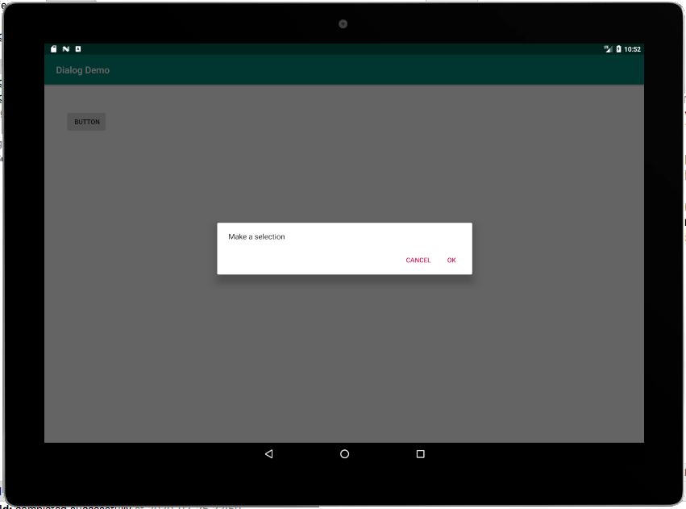

Довольно часто в наших приложениях мы хотим показать пользователю некоторую информацию или попросить подтверждения действия во всплывающем окне. Это называется диалоговым окном. Если вы посмотрите на панель **Palette**, возможно будите удивлены, не увидев никакого упоминания о диалогах.

Диалоги в Android являются более продвинутыми, чем простой виджет или даже целый макет. Это классы, которые сами могут иметь собственные макеты и другие элементы пользовательского интерфейса.

Лучший способ создать диалоговое окно в Android - это использовать класс **FragmentDialog**.

> Сами фрагменты (**Fragments**) - обширная и жизненно важная тема в Android, и скоро мы будем исследовать и использовать их. Создание аккуратного всплывающего диалога (с помощью FragmentDialog) для взаимодействия с нашим пользователем, является отличным введением во фрагменты и не слишком сложным.

## Создание проекта Dialog Demo
Помимо использования класса **FragmentDialog**, в Android есть еще один способ создания диалогов, который, возможно проще. Использование класса **Dialog**. Проблема с этим более простым классом заключается в том, что он не так хорошо поддерживается в жизненном цикле Activity, и может случайно привести к сбою приложения.

Если вы пишете приложение с одним фиксированным макетом ориентации, которому требуется только один простой всплывающий диалог, вам точно можно использовать класс **Dialog**. Но поскольку мы стремимся создавать современные, профессиональные приложения с расширенными функциями, мы выиграем от игнорирования этого класса в пользу **FragmentDialog**.

Создайте новый проект в Android Studio, используя шаблон **Empty Activity**, и назовите его ```Dialog Demo```.

## Кодирование класса DialogFragment
Создайте новый класс, щелкнув правой кнопкой мыши на папке с именем вашего пакета (папка, которая содержит файл MainActivity.java). Выберите **New | Java class** и назовите его ```MyDialog```. Нажмите **ОК**, чтобы создать класс.

Первое, что нужно сделать, это изменить объявление класса отнаследовавшись от **DialogFragment**. Когда вы это сделаете, ваш новый класс будет выглядеть так:
```java
public class MyDialog extends DialogFragment {
}
```
Если при этом Android Studio не импортировала класс **androidx.fragment.app.DialogFragment**, сделайте это самостоятельно (Alt + Enter)

Теперь давайте добавим немного кода к этому классу и объясним, что происходит на каждом шаге.

Как и многие классы в Android API, DialogFragment предоставляет нам методы, которые мы можем переопределить для взаимодействия с различными событиями, которые будут происходить с классом.

Добавьте следующий код, который переопределяет метод **onCreateDialog**. Внимательно изучите его, а затем мы рассмотрим, что происходит.
```java
    @Override
    public Dialog onCreateDialog(Bundle savedInstanceState) {
        AlertDialog.Builder builder = new AlertDialog.Builder(getActivity());
    }
```
Вам нужно будет импортировать классы **Dialog**, **Bundle** и **AlertDialog**, если это не сделала Android Studio, обычным способом или вручную добавив следующий код
```java
import android.app.AlertDialog;
import android.app.Dialog;
import android.os.Bundle;
```

> В коде есть одна ошибка, потому что наш метод ничего не возвращает, мы добавим **return** c нужным типом, когда закончим кодировать оставшуюся часть.

В коде, который добавили, мы переопределили метод **onCreateDialog**, который будет вызван Android, когда мы позже покажем диалог из класса **MainActivity**.

Затем, внутри метода **onCreateDialog**, мы объявляем и инициализируем объект AlertDialog.Builder, которому требуется ссылка на **MainActivity**, передаваемый в его конструктор. Вот почему мы используем **getActivity()** в качестве аргумента.

Метод **getActivity** является частью класса **Fragment** (и, следовательно, **DialogFragment** тоже) и возвращает ссылку на активность, которая создаст **DialogFragment**. В данном случае это наш класс **MainActivity**.

Давайте посмотрим, что мы можем сделать с builder теперь, когда мы объявили и инициализировали его.

### Использование цепочек (chaining) для настройки DialogFragment
Теперь мы можем использовать наш объект ```builder``` для выполнения остальной работы. В следующем блоке кода есть что-то немного странное. Если вы быстро просканируете его, то заметите явное отсутствие ```;```. Это показывает нам, что этот блок кода на самом деле являются всего лишь одной строкой для компилятора.

То есть мы вызывали несколько методов, последовательно, для одного и того же объекта. Это равносильно написанию нескольких строк кода, просто так будет короче.
```java
        builder.setMessage("Make a selection")
            .setPositiveButton("OK", new DialogInterface.OnClickListener() {
                @Override
                public void onClick(DialogInterface dialogInterface, int i) {
                    // что-то делаем
                }
            })
            .setNegativeButton("Cancel", new DialogInterface.OnClickListener() {
                @Override
                public void onClick(DialogInterface dialogInterface, int i) {
                    // что-то делаем
                }
            });
```
Если Android Studio не импортировал класс DialogInterface. Сделайте это сами используя (Alt + Enter) или добавьте эту строку кода к другим инструкциям импорта:
```java
import android.content.DialogInterface;
```
- В первом вызове цепочки, мы используем **setMessage**, который задает сообщение, которое пользователь увидит в диалоговом окне. 
- Затем мы добавляем кнопку в наше диалоговое окно с помощью метода **setPositiveButton**, и первый аргумент устанавливает текст на ней в ```OK```. Вторым аргументом является анонимный классом реализующий интерфейс **DialogInterface.OnClickListener**, который обрабатывает клики на этой кнопке. 
- Затем мы вызываем метод **setNegativeButton**. Опять же, два аргумента устанавливают ```Cancel``` в качестве текста для кнопки и анонимный класс для прослушивания щелчков. После вызова **setNegativeButton** мы, наконец, видим точку с запятой, отмечающую для компилятора конец выражения.

Чтобы завершить метод **onCreateDialog** и удалить ошибку. Добавим оператор **return**
```java
return builder.create();
```
Эта последняя строка кода имеет эффект возврата в **MainActivity** (который вызвал/вызовет **onCreateDialog** в первую очередь) нашего нового, полностью настроенного, диалогового окна. Скоро мы добавим вызывающий код.

Теперь, когда у нас есть класс **MyDialog**, который расширяет **FragmentDialog**. Все, что нам нужно осталось сделать, создать его экземпляр, что вызовет его переопределенный метод **createDialog**.

## Использование класса DialogFragment
Давайте добавим кнопку в наш макет, выполнив следующие шаги:

- Переключитесь на вкладку **activity_main.xml**, добавте кнопку и в атрибут **id** напишите значение ```button```. Нажмите кнопку **Infer Constraints**, чтобы ограничить кнопку именно там, где вы ее разместили.
- Теперь переключитесь на вкладку MainActivity.java и добавте обработчик события **click** на эту кнопку с помощью анонимного класса, как мы это делали в предыдущей главе.
```java 
        button.setOnClickListener(new View.OnClickListener() {
            @Override
            public void onClick(View view) {
                MyDialog myDialog = new MyDialog();
                myDialog.show(getSupportFragmentManager(), "123");
            }
        });
```
Eдинственное, что происходит в методe **onClick**, это создается новый экземпляр **MyDialog** и вызывается его метод **show**, который, покажет наше диалоговое окно точно так, как мы настроили его в классе MyDialog.

Метод **show** нуждается в ссылке на **FragmentManager**, которую мы получаем с помощью **getSupportFragmentManager**. Это класс, который отслеживает и контролирует все экземпляры **Fragment** для активности. Мы также передаем "123" в качестве id.

Более подробная информация о FragmentManager будет раскрыта, когда мы будем более глубоко рассматривать фрагменты.

Теперь мы можем запустить приложение и полюбоваться нашим новым диалоговым окном, которое появляется, когда мы нажимаем кнопку. Обратите внимание, что нажатие любой из кнопок в диалоговом окне закроет его. Это поведение по умолчанию. На следующем скриншоте показано наше диалоговое окно в действии:



Далее в этой главе мы сделаем еще два класса, которые реализуют диалоги в качестве первой части нашего приложения **Note to self**. Мы увидим, что диалоговое окно может иметь практически любой макет, который мы выбираем, и что нам не нужно полагаться на простые макеты, которые использует диалоговое окно.
