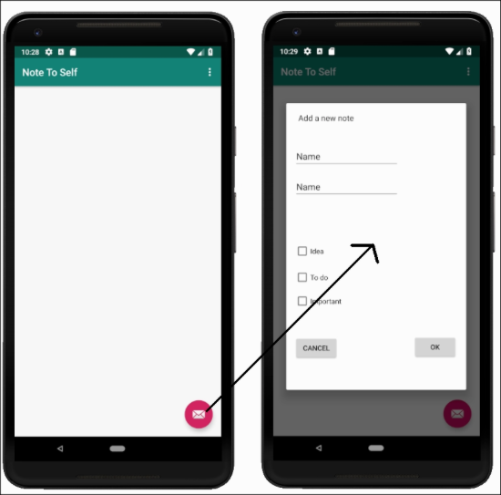
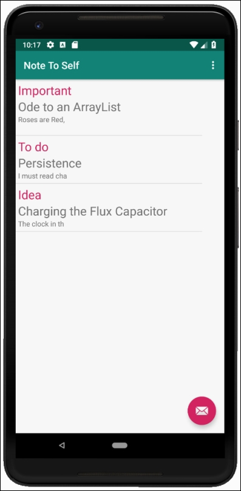
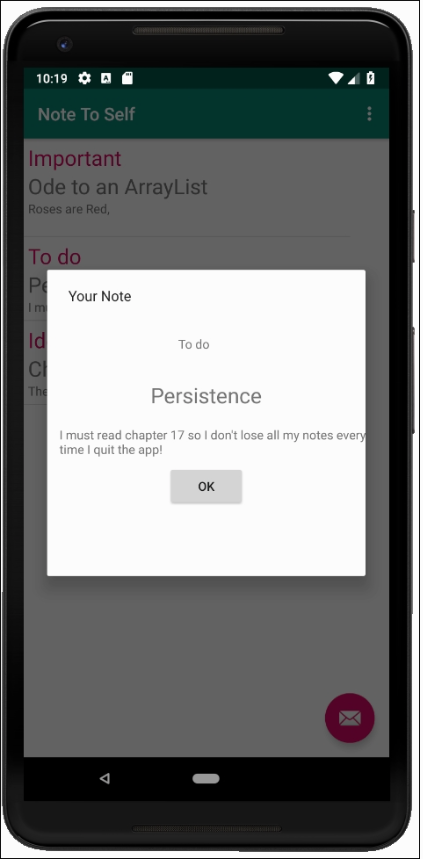
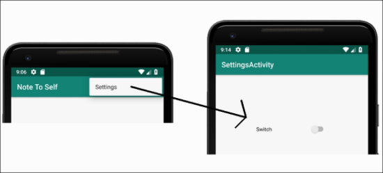
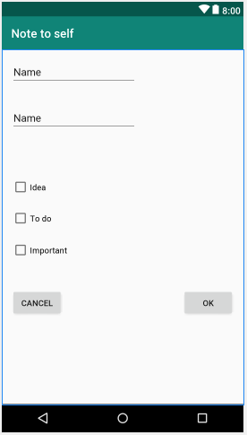
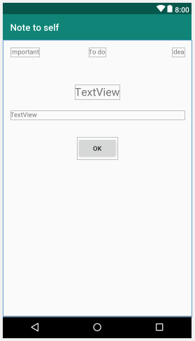
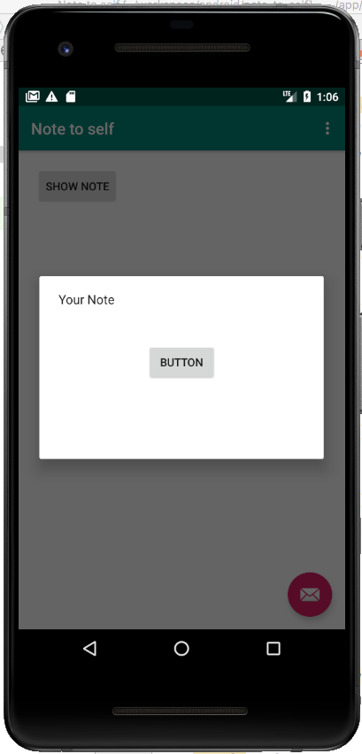
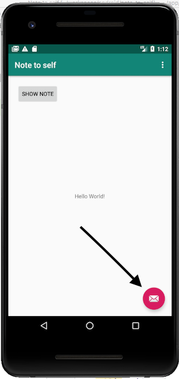

Добро пожаловать в первое из четырех основных приложений, которые мы будем реализовывать. Когда мы делаем эти проекты, мы будем делать их более профессионально, чем небольшие приложения. Мы будем использовать соглашения об именовании в Android, строковые ресурсы и надлежащую инкапсуляцию.

Эти вещи излишни, когда вы пытаетесь изучить новую тему Android | Java. Но они полезны и важны в реальных проектах. Качество наших приложений от их использования только выйграет.

## Использование соглашений об именовании и строковые ресурсы
Исследуя Android Studio и структуру проекта, мы говорили об использовании строковых ресурсов, вместо жесткого кодирования текста в наших файлах макета.

Поскольку это наш первый реальный проект, было бы неплохо сделать все правильно, чтобы мы могли получить правильный опыт.

Соглашения об именовании - это соглашения или правила, используемые для именования переменных, методов и классов. До сих пор мы свободно применяли соглашения об именовании в Android. Сейчас, мы будем применять их немного строже.

> Дополнительную информацию о правилах именования в Android и стиле кода можно найти [здесь](https://source.android.com/source/code-style.html).

## Завершенное приложение
Следующие функции и скриншоты взяты из завершенного приложения. Очевидно, что на разных стадиях развития это будет выглядеть несколько иначе.

Завершенное приложение позволит пользователю нажать кнопку в правом нижнем углу приложения, чтобы открыть диалоговое окно для добавления новой заметки. Вот скриншот, который это показывает:



В конечном итоге, когда пользователь добавляет заметки, на главном экране приложения у него будет список всех заметок, которые он добавил. Пользователь может выбрать, является ли заметка важной (**important**), идеей (**idea**) или делом (**To do**):



Он может прокрутить список и нажать на заметку, чтобы увидеть ее в другом диалоговом окне, посвященном этой заметке.



Там также будет простой (cупер простой) экран настроек, доступный из меню, которое позволит пользователю настроить форматирование списка заметок с разделительной линией.



Теперь, когда мы точно знаем, что собираемся построить, можем идти вперед и начинать реализовывать.

## Построение проекта
Давайте создадим наш новый проект прямо сейчас. Используйте шаблон **Basic Activity** и назовите проект ```Note to self```. Этот шаблон будет генерировать простое меню, а также плавающую кнопку действия, которые используются в этом проекте.

### Подготовка строковых ресурсов
Мы создадим все строковые ресурсы, на которые мы будем ссылаться из наших файлов макетов, вместо жесткого кодирования свойства text, как мы делали до сих пор. Конечно, этого шага можно было не делать. Тем не менее, если вы хотите делать качественные приложения для Android, вам будет полезно научиться делать все по правилам.

Для начала откройте файл strings.xml из папки **res | values**. Вы увидите автоматически cгенерированные ресурсы. Добавьте следующий код, перед закрывающим тегом **</ resources>**. Мы будем использовать их в нашем приложении на протяжении всей остальной части проекта.
```xml
    <string name="action_add">add</string>
    <string name="title_hint">Title</string>
    <string name="description_hint">Description</string>
    <string name="idea_text">Idea</string>
    <string name="important_text">Important</string>
    <string name="todo_text">To do</string>
    <string name="cancel_button">Cancel</string>
    <string name="ok_button">OK</string>

    <string name="settings_title">Settings</string>
    <string name="theme_title">Theme</string>
    <string name="theme_light">Light</string>
    <string name="theme_dark">Dark</string>
```
Обратите внимание, что каждый строковый ресурс имеет атрибут **name**, который уникален и отличает его от всех остальных, а также предоставляет значимый и запоминающийся ключ к фактическому значению строки, которое он представляет. Именно эти ключи мы будем использовать для ссылки на строку, которую мы хотим видеть в наших макетах.

## Кодирование класса Note
Это фундаментальная структура данных приложения. Это класс, в котором есть все переменные экземпляра, необходимые для представления одной заметки пользователя. В следующей главе мы изучим некоторые возможности **Java**, и увидем, как мы можем позволить пользователю иметь десятки, сотни или даже тысячи заметок.

Создайте новый класс, щелкнув правой кнопкой мыши на папке с именем вашего пакета, той, которая содержит файл MainActivity.java. Выберите **New | Java class** и назовите его Note. Нажмите ОК, чтобы создать класс.
```java
public class Note {
    private String title;
    private String description;
    private boolean idea;
    private boolean todo;
    private boolean important;
}
```
Обратите внимание, что мы не хотим, чтобы какой-либо другой класс имел прямой доступ к  переменным экземпляра класса **Note**, поэтому все они объявляются как **private** и нам понадобятся геттеры и сеттеры для каждого из них.

> Вместо написания кода в ручную, можно воспользоваться функцией генерации кода. Нажмите правую клавишу внутри класса Note и выберите пукт меню **generate...**, дальше **Getter and Setter**. В появившемся окне выбираем все члены, для которых необходимо произвести генерацию методов и нажмите **OK**. Profit!

```java
    public String getTitle() {
        return title;
    }

    public void setTitle(String title) {
        this.title = title;
    }

    public String getDescription() {
        return description;
    }

    public void setDescription(String description) {
        this.description = description;
    }

    public boolean isIdea() {
        return idea;
    }

    public void setIdea(boolean idea) {
        this.idea = idea;
    }

    public boolean isTodo() {
        return todo;
    }

    public void setTodo(boolean todo) {
        this.todo = todo;
    }

    public boolean isImportant() {
        return important;
    }

    public void setImportant(boolean important) {
        this.important = important;
    }
```
Тут довольно много кода, но в нем нет ничего сложного. Каждый из методов имеет модификатор доступа **public**, поэтому он может использоваться любым другим классом, имеющим ссылку на объект типа **Note**. Кроме того, для каждой переменной экземпляра существует метод с именем get..., и set... . Обратите внимание, геттеры для переменных логического типа называются is....

Каждый из геттеров просто возвращает значение связанной переменной, и каждый из сеттеров устанавливает значение связанной переменной в любое значение параметра, передаваемого в метод.

> На самом деле, нам следует немного улучшить наши сеттеры, сделав небольшую проверку, чтобы убедиться, что передаваемые значения находятся в разумных пределах. Например, проверять максимальную или минимальную длину строк для **title** и **description**. Однако, мы не будем делать этого здесь, поскольку это только затуманит реальные цели обучения связанные с этим проектом.

Теперь давайте спроектируем макеты двух диалоговых окон.

## Реализация диалоговых макетов
Теперь мы сделаем то, что делали уже много раз. Как мы знаем, у нас будет два диалоговых окна: первое чтобы ввести новую заметку, второе чтобы просмотреть заметку по своему выбору.

Мы можем проектировать макеты этих двух диалоговых окон точно так же, как мы проектировали все наши предыдущие макеты. Когда мы приступим к созданию кода Java для классов FragmentDialog, мы увидим, как мы включаем эти макеты.

Давайте добавим макет для нашего диалогового окна **new note**, выполнив следующие действия:

1. Создайте новый макет в папе **layout**. Введите ```dialog_new_note``` в поле **File name**, а затем начните вводить ```Constrai``` в поле корневого элемента. Обратите внимание, что появляется выпадающий список с несколькими вариантами, которые начинаются с ```Constrai```. Выберите **androidx.constraintlayout.widget.ConstraintLayout**. Нажмите **OK**, чтобы создать новый файл макета.
2. Cледуя остальным инструкциям, создайте следующий макет



3. Перетащите **PlainText** в самый верхний левый угол макета, а затем добавьте еще один под ним.
4. Перетащите три **CheckBox**, один под другим. 
5. Перетащите две кнопки, первую непосредственно под последним **Checkbox**, а вторую на одной горизонтали с первой кнопкой, но справа.
6. Приведите макет в порядок так, чтобы он максимально напоминал скриншот, а затем нажмите кнопку **Infer Constraints**, чтобы привязать выбранные позиции.
7. Теперь настроим свойства **text**, **id** и **hint**. Используйте значения из следующей таблицы. Помните, что мы используем строковые ресурсы для свойств **text** и **hint**:

| виджет              | атрибут   | значение                             |
|---------------------|-----------|--------------------------------------|
| PlainText (верхний) | id        | editTitle                            |
| PlainText (верхний) | hint      | @string/title_hint                   |
| PlainText (нижний)  | id        | editDescription                      |
| PlainText (нижний)  | hint      | @string/description_hint             |
| PlainText (нижний)  | inputType | textMultiLine (уберите другие опции) |
| Checkbox (верхний)  | id        | checkBoxIdea                         |
| Checkbox (верхний)  | text      | @string/idea_text                    |
| Checkbox (средний)  | id        | checkBoxTodo                         |
| Checkbox (средний)  | text      | @string/todo_text                    |
| Checkbox (нижний)   | id        | checkBoxImportant                    |
| Checkbox (нижний)   | text      | @string/important_text               |
| Button (левый)      | id        | btnCancel                            |
| Button (левый)      | text      | @string/cancel_button                |
| Button (правый)     | id        | btnOk                                |
| Button (правый)     | text      | @string/ok_button                    |

Теперь у нас есть хороший аккуратный макет, готовый для отображения. Важно то, что макет имеет идентификатор для каждого соответствующего элемента, так что мы можем получить ссылку на него.

Давайте сделаем диалоговое окно **show note** 

1. Создайте новый макет в папке **layout** c именем ```dialog_show_note``` и корневым элементом **androidx.constraintlayout.widget.ConstraintLayout**.
2. Cледуя остальным инструкциям, создайте следующий макет


3. Перетащите три **TextView**, вертикально выровненные по верхней части макета.
4. Затем перетащите еще один TextView, по центру, чуть ниже трех предыдущих **TextView**.
5. Добавьте еще один **TextView** чуть ниже центрального, но слева.
6. Добавьте кнопку в нижней части макета по центру.
7. Приведите макет в порядок так, чтобы он максимально напоминал скриншот, а затем нажмите кнопку **Infer Constraints**, чтобы привязать выбранные позиции.
8. Настройте атрибуты из следующей таблицы:

| виджет                | атрибут  | значение               |
|-----------------------|----------|------------------------|
| TextView (top-left)   | id       | textViewImportant      |
| TextView (top-left)   | text     | @string/important_text |
| TextView (top-center) | id       | textViewTodo           |
| TextView (top-center) | text     | @string/todo_text      |
| TextView (top-right)  | id       | textViewIdea           |
| TextView (top-right)  | text     | @string/idea_text      |
| TextView (center)     | id       | txtTitle               |
| TextView (center)     | textSize | 24sp                   |
| TextView (left)       | id       | txtDescription         |
| Button                | id       | btnOk                  |
| Button (правый)       | text     | @string/ok_button      |

> Вам может захотеться изменить позиции виджетов, после изменения атрибутов. Можете это быстро сделать так: нажмите кнопку **Clear all Constraints**, измените расположение элементов в макете, и снова нажмите кнопку **Infer Constraints**.

Теперь у нас есть макет, который мы можем использовать для показа заметки пользователю. Обратите внимание, что мы можем повторно использовать некоторые строковые ресурсы. Чем больше наши приложения становятся, тем выгоднее использовать строковые ресурсы.

## Кодирование диалоговых окон
Теперь, когда у нас есть макеты для обоих диалоговых окон (**show note** и **new note**), мы можем использовать класс **FragmentDialog**, чтобы реализовать классы для представления каждого из диалоговых окон, с которыми может взаимодействовать пользователь.

Начнем с **new note**

### Кодирование класса DialogNewNote 
Создайте новый класc **DialogNewNote**.

Измените объявление класса отнаследовавшись от **DialogFragment**. Кроме этого, переопределите метод **onCreateDialog**, в котором будет содержаться весь остальной код в этом классе.
```java
public class DialogNewNote extends DialogFragment {

    @Override
    public Dialog onCreateDialog(Bundle savedInstanceState) {
    }
}
```
Дальше, сначала мы объявим и инициализируем объект AlertDialog.Builder, как мы делали раньше. Однако на этот раз мы будем использовать этот объект меньше.

Затем мы инициализируем объект **LayoutInflater**, который мы будем использовать для "надувания" (inflate) нашего XML-макета. **Inflate** просто означает превратить наш XML-макет в объекты Java. Как только это будет сделано, мы сможем получить доступ ко всем виджетам обычным способом. 
```java
        AlertDialog.Builder builder = new AlertDialog.Builder(getActivity());
        LayoutInflater inflater = getActivity().getLayoutInflater();

        View dialogView = inflater.inflate(R.layout.dialog_new_note, null);
```
Мы можем думать о **inflater.inflate** как о замене **setContentView** для нашего диалога.

> Если Android Studio не импортировала классы автоматически, сделайте это с помощью (Alt + Enter) или добавте следующие стоки:
```java
import android.app.AlertDialog;
import android.view.LayoutInflater;
import android.view.View;
```

Теперь у нас есть объект типа **View** под названием ```dialogView```, который имеет весь пользовательский интерфейс из файла dialog_new_note.xml

Пойдем дальше и получим ссылку на каждый из виджетов пользовательского интерфейса обычным способом. 
```java
        final EditText editTitle = (EditText) dialogView.findViewById(R.id.editTitle);
        final EditText editDescription = (EditText) dialogView.findViewById(R.id.editDescription);
        // дальше самостоятельно
```
Все переменные, кроме ссылок на кнопки, должны иметь модификатор **final**, поскольку они будут использоваться в анонимном классе, а как мы узнали ранее, это необходимо. Надеюсь вы помните, что именно ссылка является окончательной (не может измениться). Мы все еще можем изменить объекты в куче, на которые сылаются ссылки.

> Если Android Studio не импортировала классы автоматически, сделайте это с помощью (Alt + Enter) или добавте следующие стоки:
```java
import android.widget.Button;
import android.widget.CheckBox;
import android.widget.EditText;
```
Далее мы установим сообщение диалога с помощью ```builder```. Затем мы напишем анонимный класс для обработки кликов на ```btnCancel```. В переопределенном методе **onClick** мы просто вызовем метод **dismiss**, который является публичным методом **DialogFragment**, чтобы закрыть диалоговое окно. Это как раз то, что нам нужно, если пользователь нажмет кнопку ```Cancel```.

```java
        builder.setView(dialogView).setMessage("Add a new note");

        btnCancel.setOnClickListener(new View.OnClickListener() {
            @Override
            public void onClick(View view) {
                dismiss();
            }
        });
```
Теперь мы добавим анонимный класс для кнопку ```btnOK```.

Сначала, мы создаем новую заметку (объект типа **Note**) под названием ```newNote```. Затем устанавливаем каждому свойству ```newNote``` соответствующее значение из элементов диалога.

После этого мы создаем ссылку на **MainActivity** с помощью метода **getActivity**, и используем эту ссылку для вызова метода **createNewNote** у **MainActivity** и отправляем в него аргумент ```newNote```. Это приведет к отправке новой заметки обратно в **MainActivity**.
```java
        btnOk.setOnClickListener(new View.OnClickListener() {
            @Override
            public void onClick(View view) {
                Note newNote = new Note();
                newNote.setTitle(editTitle.getText().toString());
                newNote.setDescription(editDescription.getText().toString());
                newNote.setIdea(checkBoxEdia.isChecked());
                newNote.setImportant(checkBoxImportant.isChecked());
                newNote.setTodo(checkBoxTodo.isChecked());

                MainActivity callingActivity = (MainActivity) getActivity();
                callingActivity.createNewNote(newNote);

                dismiss();
            }
        });

        return builder.create();
```
В конце, мы вызываем метод **dismiss**, чтобы закрыть диалоговое окно.
> Обратите внимание, что мы еще не написали метод **createNewNote**, и компилятор покажет ошибку. Скоро мы его добавим.

Наш первый диалог готов, давайте создадим следующий.

### Кодирование класса DialogShowNote
Создайте новый класс **DialogShowNote**.

Измените объявление класса отнаследовавшись от **DialogFragment** и переопределите метод **onCreateDialog**.

Объявим приватную переменную экземпляра ```note``` типа **Note**. Также добавим метод **sendNoteSelected** c его единственной строкой кода, которая будет инициализировать ```note```. Этот метод будет вызван **MainActivity** c переданным объектом типа **Note**, на который нажал пользователь.
```java
public class DialogShowNote extends DialogFragment {

    private Note note;

    @Override
    public Dialog onCreateDialog(Bundle savedInstanceState) {
    }

    public void sendNoteSelected(Note noteSelected) {
        note = noteSelected;
    }
}
```
> Проблемы с импортом? Добавляем следующие стоки:
```java
import android.app.Dialog;
import android.os.Bundle;
import androidx.fragment.app.DialogFragment;
```

Далее, как и в случае DialogNewNote, мы объявляем и инициализируем экземпляр **AlertDialog.Builder**, объявляем и инициализируем **LayoutInflater**, а затем используем его для создания объекта **View**, содержащего макет для диалогового окна (**dialog_show_note.xml**) и получаем ссылки на каждый из виджетов макета.  
**Реализуйте самостоятельно**

Затем, устанавливаем значение атрибута **text** у ```txtTitle``` и ```txtDescription``` из соответствующих переменных ```note```.

```java
        txtTitle.setText(note.getTitle());
        txtDescription.setText(note.getDescription());
```
Далее, проверим, является ли показываемая заметка "важной", и показываем или скрываем ```textImportant``` соответственно. 
```java
        if (!note.isImportant()) {
            textImportant.setVisibility(View.GONE);
        }
```
Тоже самое сделайте для ```textTodo``` и ```textIdea```.

Все, что осталось сделать, это закрыть диалоговое окно, когда пользователь нажимает кнопку **OK**. Это делается с помощью анонимного класса, как мы уже видели несколько раз. Метод **onClick** просто вызывает метод **dismiss**, который закрывает диалоговое окно. 
**Реализуйте самостоятельно**.

Теперь у нас есть два диалоговых окна, готовые к запуску. Нам просто нужно добавить некоторый код в **MainActivity**, чтобы закончить работу.

## Показываем наши диалоговые окна
Добавьте переменную экземпляра, сразу после объявления **MainActivity**. Это временное решение, просто для того, чтобы мы могли проверить наши диалоговые окна:
```java
    Note tempNote = new Note();
```
Затем добавим метод **createNewNote**, чтобы мы могли получить новую заметку от класса **DialogNewNote**:
```java
    public void createNewNote(Note note) {
        tempNote = note;
    }
```
Теперь, чтобы отправить заметку в метод **sendNoteSelected** класса **DialogShowNote**, нам нужно добавить кнопку в файл макета layout_main.xml

Просто чтобы было понятно, для чего предназначена эта кнопка, мы изменим ее атрибут **text** на ```Show Note```.  
**Добавте кнопку самостоятельно**. Атрибуту **id** установите значение ```button```.

> Это временная кнопка для тестирования и потом будет удалена. В конце разработки мы будем нажимать на название заметки из списка.

Далее, в методе **onCreate** класса **MainActivity**, необходимо создать анонимный класс для обработки кликов по нашей временной кнопке (**сделайте это самостоятельно**). Код в **onClick** будет следующим:
```java
    DialogShowNote dialog = new DialogShowNote();
    dialog.sendNoteSelected(tempNote);
    dialog.show(getSupportFragmentManager(), "123");
```
Создается новый экземпляр класса **DialogShowNote**, у него вызывается метод **sendNoteSelected**, чтобы передать объект ```tempNote```. Вызывается метод **show** для отображения нашего диалогового окна.

Теперь мы можем вызвать наше диалоговое окно **DialogShowNote** одним нажатием кнопки. Запустите приложение и нажмите кнопку ```Show Note```, чтобы увидеть диалоговое окно **DialogShowNote** с макетом dialog_show_note.xml



Да, думаю не впечатляет :), особенно учитывая сколько  мы сделали, но когда мы получим работающий **DialogNewNote**, мы увидим, как **MainActivity** взаимодействует и обменивается данными между двумя диалогами.

Давайте сделаем диалог **DialogNewNote** используемым.

### Кодирование плавающей кнопки действия
Это будет очень просто. Плавающая кнопка действия была предусмотрена для нас в макете. В качестве напоминания, это плавающая кнопка действия:



Она находится в файле activity_main.xml. Вот код, который позиционирует и определяет ее внешний вид:
```xml
    <com.google.android.material.floatingactionbutton.FloatingActionButton
        android:id="@+id/fab"
        android:layout_width="wrap_content"
        android:layout_height="wrap_content"
        android:layout_gravity="bottom|end"
        android:layout_margin="@dimen/fab_margin"
        app:srcCompat="@android:drawable/ic_dialog_email" />
```
Android Studio даже предоставила анонимный класс для обработки кликов по плавающей кнопке действия. Все, что нам нужно сделать, это добавить некоторый код к методу **onClick** этого класса, и мы cможем использовать класс **DialogNewNote**.

Плавающая кнопка действия обычно используется для основного действия приложения. Например, в приложении электронной почты она, вероятно, будет использоваться для создания нового сообщения электронной почты, а в приложении для ведения заметок, вероятно, будет использоваться для добавления новой заметки. Так что давайте сделаем это.

В MainActivity.java, найдите автоматически сгенерированный код, в методе **onCreate**. Вот он:
```java
        FloatingActionButton fab = findViewById(R.id.fab);
        fab.setOnClickListener(new View.OnClickListener() {
            @Override
            public void onClick(View view) {
                Snackbar.make(view, "Replace with your own action", Snackbar.LENGTH_LONG)
                        .setAction("Action", null).show();
            }
        });
```
Сгенерированное содержимое метода **onClick** заменим на
```java
    DialogNewNote dialog = new DialogNewNote();
    dialog.show(getSupportFragmentManager(), "");
```
Теперь мы можем запустить приложение и проверить работоспособность всего что написали.
