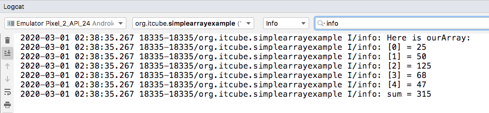

Создайте проект с пустой активностью **Empty Activity** и назовите его ```Simple Array Example```.

Сначала мы объявим наш массив типа **int**, выделим память на пять элементов и инициализируем значения для каждого. Затем мы выводим значение каждого элемента в консоль **Logcat**. Добавьте следующий код в метод **onCreate** сразу после вызова **setContentView**:
```java
        int[] ourArray;

        ourArray = new int[5];

        ourArray[0] = 25;
        ourArray[1] = 50;
        ourArray[2] = 125;
        ourArray[3] = 68;
        ourArray[4] = 47;

        Log.i("info", "Here is ourArray:");
        Log.i("info", "[0] = " + ourArray[0]);
        Log.i("info", "[1] = " + ourArray[1]);
        Log.i("info", "[2] = " + ourArray[2]);
        Log.i("info", "[3] = " + ourArray[3]);
        Log.i("info", "[4] = " + ourArray[4]);
```
Далее, мы складываем все значения элементов массива, так же, как мы могли бы сложить обычные переменные типа **int**. 
```java
        int sum = ourArray[0] +
                ourArray[1] +
                ourArray[2] +
                ourArray[3] +
                ourArray[4];
        Log.i("info", "sum = " + sum);
```
Обратите внимание, что когда мы складываем элементы массива, мы делаем это на нескольких строчках. Это нормально, поскольку мы не ставим точку с запятой до последней операции, поэтому, компилятор Java обрабатывает строки как одно выражение. 

Запустите пример и посмотрите вывод в окне **Logcat**.

> На дисплее эмулятора ничего не произойдет, так как все выходные данные будут отправлены в окно консоли **Logcat** в Android Studio.



Мы можем видеть, что все значения были сложены, так же, как если бы они были простыми типами **int**, которыми они и являются, но просто хранятся по-другому.
