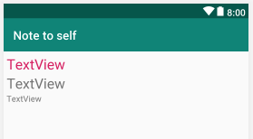
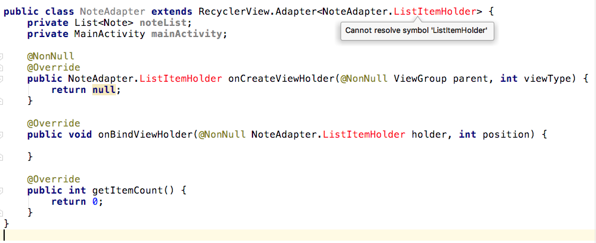
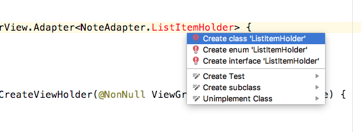
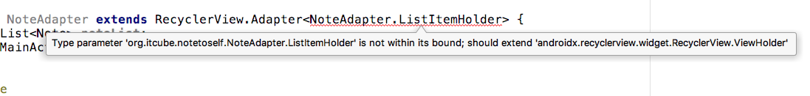

## Удаление временной кнопки Show Note и добавление RecyclerView
Этот шаг удалит временный код, который мы добавили в главе ```Диалоговые окна в Android```, и подготовит наш **RecyclerView** к привязке к **RecyclerAdapter**.

- В content_main.xml, удалите временную кнопку с идентификатором ```button```, которую мы добавили в целях тестирования.
- В методе **onCreate**  MainActivity.java, удалите объявление кнопки и инициализацию вместе с анонимным классом, который обрабатывает нажатия по ней.
- В content_main.xml перетащите на макет **RecyclerView**, из категории **Common** панели **Palette**.
- Установите свойству **id** значение ```recyclerView```.

## Создание элемента списка для RecyclerView
Далее, нам нужен макет, чтобы отобразить каждый элемент в **RecyclerView**. Как уже упоминалось ранее, мы будем использовать **LinearLayout**, который содержит три виджета **TextView**.

1. Создайте новый макет в папке **layout**, c названием ```listitem``` и корневым элементом **LinearLayout**.
2. На следующем скриншоте показан конечный вид макета.



3. Перетащите три **TextView** на макет, один над другим. Первый (верхний) **TextView** будет содержать тип заметки (idea|important|todo). Второй название заметки, а третий саму заметку.
4. Настройте различные атрибуты виджетов **LinearLayout** и **TextView**, как показано в следующей таблице:

| виджет            | атрибут       | значение            |
|-------------------|---------------|---------------------|
| LinearLayout      | layout_height | wrap_content        |
| LinearLayout      | layout_margin | 5dp                 |
| TextView (top)    | id            | textViewStatus      |
| TextView (top)    | textSize      | 24sp                |
| TextView (top)    | textColor     | @color/colorAccent  |
| TextView (middle) | id            | textViewTitle       |
| TextView (middle) | textSize      | 24sp                |
| TextView (bottom) | id            | textViewDescription |

Теперь у нас есть **RecylerView** для основного макета и макет для каждого элемента в списке. Мы можем пойти дальше и закодировать нашу реализацию **RecyclerAdapter**.

## Кодирование класса RecyclerAdapter
Создайте новый класс ```NoteAdapter```. Измените объявление класса на следующее:
```java
public class NoteAdapter extends RecyclerView.Adapter<NoteAdapter.ListItemHolder> {
}
```

В тело класса добавте следующие переменные экземпляра:
```java
    private List<Note> noteList;
    private MainActivity mainActivity;
```
Импортируйте недостающие классы.

Объявление класса подчеркнуто красным цветом, показывая, что в нашем коде есть ошибка. Ошибка заключается в том, что наследование от **RecylerView.Adapter** нуждается в переопределении некоторых его абстрактных методов.

Самый быстрый способ сделать это - щелкнуть по строке объявления класса, нажать ``Alt + Enter```. Выберите **Implement methods**.

Это добавит следующие три метода:

- **onCreateViewHolder**, который вызывается, когда требуется макет элемента списка.
- **onBindViewHolder**, который вызывается, когда **RecyclerAdapter** связан (соединен) с **RecyclerView** в макете.
- **getItemCount**, который будет использоваться для возврата количества экземпляров **Note** в **ArrayList**. Пока он просто возвращает ноль.

Вскоре мы добавим код к каждому из этих методов, чтобы выполнить необходимую работу в определенное время.

Обратите внимание, что у нас все еще есть несколько ошибок в нашем коде, в том числе в автоматически cгенерированных методах, а также в объявлении класса. 



Ошибки выводятся потому, что класс **NoteAdapter.ListItemHolder** не существует. ListItemHolder был добавлен нами, когда мы расширили NoteAdapter. Это выбранный нами класс, который будет использоваться в качестве хранителя для каждого элемента списка. На данный момент его не существует – отсюда и ошибка. Два метода, которые имеют подобную ошибку, были автоматически сгенерированы, когда мы попросили Android Studio реализовать отсутствующие методы.

Давайте решим эту проблему. Нам будет полезно, чтобы экземпляры **ListItemHolder** могли обмениваться данными/переменными с **NoteAdapter**, поэтому мы создадим **ListItemHolder** как внутренний класс **NoteAdapter**.

Щелкните на ошибке, нажмите ```Alt + Enter``` и выберите **Create class 'ListItemHolder'**



Следующий код был добавлен в класс **NoteAdapter**:
```java
    public class ListItemHolder {
    }
```
Но есть еще одна ошибка с объявлением класса, как показано далее на этом скриншоте:



Сообщение об ошибке говорит 'бла-бла, все плохо ...; должен расширять **android.recylerview.widget.RecyclerView.ViewHolder**, потому что добавленный **ListItemHolder** должен расширять **RecyclerView.ViewHolder** для использования в качестве параметризованного типа.

Измените объявление класса **ListItemHolder**, чтобы он соответствовал этому коду:
```java
    public class ListItemHolder extends RecyclerView.ViewHolder implements View.OnClickListener {
    }
```

Теперь ошибка исчезла из объявления класса **NoteAdapter**, но, из-за того, что мы объявили реализацию интерфейса **View.OnClickListener**, нам нужно реализовать метод **onClick**. Кроме того, **RecyclerView.ViewHolder** не предоставляет конструктор по умолчанию, поэтому нам нужно определить конструтор. Добавьте метод **onClick** (пустой на данный момент) и метод конструктора (пустой на данный момент) в класс **ListItemHolder**:
```java
        public ListItemHolder(View view) {
            super(view);
        }

        @Override
        public void onClick(View view) {

        }
```
> Добавить необходимо во внутренний класс **ListItemHolder**, а не в **NoteAdapter**.

После долгих манипуляций и автоматической генерации, у нас, наконец, есть класс **NoteAdapter** с переопределенными методами и внутренним классом, который мы можем закодировать, чтобы заставить наш **RecyclerAdapter** работать. Кроме того, мы можем написать код для обработки нажатий на каждом из наших экземпляров **ListItemHolder**.

### Кодирование конструктора NoteAdapter
Далее мы закодируем конструктор **NoteAdapter**, который инициализирует члены класса **NoteAdapter**.
```java
    public NoteAdapter(MainActivity mainActivity, List<Note> noteList) {
        this.mainActivity = mainActivity;
        this.noteList = noteList;
    }
```
Обратите внимание на параметры конструктора. Он получает **MainActivity**, а также **List**. Это означает, что при использовании этого класса нам нужно будет отправить ссылку на основную активность нашего приложения (MainActivity), а также **List/ArrayList** - ссылка на наш ArrayList экземпляров Note.

### Кодирование метода onCreateViewHolder
Далее мы тронем автоматически сгенерированный метод **onCreateViewHolder**. Добавьте в него следующие две строки кода и изучите параметры, которые были сгенерированы автоматически:
```java
View itemView = LayoutInflater.from(parent.getContext()).inflate(R.layout.listitem, parent, false);
return new ListItemHolder(itemView);
```
Этот код инициализирует ```itemView``` с помощью **LayoutInflater** и нашего недавно разработанного макета ```listitem```. Затем он возвращает новый экземпляр **ListItemHolder**, дополненный *надутым* и готовым к использованию макетом.

### Кодирование метода onBindViewHolder
Далее займемся методом **onBindViewHolder**. Добавьте в него следующий код, а также обязательно изучите параметры:
```java
    Note note = noteList.get(position);
    holder.title.setText(note.getTitle());

    if (note.getDescription().length() > 15) {
        holder.description.setText(note.getDescription().substring(0, 15));
    } else {
        holder.description.setText(note.getDescription());
    }

    String statusText = "";
    if (note.isIdea()) {
        statusText += R.string.idea_text + " ";
    }
    if (note.isTodo()) {
        statusText += R.string.todo_text + " ";
    }
    if (note.isImportant()) {
        statusText += R.string.important_text + " ";
    }
    holder.status.setText(statusText);
```
Этот код оставляет некоторые ошибки в ```holder.title```, ```holder.description``` и ```holder.status```, потому что нам нужно добавить их к нашему внутреннему классу **ListItemHolder**. Скоро мы это сделаем.

### Кодирование метода getItemCount
Сделаем так, чтобы метод возвращал текущее количество элементов в списке ```noteList```;
```java
return noteList.size();
```

### Кодирование внутреннего класса ListItemHolder
Теперь мы можем обратить наше внимание на внутренний класс **ListItemHolder**.

Сначала объявим необходимые переменные экземпляра
```java
    TextView title;
    TextView status;
    TextView description;
```
Заметьте, что после этого, ошибки в методе **onBindViewHolder** пропали.

Затем, в конструкторе **ListItemHolder** получаем ссылки на каждый из виджетов TextView макета ```listitem```. 
```java
    title = view.findViewById(R.id.textViewTitle);
    status = view.findViewById(R.id.textViewStatus);
    description = view.findViewById(R.id.textViewDescription);
```
Далее, установим всему представлению возможность быть кажатым и обработчик события ```click```.
```java
    view.setClickable(true);
    view.setOnClickListener(this);
```
В методе **onClick** добавим 
```java
mainActivity.showNote(getAdapterPosition());
```
вызов ```mainActivity.showNote``` имеет ошибку, потому что такого метода в **MainActivity** не существует, но мы это исправим. Метод **showNote** просто покажет нажатую заметку в диалоговом окне.

## Изменение MainActivity для использования RecyclerView и RecyclerAdapter
Теперь переключитесь на класс **MainActivity** и добавьте в него два новых члена:
```java
    RecyclerView recyclerView;
    NoteAdapter adapter;
```

### Добавление кода в onCreate
Добавьте следующий код в метод **onCreate** после обработки нажатия кнопки плавающего действия:
```java
    recyclerView = (RecyclerView) findViewById(R.id.recyclerView);
    adapter = new NoteAdapter(this, notes);
    RecyclerView.LayoutManager layoutManager = new LinearLayoutManager(getApplicationContext());
    recyclerView.setLayoutManager(layoutManager);
    recyclerView.setItemAnimator(new DefaultItemAnimator());

    recyclerView.addItemDecoration(new DividerItemDecoration(this, LinearLayoutManager.VERTICAL));
    recyclerView.setAdapter(adapter);
```
Здесь мы инициализируем ```recyclerView``` ссылкой на **RecyclerView** в макете. Наш ```adapter``` инициализируется вызовом конструктора **NoteAdapter**, который мы закодировали. Обратите внимание, что ссылка на **MainActivity** (```this```) и **ArrayList** передаются, как и требуется конструктором класса.

Затем мы создаем новый объект типа **LayoutManager** и устанавливаем его для ```recyclerView```. Теперь мы можем настроить некоторые свойства ```recyclerView```.

Методы **setItemAnimator** и **addItemDecoration** делают каждый элемент списка немного лучше визуально, с разделительной линией между каждым элементом в списке. Позже, когда мы создадим экран настроек, мы дадим пользователю возможность добавлять и удалять этот разделитель.

Последнее, что мы делаем, это вызываем метод **setAdapter**, который объединяет адаптер с нашим представлением.

Теперь мы внесем некоторые изменения в метод **addNote**.

### Модифицирование метода createNewNote
Нам нужно вызвать метод **notifyDataSetChanged**, который позволяет нашему адаптеру узнать, что была добавлена новая заметка.
```java
adapter.notifyDataSetChanged();
```

### Кодирование метода showNote
Добавьте новый метод **showNote**, который будет вызываться из NoteAdapter, используя ссылку на класс **MainActivity**, который был передан в конструктор **NoteAdapter** . Если точнее, он будет вызываться из внутреннего класса **ListerItemHolder**, когда пользователь нажимает на один из элементов в **RecyclerView**.
```java
    public void showNote(int index) {
        DialogShowNote dialog = new DialogShowNote();
        dialog.sendNoteSelected(notes.get(index));
        dialog.show(getSupportFragmentManager(), "");
    }
```
> Все ошибки в файле ```NoteAdapter.java``` прошли.

Только что добавленный код запустит новый экземпляр **DialogShowNote**, отобразив конкретную заметку из списка, по которой кликнул пользователь.

Теперь вы можете запустить приложение и посмотреть как все работает.

<!-- видео работы приложения -->

Не тратьте слишком много времени на добавление новых заметок, потому что есть небольшая проблема. Закройте и перезагрузите приложение. Упс, все заметки исчезли!
