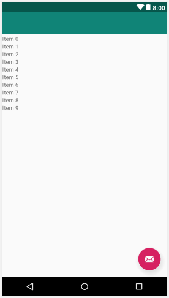

В главе ```Красивые макеты с CardView и ScrollView```, мы использовали **ScrollView** и мы заполняли его несколькими виджетами **CardView**, чтобы мы могли прокрутку. Можно было бы взять то, что мы узнали о массивах и **ArrayList**, и создать массив **TextView**, использовать его для заполнения **ScrollView**, а внутри каждого **TextView** поместить заголовок заметки. Звучит как идеальное решение для показа каждой заметки, чтобы она была доступна для кликабельности.

Сами **TextView** создавали бы в коде Java, установливая их свойство **text** в значение заголовка заметки, а затем добавляли полученный **TextView** в **LinearLayout**, содержащийся в **ScrollView**. Но есть засада.

## Проблема с отображением большоко количества виджетов
При создании любого объекта, требуется память. А что если у нас сотни или даже тысячи записей? Мы не можем иметь тысячи **TextView** в памяти, потому что Android-устройство может просто исчерпать память или начнет притормаживать, поскольку пытается обрабатывать прокрутку такого огромного количества виджетов.

К этому добавляется, еще то, что одного **TextView** нам не хватит. Нам необоходимо еще отображать что это за заметка (важное, задача, идея) и небольшой отрывок из текста заметки.

Необходимо разработать какой-то умный код, который загружает и уничтожает объекты **Note** и **TextView** из нашего ArrayList не все сразу, а частями. Это можно сделать, но сделать это эффективно далеко не просто.

## Решение проблемы
К счастью, это проблема, с которой так часто сталкиваются мобильные разработчики, имеет решение встроенное в Android API.

Мы можем добавить один виджет под названием **RecyclerView** в макет пользовательского интерфейса (он как ScrollView, но с ускорителями). **RecyclerView** был разработан именно как решение проблемы, которую мы обсуждали. Кроме того, мы должны взаимодействовать с **RecyclerView** с помощью специального класса, который понимает, как работает **RecyclerView**. Эти классы называются адаптерами. Мы будем использовать класс **RecyclerAdapter**, расширять его, настраивать, а затем использовать его для управления данными из нашего **ArrayList** и отображения их в **RecyclerView**.

Давайте узнаем немного больше о том, как работают классы **RecyclerView** и **RecyclerAdapter**.

## Как использовать RecyclerView и RecyclerAdapter
Мы уже знаем, как хранить почти неограниченное количество заметок — с использованием **ArrayList** Мы также знаем, что существует элемент пользовательского интерфейса **RecyclerView**, который специально разработан для отображения потенциально длинных списков данных из **ArrayList**. Нам просто нужно посмотреть, как все это воплотить в жизнь.

Чтобы добавить **RecyclerView** в наш макет, мы можем просто перетащить его из панели **Palette** в наш пользовательский интерфейс обычным способом.

> Пока не делайте этого. Сначала немного обсудим.

Вот так он будет выглядеть в графическом представлении макета:



Однако, это только представление возможностей, а не фактическое отображение в приложении. Если мы запустим приложение, сразу после добавления **RecyclerView**, мы получим просто пустой экран.

Первое, что нам нужно сделать, чтобы использовать **RecyclerView**, это решить, как будет выглядеть каждый элемент в списке. Это может быть только один **TextView**, а может и целый макет. Мы будем использовать **LinearLayout**, который содержит три виджета **TextView**, для каждого элемента в **RecyclerView**. Это позволит нам отобразить статус заметки (важно|идея|сделать), заголовок заметки и короткий фрагмент текста из фактического содержания заметки.

Элемент списка должен быть определен в собственном xml-файле, тогда **RecyclerView** cможет содержать несколько экземпляров этого макета.

Конечно, ничто из этого не объясняет, как мы будем управлять тем, какие данные отображаются в элементах списка и как они извлекаются из ArrayList.

Об обработке этих данных будет заботится наша реализация **RecyclerAdapter**. Класс **RecyclerAdapter** реализует интерфейс **Adapter**. Нам не нужно знать, как **Adapter** работает внутри. Нам просто нужно переопределить правильные методы, и тогда **RecyclerAdapter** выполнит всю работу по взаимодействию с нашим **RecyclerView**.

Подключить реализацию **RecyclerAdapter** к **RecyclerView**, безусловно, сложнее, чем перетащить 20 **TextView** на **ScrollView**. Но как только это будет сделано, мы сможем забыть о нем, и он будет продолжать работать и управлять собой независимо от того, сколько заметок мы добавим в **ArrayList**. Он также имеет встроенные функции для обработки таких вещей, как определение того, какой элемент в списке был нажат.

## Что мы сделаем
Посмотрите на этот план необходимых шагов, которые вам необходимо сделать:

1. Удалить временную кнопку и связанный с ней код, а затем добавьте **RecyclerView** в макет пользовательского интерфейса с определенным свойством **id**.
2. Создать xml-макет для представления каждого элемента в списке. Мы уже упоминали, что каждый элемент в списке будет **LinearLayout**, который содержит 3 виджета **TextView**.
3. Создать новый класс, который расширяет **RecyclerAdapter** и переопределяет несколько методов, чтобы управлять отображением и поведением элементов списка.
4. Добавить код в **MainActivity**, чтобы использовать вместе **RecyclerAdapter**, **RecyclerView** и **ArrayList** содержащий все наши заметки.

Давайте подробно рассмотрим каждый из них.
