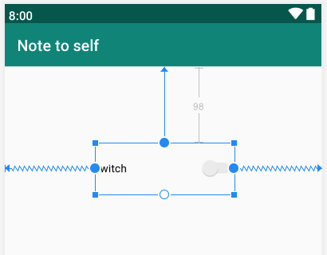
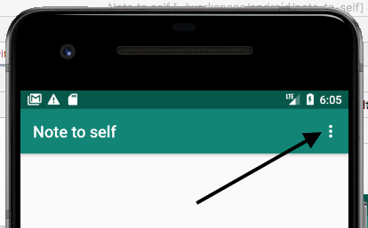
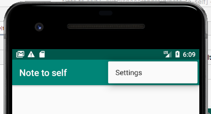

Теперь, когда мы вооружены всеми этими знаниями о классе **Intent**, мы можем добавить еще одну активность в наше приложение ```Note to Self```.

Сначала мы создадим новую активность **SettingActivity** для экрана настроек и посмотрим, какой эффект это окажет на фаил AndroidManifest.xml. Затем мы создадим очень простой макет для экрана настроек и добавим код Java для переключения с **MainActivity** на **SettingActivity**. 

## Создание активности SettingActivity
На экране настроек пользователь может включить или выключить декоративный разделитель между каждым элементом в **RecyclerView**. Несмотря на свою минималистичность возможностей, это будет полезное упражнение, и мы узнаем, как переключаться между активностями, а также сохранять данные на диск. Для начала выполните следующие действия:

1. В панели **Project** щелкните правой кнопкой мыши на папке, содержащей все ваши .java файлы и имеет имя пакета. Во всплывающем контекстном меню выберите  **New | Activity | Empty Activity**.
2. В поле ```Activity Name``` введите ```SettingsActivity```.
3. Оставьте все остальные параметры по умолчанию и щелкните **Finish**.

Android Studio создала новую активность для нас и связанный с ней макет. Давайте быстро взглянем на некоторые изменения, которые были сделаны за кулисами для нас. Ведь полезно знать, что происходит.

Откройте файл AndroidManifest.xml в папке **manifests** панели **Project**. Обратите внимание на следующую строчку кода:
```xml
<activity android:name=".SettingActivity"></activity>
```
Это то, как активность регистрируется в операционной системе. Если активность не зарегистрирована в файле **AndroidManifest.xml**, то попытка запустить её приведет к сбою приложения. Мы могли бы создать активность, просто создав новый класс, который расширяет **Activity** или **AppCompatActivity**. Однако, тогда нам пришлось бы самим добавлять предыдущий код для регистрации активности. Кроме того, с помощью мастера новых активностей мы получили еще файл макета activity_settings.xml.

## Проектирование макета экрана настроек
Быстро построим пользовательский интерфейс для экрана настроек:

1. Откройте файл activity_settings.xml, переключитесь на вкладку **Design**, и мы быстро выложим наш экран настроек.
2. Используйте следующий скриншот в качестве руководства, выполняя остальные шаги:



3. Перетащите **Switch** в центр макета. Растяните его, потянув края, чтобы сделать красивым и ясным.
4. Проверьте, что атрибута **id** значение ```switch1```.
5. Расположите переключатель, чтобы было похоже на скриншот и зафиксируйте привязки автоматически, нажав кнопку **Infer Constraints**.

Теперь у нас есть супер-простой макет для экрана настроек готовый к связки с Java-кодом.

## Включение перехода пользователя на экран настроек
Мы уже знаем, как переключиться на активность **SettingsActivity**. Кроме того, поскольку мы не будем передавать данные в неё или из неё, это займет всего две строчки кода :).

Возможно, вы заметили, что в панели действий нашего приложения есть значок меню:



Если вы нажмете его, там будет пункт меню ```Settings```. Это было создано по умолчанию шаблоном **Basic Activity**, когда мы создали приложение.



Все, что нам нужно сделать, это поместить код для переключения на **SettingsActivity** в метод **onOptionsItemSelected** в файле MainActivity.java. Android Studio, заботливо, даже предоставляет блок **if** для вставки нашего кода.

Откройте MainActivity.java и найдите метод **onOptionsItemSelected**. Внутрь блока **if** добавьте следующий код, перед ```return true;```:
```java
    Intent intent = new Intent(this, SettingActivity.class);
    startActivity(intent);
```
Теперь вы можете запустить приложение и перейти на экран настроек, нажав на пункт меню ```Settings```.

Чтобы вернуться обратно к **MainActivity**, вы можете нажать кнопку назад на устройстве.
