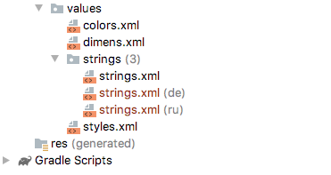

Во – первых, нам нужно добавить несколько папок в наш проект, по одной для каждого поддерживаемого языка. Текст классифицируется как ресурс, и следовательно, должен быть помещен в папку **res**.

## Добавление поддержки языка
1. Щелкните правой кнопкой мыши на папке **res**, а затем выберите **New | Android resource directory**. В поле имя каталога введите ```values-ru```.
2. Теперь нам нужно добавить файл, в который мы можем поместить все наши русские переводы.
3. Щелкните правой кнопкой мыши на **res**, затем выберите **New | Android resource file** и введите ```strings.xml``` в поле **File name**. Введите ```values-ru``` в поле **Directory name**.
4. Теперь у нас есть файл ```strings.xml```, на который будет ссылаться любое устройство, настроенное на использование русского языка. 

Проделайте теже шаги для поддержки немецкого языка (имя каталога ```values-de```);

Теперь у нас в проекте появилась папка **strings**



Вы, наверное, задаетесь вопросом: Что тут делает папка **strings**? Мы же делали совершенно другие шаги.

Android Studio помогает нам организовать наши файлы и папки, как это требуется операционной системой Android в формате APK. Однако вы можете ясно видеть русские и немецкие файлы, обозначенные их (de) и (ru) постфиксы.

> В зависимости от настроек Android Studio вы можете увидеть значки флагов страны, с соотвествующими файлами strings.xml.

## Добавление строковых ресурсов
Как мы знаем, файл strings.xml содержит слова, которые приложение будет отображать. Такие как ```important```, ```to do```, ```idea``` и другие.

Имея файл ```strings.xml``` для каждого языка, который мы хотим поддерживать, мы можем затем дать возможность Android выбрать соответствующие значения текстов, в зависимости от языковых настроек пользователя.

Давайте обеспечим переводы строковых значений. Самый просто способ это сделать, скопировать и вставить содержимое исходного файла ```strings.xml```, а затем изменить значения каждого из ресурсов.
```xml
<?xml version="1.0" encoding="utf-8"?>
<resources>
    <string name="app_name">На заметку</string>
    <string name="action_settings">Настройки</string>

    <string name="action_add">добавить</string>
    <string name="title_hint">Заголовок</string>
    <string name="description_hint">Описание</string>
    <string name="idea_text">Идея</string>
    <string name="important_text">Важное</string>
    <string name="todo_text">Сделать</string>
    <string name="cancel_button">Отмена</string>
    <string name="ok_button">Ок</string>

    <string name="settings_title">Настройки</string>
    <string name="theme_title">Темы</string>
    <string name="theme_light">Светлая</string>
    <string name="theme_dark">Темная</string>

</resources>
```
Обратите внимание, что, хотя мы помещаем перевод в качестве значения, атрибут **name** остается тем же самым. И это логично, потому что на этот атрибут мы ссылаемся в наших макетах.
```xml
<?xml version="1.0" encoding="utf-8"?>
<resources>
    <string name="app_name">Hinweis auf selbst</string>
    <string name="action_settings">Einstellungen</string>

    <string name="action_add">add</string>
    <string name="title_hint">Titel</string>
    <string name="description_hint">Beschreibung</string>
    <string name="idea_text">Idee</string>
    <string name="important_text">Wichtig</string>
    <string name="todo_text">zu tun</string>
    <string name="cancel_button">Abbrechen</string>
    <string name="ok_button">Okay</string>

    <string name="settings_title">Einstellungen</string>
    <string name="theme_title">Theme</string>
    <string name="theme_light">Light</string>
    <string name="theme_dark">Dark</string>

</resources>
```
> Если вы не предоставите все строковые ресурсы в дополнительных файлах strings.xml, то недостающие ресурсы будут взяты из файла по умолчанию.

То, что мы сделали, - это обеспечили два перевода. Android знает, какой перевод предназначен для какого языка, по папкам, в которые они помещены. 

> Вы даже можете локализоваться на разные версии языка; например, вы можете иметь английский язык US или UK. Так же вы можете локализовать такие ресурсы, как изображения и звук. Подробнее по [ссылке](https://developer.android.com/guide/topics/resources/localization.html)

Теперь, когда у нас есть переводы, мы можем видеть их в действии.
