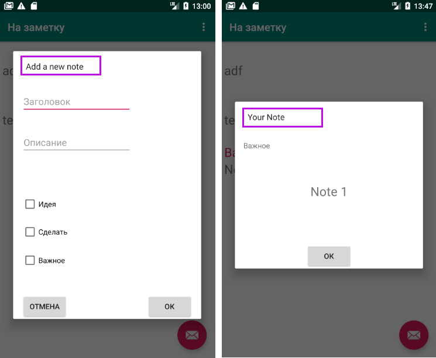
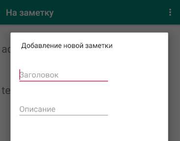

Запустите приложение, чтобы увидеть, работает ли оно в обычном режиме. Теперь мы можем изменить настройки локализации, чтобы увидеть его на русском языке. Различные устройства немного различаются в том, как это сделать, на эмуляторе Pixel 2 изменить локаль можно нажав на приложение Custom Locale:


Выберите ru-Russia, а затем нажмите кнопку SELECT 'RU' в левом нижнем углу экрана.

Теперь вы можете запустить приложение обычным способом. Вот некоторые скриншоты приложения, работающего на русском языке.



На предыдущих скриншотах вы можете четко видеть, что наше приложение в основном переведено на русский язык. Однако есть места, где текст все еще на английском языке.

Это произошло потому, что текст содержится непосредственно в коде Java. Как мы уже видели, легко использовать строковые ресурсы на нескольких языках, а затем ссылаться на них в наших макетах, но как мы можем ссылаться на строковые ресурсы из кода Java?

## Локализация в коде Java
Первое, что нужно сделать, это создать ресурсы в каждом из трех файле ```strings.xml```. Вот два ресурса, которые нужно добавить к трем различным файлам. Сначала добавляем файл без постфикса:
```xml
<string name="add_new_note" >Add a new note</string>
<string name="your_note">Your note</string>
```
Затем в локализованные файлы
```xml
<string name="add_new_note" >Добавление новой заметки</string>
<string name="your_note">Ваша заметка</string>
```
```xml
<string name="add_new_note">Eine neue Note hinzufügen</string>
<string name="your_note">Ihre Notiz</string>
```
Далее, нам нужно отредактировать код Java, чтобы ссылаться на ресурс, а не на жестко закодированную строку.

Откройте файл ```DialogNewNote.java``` файл и найдите строку кода:
```java
builder.setView(dialogView).setMessage("Add a new note");
```
Отредактируйте его, чтобы использовать строковый ресурс, который мы только что добавили вместо прибитого гвоздями текста:
```java
builder.setView(dialogView).setMessage(getResources().getString(R.string.add_new_note));
```
Новый код использует цепочку ```getResources.getString``` методов для замены ранее жестко закодированного текста. Аргумент, отправленный в **getString**, является строковым идентификатором ```R.string.add_new_note```.

Код ```R.string``` ссылается на строковые ресурсы в папке res, а ```add_new_note``` - это идентификатор. Затем Android сможет решить, какая версия (по умолчанию, русская или немецкая) является подходящей, основываясь на локали устройства, на котором работает приложение.

У нас есть еще одна жестко закодированная строка для изменения. Откройте файл ```DialogShowNote.java``` найдите эту строку кода:
```java
builder.setView(dialogView).setMessage("Your Note");
```
Отредактируйте его, чтобы использовать строковый ресурс ```your_note```, который мы недавно добавили.

Теперь Android может решить, какая версия строковых ресурсов ( default, русская или немецкая) является подходящей, основываясь на локали устройства, на котором работает приложение. На следующем снимке экрана показано, что новый экран заметок теперь содержит текст на соответствующем языке:



Вы можете добавить столько строковых ресурсов, сколько захотите. Использование строковых ресурсов является рекомендуемым способом добавления всего текста во все проекты.
