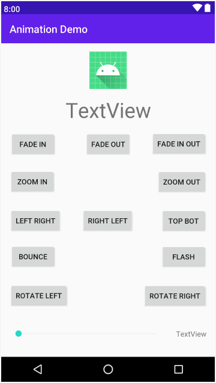
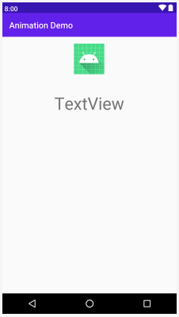
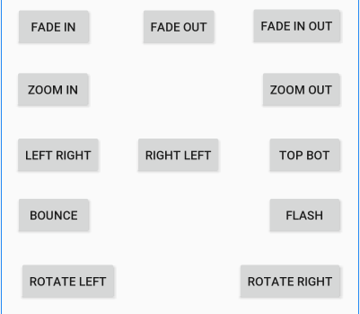
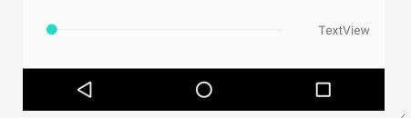

Давайте создадим демонстрационное приложение, для исследования всего, что мы только что обсуждали, и даже немного больше.

Приложение будет демонстрировать повороты, затухания, сдвиги, анимационные события, интерполяции и управление длительностью с помощью виджета **SeekBar**. Лучший способ объяснить, что делает SeekBar - это создать его и наблюдать за ним в действии.

## Макет приложения
Создайте новый проект под названием ```Animation Demo```, используя шаблон **Empty Activity**.

Cкриншот готового макета для помощи, при выполнении cледующих шагов:



1. Откройте activity_main.xml в режиме конструктора окна редактора.”
2. Удалите стандартный **TextView** (Hello World!).
3. Добавьте **ImageView** в верхнюю центральную часть макета. В качестве ресурса картинки используйте @mipmap/ic_launcher, выбрав **Project | ic_launcher** во всплывающем окне.
4. Для свойства id объекта **ImageView** установите значение ```imageView```.
5. Непосредственно под **ImageView** добавьте **TextView** c идентификатором ```textStatus```. Измените атрибут **textSize** на ```40sp```.



6. Добавьте 12 кнопок в макет. Точное позиционирование не является жизненно важным. Атрибут **text** и **id** у кнопок задавайте из таблицы, ориентируясь по скриншоту.



| свойство text | свойство id    |
|---------------|----------------|
| Fade in       | btnFadeIn      |
| Fade out      | btnFadeOut     |
| Fade In Out   | btnFadeInOut   |
| Zoom In       | btnZoomIn      |
| Zoom Out      | btnZoomOut     |
| Left Right    | btnLeftRight   |
| Right Left    | btnRightLeft   |
| Top Bot       | btnTopBottom   |
| Bounce        | btnBounce      |
| Flash         | btnFlash       |
| Rotate Left   | btnRotateLeft  |
| Rotate Right  | btnRotateRight |

> Чтобы ускорить процесс выкладки кнопок, сначала выложите их примерно, затем измените текстовые атрибуты, и в конце точно отрегулируйте положение кнопок.

7. Добавьте **SeekBar** из категории **Widjets** слева под кнопками. Cвойствe **id** задайте значение ```seekBarSpeed```, а свойству **max** ```5000```. Это означает, что **SeekBar** будет содержать значения от 0 до 5000. Скоро мы увидим, как мы можем читать и использовать эти данные.
8. Сделайте **SeekBar** шире. Чтобы добиться этого, вы используете точно такую же технику, как и с любым виджетом, просто перетащите края виджета.
9. Добавьте TextView справа от **SeekBar** и установите его свойство **id** в ```textSeekerSpeed```.



10. Поправив положение элементов, нажмите кнопку **Infer Constraints**, для привязки элементов. Можете сделать это вручную, если вам нужна практика :).

## Кодирование XML анимаций
Щелкните правой кнопкой мыши на папке res и выберите **New | Android resource directory**. Введите ```anim``` в поле **Directory name** и щелкните **OK**.

Теперь щелкните правой кнопкой мыши на новом каталоге **anim** и выберите **New | Animation resource file**. В поле **File name** введите ```fade_in``` и нажмите **ОК**. Измените содержимое, чтобы соотвествовало следующему коду:
```xml
<?xml version="1.0" encoding="utf-8"?>
<set xmlns:android="http://schemas.android.com/apk/res/android"
    android:fillAfter="true">

    <alpha
        android:fromAlpha="0.0"
        android:toAlpha="1.0"
        android:interpolator="@android:anim/accelerate_interpolator"/>
</set>
```
Повторите теже действия для ```fade_out```:
```xml
<?xml version="1.0" encoding="utf-8"?>
<set xmlns:android="http://schemas.android.com/apk/res/android"
    android:fillAfter="true">
    
    <alpha
        android:fromAlpha="1.0"
        android:toAlpha="0.0"
        android:interpolator="@android:anim/accelerate_interpolator" />
</set>
```
Для ```fade_in_out```
```xml
<?xml version="1.0" encoding="utf-8"?>
<set xmlns:android="http://schemas.android.com/apk/res/android"
    android:fillAfter="true">

    <alpha
        android:fromAlpha="0.0"
        android:toAlpha="1.0"
        android:interpolator="@android:anim/accelerate_interpolator"/>
    
    <alpha
        android:fromAlpha="1.0"
        android:toAlpha="0.0"
        android:interpolator="@android:anim/accelerate_interpolator"/>
</set>
```
Для ```zoom_in```
```xml
<?xml version="1.0" encoding="utf-8"?>
<set xmlns:android="http://schemas.android.com/apk/res/android"
    android:fillAfter="true">

    <scale
        android:fromXScale="1"
        android:fromYScale="1"
        android:pivotX="50%"
        android:pivotY="50%"
        android:toXScale="6"
        android:toYScale="6">
    </scale>
</set>
```
Для ```zoom_out```
```xml
<?xml version="1.0" encoding="utf-8"?>
<set xmlns:android="http://schemas.android.com/apk/res/android"
    android:fillAfter="true">

    <scale
        android:fromXScale="6"
        android:fromYScale="6"
        android:pivotX="50%"
        android:pivotY="50%"
        android:toXScale="1"
        android:toYScale="1">
    </scale>
</set>
```
Для ```left_right```
```xml
<?xml version="1.0" encoding="utf-8"?>
<set xmlns:android="http://schemas.android.com/apk/res/android"
    android:fillAfter="true">

    <translate
        android:fromXDelta="-500%"
        android:toXDelta="0%"/>
</set>
```
Для ```right_left```
```xml
<?xml version="1.0" encoding="utf-8"?>
<set xmlns:android="http://schemas.android.com/apk/res/android">

    <translate
        android:fillAfter="false"
        android:fromXDelta="500%"
        android:toXDelta="0%"/>
</set>
```
Для ```top_bot```
```xml
<?xml version="1.0" encoding="utf-8"?>
<set xmlns:android="http://schemas.android.com/apk/res/android">

    <translate
        android:fillAfter="false"
        android:fromYDelta="100%"
        android:toYDelta="0%"/>
</set>
```
Для ```flash```
```xml
<?xml version="1.0" encoding="utf-8"?>
<set xmlns:android="http://schemas.android.com/apk/res/android">

    <alpha
        android:fromAlpha="0.0"
        android:toAlpha="1.0"
        android:interpolator="@android:anim/accelerate_interpolator"
        android:repeatMode="reverse"
        android:repeatCount="10"/>
</set>
```
Для ```bounce```
```xml
<?xml version="1.0" encoding="utf-8"?>
<set xmlns:android="http://schemas.android.com/apk/res/android"
    android:fillAfter="true"
    android:interpolator="@android:anim/bounce_interpolator">

    <scale
        android:fromXScale="1.0"
        android:fromYScale="0.0"
        android:toXScale="1.0"
        android:toYScale="1.0">
    </scale>
</set>
```
Для ```rotate_left```
```xml
<?xml version="1.0" encoding="utf-8"?>
<set xmlns:android="http://schemas.android.com/apk/res/android">

    <rotate
        android:fromDegrees="360"
        android:toDegrees="0"
        android:pivotX="50%"
        android:pivotY="50%"
        android:interpolator="@android:anim/cycle_interpolator"/>
</set>
```
И для ```rotate_right```
```xml
<?xml version="1.0" encoding="utf-8"?>
<set xmlns:android="http://schemas.android.com/apk/res/android">

    <rotate
        android:fromDegrees="0"
        android:toDegrees="360"
        android:pivotX="50%"
        android:pivotY="50%"
        android:interpolator="@android:anim/cycle_interpolator"/>
</set>
```
Теперь мы можем написать Java-код, чтобы добавить наши анимации в пользовательский интерфейс.

## Подключение анимации в Java
Откройте файл MainActivity.java и объявите следующие переменные экземпляра для анимаций.
```java
Animation animFadeIn;
Animation animFadeOut;
// дальше сами
```
Далее объявите переменные для элементов пользовательского интерфейса
```java
ImageView imageView;
TextView textStatus;

Button btnFadeId;
Button btnFadeOut;
// дальше сами
```
Далее добавим переменную типа int, которая будет использоваться для текущего значения/позиции пина в **SeekBar**:
```java
int seekSpeedProgress = 0;
```
Теперь давайте вызовем два новых метода в **onCreate**, после вызова **setContentView**:
```java
loadAnimations();
loadUI();
```
Эти две новые строчки кода будут иметь ошибки, пока мы не реализуем эти два новых метода.

Займемся методом **loadAnimations**. Хотя код в нем будет довольно обширен, сам по себе он очень прост. Все, что мы делаем, это используем статический метод **loadAnimation** класса **AnimationUtils** для инициализации каждой из наших ссылок на анимацию с помощью соответствующей xml-анимации.
```java
    animFadeIn = AnimationUtils.loadAnimation(this, R.anim.fade_in);
    animFadeOut = AnimationUtils.loadAnimation(this, R.anim.fade_out);
    // дальше сами
```
Теперь реализуем метод loadUI. Он будет большой, и мы его разобьем на 3 части. Во- первых, давайте получим ссылки элементы нашего xml-макета:
```java
    imageView = (ImageView) findViewById(R.id.imageView);
    textStatus = (TextView) findViewById(R.id.textStatus);
    
    btnFadeIn = (Button) findViewById(R.id.btnFadeIn);
    btnFadeOut = (Button) findViewById(R.id.btnFadeOut);
    // дальше сами
```
Далее мы добавим слушателя события клик для каждой кнопки.
```java
    btnFadeIn.setOnClickListener(this);
    btnFadeOut.setOnClickListener(this);
    // дальше сами
```
Третий и последний раздел метода **loadUI** устанавливает анонимный класс для обработки изменений в **SeekBar**. Мы могли бы добавить это в качестве интерфейса к MainActivity, как мы делали с прослушиванием кликов по кнопкам и анимационных событий, но имея только один экземпляр **SeekBar**, имеет смысл обрабатывать его на месте.

Мы будем переопределять три метода, как это требует реализация интерфейса  **OnSeekBarChangeListener**:

- onProgressChanged - метод вызывающийся при изменении положения пина **SeekBar**
- onStartTrackingTouch - метод, который вызывается, когда пользователь начинает менять позицию пина
- onStopTrackingTouch - метод, который вызывается, когда пользователь закончил использовать **SeekBar**

Для достижения наших целей нам нужно только добавить код в метод **onProgressChanged**, но мы все равно должны переопределить их все.

Все, что мы делаем в методе **onProgressChanged**, - это присваиваем текущее значение панели поиска переменной **seekSpeedProgress**. Затем мы используем это значение вместе с максимально возможным значением **SeekBar**, которое получается при вызове метода **getMax** и выводим сообщение в ```textSeekerSpeed```.

Добавьте код, который мы только что обсуждали, в метод loadUI:
```java
    seekBarSpeed.setOnSeekBarChangeListener(new SeekBar.OnSeekBarChangeListener() {
        @Override
        public void onProgressChanged(SeekBar seekBar, int progress, boolean fromUser) {
            seekSpeedProgress = progress;
            textSeekerSpeed.setText(seekSpeedProgress + " of " + seekBarSpeed.getMax());
        }

        @Override
        public void onStartTrackingTouch(SeekBar seekBar) {
        }

        @Override
        public void onStopTrackingTouch(SeekBar seekBar) {
        }
    });
```
Теперь нам нужно изменить объявление класса **MainActivity**, чтобы реализовать два интерфейса. В этом приложении мы будем прослушивать клики и события анимации, поэтому два интерфейса, которые мы будем использовать, - это **View.OnClickListener** и **Animation.AnimationListener**. Обратите внимание, что для реализации более чем одного интерфейса мы просто разделяем интерфейсы запятой.
```java
public class MainActivity extends AppCompatActivity implements View.OnClickListener, Animation.AnimationListener {
```
На данном этапе, с помощью ```Alt + Enter```, мы можем добавить и реализовать необходимые методы для этих интерфейсов. Во-первых, методы интерфейса **AnimationListener**: **onAnimationEnd**, **onAnimationRepeat** и **onaAnimationStart**. Нам нужно только добавить немного кода к двум из этих методов. В **onAnimationEnd**, мы устанавливаем свойство **text** у **textStatus** в значение ```STOPPED```, а в методе **onAnimationStart** устанавливаем его на ```RUNNING```. Это продемонстрирует, что наши слушатели анимации действительно работают:
```java
    @Override
    public void onAnimationStart(Animation animation) {
        textStatus.setText("RUNNING");
    }

    @Override
    public void onAnimationEnd(Animation animation) {
        textStatus.setText("STOPPED");
    }
```    
Метод **onClick** довольно длинный, но в нем ничего сложного. В Каждом **case** просто устанавливается длительность анимации на основе текущего положения **SeekBar**, настраивается анимация, чтобы ее события можно было прослушивать, а затем запускает анимацию.
```java
    switch (v.getId()) {
        case R.id.btnFadeIn:
            animFadeIn.setDuration(seekSpeedProgress);
            animFadeIn.setAnimationListener(this);
            imageView.startAnimation(animFadeIn);
            break;
        case R.id.btnFadeOut:
            animFadeOut.setDuration(seekSpeedProgress);
            animFadeOut.setAnimationListener(this);
            imageView.startAnimation(animFadeOut);
            break;
        // дальше сами :)
    }
```
Теперь запустите приложение. Переместите **SeekBar** примерно в центр, чтобы анимация выполнялась в течение разумного количества времени.



Обратите внимание, как текст на Android-роботе меняется от ```RUNNING``` до ```STOPPED``` в соответствующее время.
