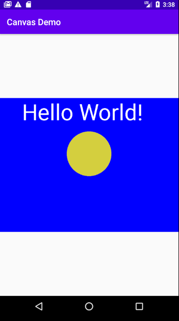

Создайте новый проект, выбрав шаблон **Empty Activity**, и назовите его ```Canvas Demo```. 

В ```MainActivity.java``` удалите строчку ```setContentView(R.layout.activity_main);```

Для начала добавим необходимые нам для работы переменные экземпляра класса **MainActivity**:
```java
    ImageView imageView;
    Bitmap blankBitmap;
    Canvas canvas;
    Paint paint;
```
Теперь, когда мы объявили экземпляры необходимых классов, мы можем инициализировать их. Добавьте следующий код в метод **onCreate** после вызова ```super.onCreate```:
```java
    int width = 800;
    int height = 600;
    blankBitmap = Bitmap.createBitmap(width, height, Bitmap.Config.ARGB_8888);
    canvas = new Canvas(blankBitmap);
    imageView = new ImageView(this);
    paint = new Paint();
```
Этот код такой же, как мы недавно видели. Но стоит подробнее посмотреть на инициализацию класса Bitmap.

Растровые изображения (bitmaps), более типичные в графических приложениях и играх, используются для представления таких объектов, как: различные кисти для рисования, игрок, фон, игровые объекты и так далее. Здесь мы просто используем его, чтобы рисовать. В следующем проекте мы будем использовать растровые изображения для представления объекта нашего рисунка, а не только поверхности, на которой он будет нарисован.

Метод, который нуждается в объяснении - **createBitmap**. Параметры слева направо следующие: ширина (в пикселях), высота (в пикселях), конфигурация растрового изображения.

Растровые изображения могут быть сконфигурированы несколькими различными способами. Конфигурация **ARGB_8888** означает, что каждый пиксель представлен 4 байтами памяти.

> Есть несколько растровых форматов, которые может использовать Android. Этот вариант идеально подходит для хорошего диапазона цветов и гарантирует, что растровые изображения, которые мы используем, и цвет, который мы запрашиваем, будут нарисованы так, как задумано. Есть более высокие и более низкие конфигурации.

Теперь мы можем сделать настоящий рисунок.

## Рисование на экране
Добавьте следующий код после инициализации ```paint```
```java
    canvas.drawColor(Color.argb(255, 0, 0, 255));

    paint.setTextSize(100);
    paint.setColor(Color.argb(255, 255, 255, 255));
    canvas.drawText("Hello World!", 100, 100, paint);

    paint.setColor(Color.argb(255, 212, 207, 62));
    canvas.drawCircle(400, 250, 100, paint);
```
Предыдущий код использует ```canvas.drawColor```, чтобы заполнить определенным цветом.

```paint.setTextSize``` определяет размер текста, который будет нарисован.  
```paint.setColor``` определяет, какого цвета будет любое следующее рисование.   ```canvas.drawText``` рисует текст на экране.

Проанализируйте аргументы, переданные в **drawText**. Текст будет: ```Hello world!``` и он будет выведет от точки 100 пикселей слева и 100 пикселов сверху нашего **Bitmap** (blankBitmap).

Затем мы снова используем **setColor**, чтобы изменить цвет, который будет использоваться для рисования. В финале, мы используем метод **drawCircle**, чтобы нарисовать круг, с центром 400 пикселей слева и 100 пикселей сверху. Круг будет иметь радиус 100 пикселей.

### Класс Color
Класс **Color**, помогает нам манипулировать и представлять цвет. Метод **argb**, возвращает цвет (int-овое представление), построенный с использованием альфа-канала (непрозрачность/прозрачность), красного, зеленого и синего цветов. Эта модель использует значения в диапазоне от нуля (отсутствие цвета) до 255 (полный цвет) для каждого элемента. Важно отметить, что смешанные цвета являются интенсивностями света и совершенно отличаются от того, что происходит, например, когда мы смешиваем краски.

Значения, используемые для заливки поверхности рисутка, были: 255, 0, 0, 255. Эти значения означают полную непрозрачность (сплошной цвет), отсутствие красного, зеленого и полного синего цветов. Это дает синий цвет.

Следующий вызов метода **argb** находится в первом вызове **setColor**, где мы устанавливаем необходимый цвет для текста. Значения 255, 255, 255, 255 означают полную непрозрачность, полный красный, полный зеленый, полный синий. Когда вы объединяете свет с этими значениями, вы получаете белый цвет.

В последнем вызове **argb**, мы передаем: 255, 21, 207, 62. Получится солнечно-желтый цвет.

Прежде чем мы сможем запустить код, необходимо добавить вызов метода **setContentView**, который поместит **ImageView** в качестве **View**, которое будет установлено в качестве содержимого для приложения.
```java
    imageView.setImageBitmap(blankBitmap);
    setContentView(imageView);
```
Вызывая **setContentView**, мы говорим классу **Activity** использовать imageView.

Запустив приложение, мы увидим рисунок размером 800 на 600 пикселей. 



<!-- В следующей главе мы будем использовать более продвинутые методы, чтобы использовать весь экран, а также узнаем о потоках, чтобы заставить графику работать в реальном времени. -->

Понимание системы координат используемой в Android, поможет лучше разобраться с тем как мы используем ее в методах рисования на **Canvas**. 
