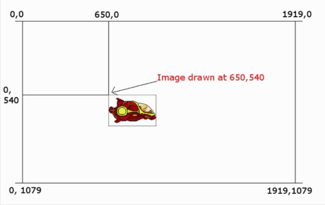

Как мы увидим, рисование **Bitmap** является тривиальным. Но система координат, которую мы используем для построения нашей графики, нуждается в кратком объяснении.

## Черчение и рисование
Когда мы рисуем объект **Bitmap** на экране, мы передаем координаты, в которых мы хотим нарисовать объект. Доступные координаты устройства Android зависят от разрешения его экрана.

Например, телефон Google Pixel имеет разрешение экрана 1920 пикселей по горизонтали на 1080 пикселей по вертикали, если держать его в альбомном режиме.

Система нумерации этих координат начинается в верхнем левом углу с 0,0 и продолжается вниз и вправо до тех пор, пока нижний правый угол не станет пикселом 1919, 1079.

Поэтому, когда мы рисуем **Bitmap** или что-то еще на экране (например, круги и прямоугольники на **Canvas**), мы должны указать координату x, y.

Кроме того, **Bitmap** (или форма **Canvas**), содержит много пикселей. Возникает вопрос, какой пиксель растрового изображения указывается в координатах экрана x, y?

Это верхний левый пиксель растрового объекта. Посмотрите на следующую диаграмму,которая должна прояснить координаты экрана, используя в качестве примера телефон Google Pixel.

Более того, координаты относительны к тому на чем вы рисуете. Так в Canvas Demo, которое мы только что сделали, координаты были относительно растрового изображения (blankBitmap).

Давайте сделаем еще несколько рисунков — на этот раз с растровыми изображениями.
