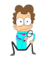
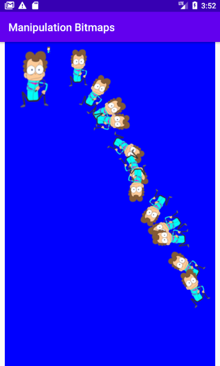

Теперь, когда мы изучили теорию, давайте нарисуем и раскрутим несколько растровых изображений. Создайте новый проект и назовите его ```Manipulating Bitmaps```, выбрав шаблон **Empty Activity**.

## Добавление изображения в проект
Сохраните изображение Боба на ПК.



В Android Studio найдите папку **res/drawable** в окне обозревателя проектов.

Щелкните правой кнопкой мыши на папке **drawable** и выберите Вставить, чтобы добавить Боб.png-файл для проекта. Дважды нажмите кнопку **ОК**, чтобы подтвердить параметры импорта файла в проект по умолчанию.

Добавим необходимые экземпляры класса в **MainActivity**
```java
    ImageView imageView;
    Bitmap blankBitmap;
    Bitmap bobBitmap;
    Canvas canvas;
    Paint paint;
```
Теперь инициализируем их в методе **onCreate**, удалив при этом строчку ```setContentView(R.layout.activity_main);```
```java
    int width = 1300;
    int height = 1000;

    imageView = new ImageView(this);
    blankBitmap = Bitmap.createBitmap(width, height, Bitmap.Config.ARGB_8888);
    bobBitmap = BitmapFactory.decodeResource(getResources(), R.drawable.bob);
    canvas = new Canvas(blankBitmap);
    paint = new Paint();

    canvas.drawColor(Color.argb(255, 0, 0, 255));
```
Далее мы добавим вызовы трех методов, которые скоро реализуем, и установим наш **ImageView** в качестве вида для приложения:
```java
    drawRotateBitmaps();
    drawEnlargedBitmap();
    drawShrunkenBitmap();

    imageView.setImageBitmap(blankBitmap);
    setContentView(imageView);
```
Теперь реализуем метод **drawRotatedBitmap**, который выполняет манипуляции с растровым изображением:
```java
    private void drawRotateBitmaps() {
        int rotation = 0;
        int horizontalPosition = 350;
        int verticalPosition = 25;
        Matrix matrix = new Matrix();
        Bitmap rotateBitmap;

        for (rotation = 0; rotation < 360; rotation+=30) {
            matrix.reset();
            matrix.preRotate(rotation);
            rotateBitmap = Bitmap.createBitmap(bobBitmap, 0, 0, bobBitmap.getWidth() - 1, bobBitmap.getHeight() - 1, matrix, true);
            canvas.drawBitmap(rotateBitmap, horizontalPosition, verticalPosition, paint);

            horizontalPosition += 60;
            verticalPosition += 120;
        }
    }
```
Метод **drawRotateBitmaps** использует цикл **for**, чтобы сделать петлю на 360 градусов, 30 градусов за один раз. Это значение при каждом проходе через цикл используется в экземпляре матрицы для поворота изображения Боба, а затем он рисуется на экране с помощью метода **drawBitmap**.

Добавим методы **drawEnlargedBitmap** и **drawShrunkenBitmap**:
```java
    private void drawEnlargedBitmap() {
        bobBitmap = Bitmap.createScaledBitmap(bobBitmap, 300, 400, false);
        canvas.drawBitmap(bobBitmap, 25, 25, paint);
    }

    private void drawShrunkenBitmap() {
        bobBitmap = Bitmap.createScaledBitmap(bobBitmap, 50, 75, false);
        canvas.drawBitmap(bobBitmap, 250, 25, paint);
    }
```
Метод **drawEnlargedBitmap** использует метод **createScaledBitmap**, для создания большого Боба, который составляет 300 на 400 пикселей. Затем метод **drawBitmap** выводит его на экран.

**DrawShrunkenBitmap** использует точно такую же технику, за исключением того, что он уменьшает Боба.

Запустите приложение, чтобы увидеть, как Боб растет, сжимается и вращается на 360 градусов с интервалом в 30 градусов, как показано на следующем скриншоте:



Единственное, чего не хватает в нашем рисовальном репертуаре - это возможности наблюдать как происходит вся эта деятельность. Скоро мы исправим этот пробел в наших знаниях.
