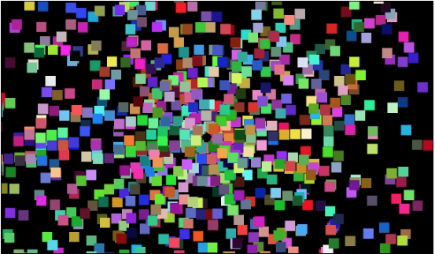

**ParticleSystem** - это класс, который мы напишем, который породит экземпляры (множество экземпляров) класса **Particle** (мы его тоже напишем :)), что будет создавать простой эффект взрыва.

Вот изображение как это будет выглядеть:



Просто для пояснения, каждый из цветных квадратов является экземпляром класса **Particle**, а все экземпляры частиц контролируются и удерживаются классом **ParticleSystem**. Кроме того, пользователь будет создавать несколько (сотни) экземпляров **ParticleSystem**, рисуя их пальцем. Все эти экземпляры **ParticleSystem** будут появляться в виде точек или блоков, пока пользователь не нажмет кнопку паузы, и они не оживут. Мы рассмотрим код достаточно подробно, чтобы вы могли изменить в нем размер, цвет, скорость и количество экземпляров **Particle** и **ParticleSystem**.

Начнем мы с кодирования класса **Particle**.

## Кодирование класса Particle
```java
public class Particle {
    PointF velocity;
    PointF position;

    Particle(PointF direction) {
        velocity = new PointF();
        position = new PointF();

        velocity.x = direction.x;
        velocity.y = direction.y;
    }
}
```
У нас есть две переменные-экземпляра — одна для скорости и одна для положения. Обе являются объектами PointF. PointF содержит два значения с плавающей точкой, это просто горизонтальное и вертикальное значение. Скорость стоит объяснить немного подробнее. Каждое из двух значений в PointF будет представлять собой скорость, одно горизонтальное, а другое вертикальное. Именно сочетание этих двух скоростей будет означать направление движения.

> В конструкторе создаются два новых объекта **PointF**, а значения x и y ```velocity``` инициализируются значениями, переданными через параметр ```direction```. Обратите внимание на то, как значения копируются из ```direction``` в ```velocity```. Каждый экземпляр **Particle**, будет копировать значения из ```direction``` и они будут различны для каждого экземпляра.

Затем добавим эти три метода, и поговорить о них:
```java
    void update(float fps) {
        position.x += velocity.x;
        position.y += velocity.y;
    }

    void setPosition(PointF position) {
        this.position.x = position.x;
        this.position.y = position.y;
    }

    PointF getPosition()  {
        return position;
    }
```
Внутри метода **update** горизонтальные и вертикальные значения ```position``` обновляются с использованием соответствующих значений ```velocity```.

> Обратите внимание, что мы не используем текущей частоты кадров ```fps``` в **update**. Вы можете изменить это, если хотите быть уверенными, что все ваши частицы летят с абсолютно правильной скоростью, но все скорости будут случайными в любом случае. Добавляя это дополнительное вычисление (для каждой частицы), мы мало что выиграем. Однако, как мы вскоре увидим, класс **ParticleSystem** должен будет учитывать текущие кадры в секунду, чтобы измерить, как долго он должен работать.

Метод **setPosition**. Обратите внимание, что метод получает **PointF**, который используется для установки начальной позиции. Класс **ParticleSystem** передаст эту позицию при срабатывании эффекта.

И метод **getPosition**. Нам нужен этот метод, чтобы класс **ParticleSystem** мог нарисовать все частицы в правильном положении.

Теперь мы можем перейти к классу **ParticleSystem**.

## Кодирование класса ParticleSystem
Класс **ParticleSystem** имеет несколько больше деталей, чем класс **Particle**, но он все еще достаточно прост. Помните, чего мы должны достичь с помощью этого класса? Порождать и обновлять кучу (довольно большую кучу) экземпляров **Particle**.
```java
public class ParticleSystem {
    private float duration;

    private ArrayList<Particle> particles;
    private Random random = new Random();
    boolean isRunning = false;
}
```
У нас есть четыре переменные экземпляра: во-первых, ```duration``` типа float, которая будет инициализирована на то количество секунд, на которое мы хотим запустить эффект; во-вторых, ArrayList называемый ```particles```, будет содержать все экземпляры **Particle**, которые мы создаем.

Экземпляр типа **Random**, называемый ```random```, создается как переменная экземпляра, потому что нам нужно генерировать так много случайных значений, что создание нового объекта каждый раз будет немного замедлять нас.

Наконец, ```isRunning``` будет отслеживать, отображается ли в данный момент **ParticleSystem**.

Теперь мы можем кодировать метод **init**. Этот метод будет вызываться каждый раз, когда мы хотим получить новый экземпляр **ParticleSystem**. Обратите внимание, что один и единственный параметр - это int, называемый ```numParticles```.
```java
    void init(int numParticles) {
        particles = new ArrayList<>();

        for (int i = 0; i < numParticles; i++) {
            float angle = random.nextInt(360);
            angle = angle * 3.14f / 180;
            
            float speed = (random.nextInt(10)+1); // быстрые частицы
            
            PointF direction = new PointF((float)Math.cos(angle) * speed, (float)Math.sin(angle) * speed);
            particles.add(new Particle(direction));
        }
    }
```
Когда мы вызываем init, мы можем немного повеселиться, инициализируя сумашедшее количество частиц. Сам метод состоит только из одного цикла for, который выполняет всю работу.

Во-первых, случайное число между 0 и 359 генерируется и сохраняется в ```angle```. Далее, есть немного математики, и мы умножаем угол на 3,14 и делим на 180. Это превращает угол в градусах в радианное измерение, что требуется для класса **Math**.

Затем мы генерируем еще одно случайное число переменной, называемой ```speed```.

Теперь, когда у нас есть случайный угол и скорость, мы можем преобразовать и объединить их в вектор, который может быть использован внутри метода **update** каждого кадра.

> Вектор - это величина, которая определяет направление и скорость. Наш вектор хранится в объекте ```direction`` до тех пор, пока он не будет передан в конструктор **Particle**. Векторы могут иметь много измерений. Наше измерение двухмерное и поэтому определяет направление от 0 до 359 градусов. 

Наконец, создается новая частица, а затем добавляется в **ArrayList** ```particles```.

Далее мы будем кодировать метод **update**. Обратите внимание, что метод **update** нуждается в текущей частоте кадров в качестве параметра.
```java
    void update(long fps) {
        duration -= 1f / fps;

        for (Particle p : particles) {
            p.update(fps);
        }

        if (duration < 0) {
            isRunning = false;
        }
    }
```
Первое, что происходит внутри метода **update**, это вычитание прошедшего времени из ```duration```. Помните, что fps - это кадры в секунду? Поэтому 1 / fps дает значение в виде доли секунды.

Далее, расширенный цикл **for**, который вызывает метод **update** для каждого экземпляра **Particle** из списка ```particles```.


Наконец, метод проверяет, не прошло ли время работы эффекта, и если прошло, выставляет ```isRunning`` в false.

Теперь мы можем закодировать метод **emitParticles**, который будет запускать каждый экземпляр **Particle**. Его не следует путать с **init**, который создает все новые частицы и придает им их скорости. Метод **init** будет вызван один раз, прежде чем пользователь начнет взаимодействовать, в то время как метод **emitParticles** будет вызываться каждый раз при запуске эффекта, когда пользователь рисует на экране.
```java
    void emitParticles(PointF startPosition) {
        isRunning = true;
        duration = 3f; // 3 секунды

        for (Particle p : particles) {
            p.setPosition(startPosition);
        }
    }
```
Во-первых, обратите внимание, что в качестве параметра передается PointF, точка, с которой будут стартовать все частицы, а затем разлетаться веером, исходя из их индивидуальных скоростей.

```isRunning``` устанавливается в **true**, а ```duration``` в **3f**, так что эффект будет выполняться в течение 3-х секунд. Усовершенствованный цикл for вызывает **setPosition** у каждой частицы, чтобы переместить ее точку начальной координаты.

Последний метод для **ParticleSysytem** - это метод **draw**, который покажет эффект во всей его красе. Метод получает ссылку на **Canvas** и **Paint**, поэтому он может рисовать на том же самом холсте, который **LiveDrawingView** блокирует в своем методе **draw**.
```java
    void draw(Canvas canvas, Paint paint) {
        if (isRunning) {
            for (Particle p : particles) {
                paint.setARGB(255, random.nextInt(256), random.nextInt(256), random.nextInt(256));

                // размер частиц
                float sizeX = 10;
                float sizeY = 10;

                float x = p.getPosition().x;
                float y = p.getPosition().y;
                canvas.drawRect(x, y, x + sizeX, y + sizeY, paint);
            }
        }
    }
```
Усовершенствованный цикл for проходит по каждому из экземпляров **Particle** в ```particles```. Каждая частица, в свою очередь, рисуется с помощью **drawRect**.

## Создание ParticleSystem в LiveDrawingView
```java
    private ArrayList<ParticleSystem> particleSystems = new ArrayList<>();
    private int nextSystem = 0;
    private final int MAX_SYSTEM = 1000;
    private int particlesPerSystem = 100;
```
Теперь мы можем отслеживать до 1000 экземпляров **ParticleSystem** с 100 частицами в каждой. Не стесняйтесь играть с этими цифрами. На современном устройстве можно без особых проблем запускать миллионы частиц. На эмуляторе конечно меньше, сотни тысяч.

Инициализируйте ```particleSystems``` в конструкторе:
```java
    for (int i = 0; i < MAX_SYSTEM; i++) {
        particleSystems.add(new ParticleSystem());
        particleSystems.get(i).init(particlesPerSystem);
    }
```
На каждом кадре, обновим экземпляры **ParticleSystem**, добавив следующий код в метод **update**:
```java
    private void update() {
        for (int i = 0; i < particleSystems.size(); i++) {
            if (particleSystems.get(i).isRunning) {
                particleSystems.get(i).update(fps);
            }
        }
    }
```
В цикле проходит по экземплярам **ParticleSystem**, вызывая их обновление у активных.

Теперь нарисуем наши системы, добавив следующий код в метод **draw**:
```java
    for (int i = 0; i < nextSystem; i++) {
        particleSystems.get(i).draw(canvas, paint);
    }
```
Этот код циклически проходит через ```particleSystems```, вызывая метод **draw** для каждого из них. Конечно, на самом деле мы еще не породили ни одного экземпляра. Для этого нам нужно будет научиться реагировать на экранные взаимодействия.
