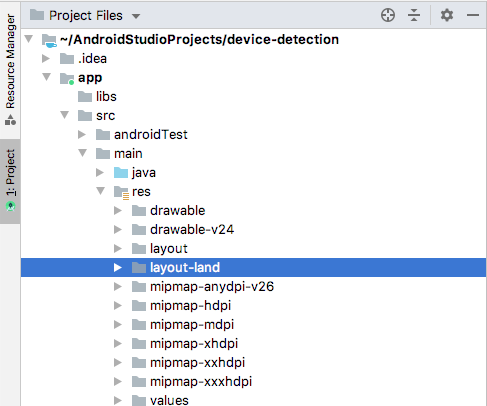

Мы уже встречались со спецификаторами конфигурации<!--, такими как layout-large или layout-xhdpi-->. Сейчас мы освежим и расширим наше понимание этого понятия.

C помощью спецификаторов конфигурации, мы можем влиять на макет приложения, с меньшей зависимости от уровня контроллера (из MVC). Существуют спецификаторы для размера, ориентации и плотности пикселей. Чтобы воспользоваться преимуществами спецификаторов, мы просто создаем макет обычным способом, оптимизированным для нашей предпочтительной конфигурации, а затем помещаем этот макет в папку с именем, которое Android распознает как относящееся к этой конкретной конфигурации.

Например, в предыдущем приложении размещение макета в папке land указывает Android использовать этот макет, когда устройство находится в альбомной ориентации.

Скорее всего, что приведенное выше утверждение покажется странным, вы же не видите никаких особых папок. Это происходит потому, что панель **Project** в Android Studio показывает нам структуру файлов и папок, которая не совсем соответствует реальности. Она пытается упростить вещи и "помочь" нам. Если вы выберете опцию **Project files** из раскрывающегося списка в верхней части панели **Project**, а затем изучите содержимое проекта, вы действительно увидите, что существует папка layout и layout-land:

Переключитесь обратно на макет Android или оставьте его в представлении файлов проекта, в зависимости от того, что вы предпочитаете.

Итак, если мы хотим иметь другой макет для альбомной ориентации, мы создадим папку под названием layout-land в папке res (или используем кнопку **Orientation for Preview**) и поместим в нее наш специально разработанный макет. Когда устройство находится в книжной ориентации, будет использоваться обычный макет из папки layout, а когда оно находится в альбомной, будет использоваться макет из папки layout-land.

Если мы проектируем для разных размеров экрана, мы помещаем макеты в папки со следующими именами:

* layout-small
* layout-normal
* layout-large
* layout-xlarge

Если мы разрабатываем для экранов с различной плотностью пикселей, мы можем поместить XML-макеты в папки с такими именами, как эти:

* layout-ldpi - для экранов низкой плотности; приблизительно 120 dpi.
* layout-mdpi - для экранов средней плотности (обычные HVGA); приблизительно 160 dpi.
* layout-hdpi - для экранов высокой плотности; приблизительно 240 dpi.
* layout-xhdpi - для экранов очень высокой плотности; приблизительно 320 dpi.
* layout-xxhdpi - для экранов сверхвысокой плотности; приблизительно 480 dpi.
* layout-xxxhdpi - для экранов исключительно высокой плотности; приблизительно 640 dpi.
* layout-nodpi - 
* layout-tvdpi - для экранов промежуточной плотности между mdpi и hdpi; приблизительно 213 dpi. предназначен для телевизоров.

Стоит отметить, что то, что мы только что обсудили, далеко от всей истории, касающейся спецификаторов конфигурации, и, как и в случае с дизайном, стоит включить это в свой список вещей для дальнейшего изучения :)

> На сайте разработчика Android есть много подробной информации об обработке макетов для различных устройств. Идем по этой [ссылке](https://developer.android.com/guide/practices/screens_support) для получения дополнительной информации.

## Ограничения
То, что показало нам предыдущее приложение и наше обсуждение спецификаторов конфигурации, безусловно, очень полезно в ряде ситуаций. Однако, к сожалению, спецификаторы, как и детектирование атрибутов состояния в коде, решают проблему только на уровне представления нашего шаблона MVC.

Как уже говорилось, наши приложения иногда должны иметь не только разный макет, но и разное поведение. Это, возможно, подразумевает несколько ветвей кода Java на уровне контроллера и, возможно, вызывает кошмарные представления огромных блоков if или switch с различным кодом для каждого отдельного сценария.

К счастью, это делается совсем не так. Для таких ситуаций Android имеет фрагменты.
