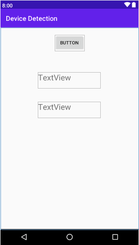
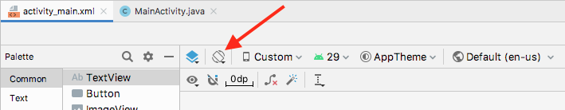
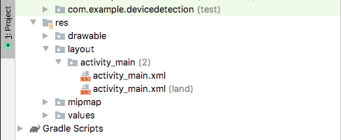
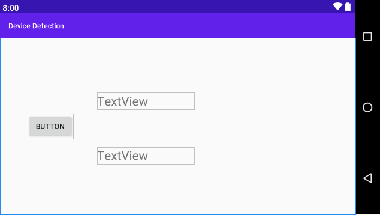
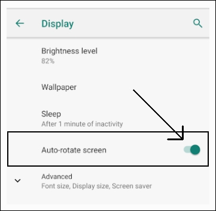
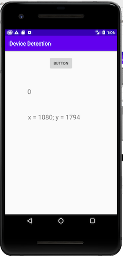
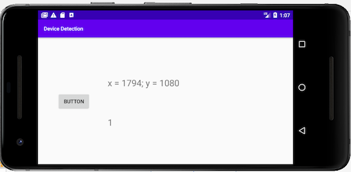

Для наглядности определения различных атрибутов устройства (экран, ориентация и прочее) сделаем простое приложение.

1. Создайте новый проект базового действия и назовите его ```Device Detection```.
2. Удалите стандартный **TextView** ```Hello world!```.
3. Перетащите кнопку в верхнюю часть экрана и установите ее свойство onClick в ```detectDevice```. Мы закодируем этот метод через минуту.
4. Перетащите два виджета **TextView** на макет, один под другим, и установите их свойства **id** в ```txtOrientation``` и ```txtResolution``` соответственно.

Макет будет выглядеть примерно так:



> Я растянул свои виджеты (в основном горизонтально) и увеличил атрибуты **textSize** до ```24sp```, чтобы сделать их более четкими на экране, но это не требуется для правильной работы приложения.

5. Нажмите кнопку **Infer Constraints**, чтобы закрепить позиции элементов. 

Теперь мы сделаем кое-что новое. Мы построим макет специально для ландшафтной ориентации.

В Android Studio, при выбранном файле activity_main.xml найдите кнопку **Orientation for preview**:



Щелкните её и выберите пункт **Create landscape variation**.

Теперь у вас есть новый XML-файл макета с тем же именем, но ориентированный в ландшафтном режиме. Посмотрите на папку **layouts** на панеле **Project** и обратите внимание, что там действительно есть два файла с именем activity_main, и один из них постфиксирован с land.



Теперь посмотрим на сам макет. Похоже, что макет уже содержит все наши виджеты — но мы либо не видем часть из них либо все. Причина этой аномалии заключается в том, что при создании ландшафтного макета Android Studio скопировала портретный макет, включая все привязки. Портретные привязки редко совпадают с ландшафтными.

Чтобы решить эту проблему, нажмите кнопку **Remove all constraints**. Немного пострадало расположение, но, по крайней мере, теперь мы можем видеть наши виджеты. Переставьте их, чтобы макет выглядел аккуратно:



Нажмите кнопку **Infer Constraints**, чтобы зафиксировать макет в новых позициях.

Теперь, когда у нас есть базовый макет для двух различных ориентаций, мы можем обратить наше внимание на Java.

## Кодирование MainActivity
Добавим следующие переменные-экземпляра в класс **MainActivity**, чтобы сохранить ссылки на два виджета **TextView**:
```java
    private TextView txtOrientation;
    private TextView txtResolution;
```
Теперь, в методе **onCreate** проинициализируем эти переменные ссылками на виджеты:
```java
    txtOrientation = (TextView) findViewById(R.id.txtOrientation);
    txtResolution = (TextView) findViewById(R.id.txtResolution);
```
После метода **onCreate** добавьте метод, который будет обрабатывает щелчок кнопки и запускать код обнаружения:
```java
    public void detectDevice(View v) {
        Display display = getWindowManager().getDefaultDisplay();
        txtOrientation.setText("" + display.getRotation());

        Point size = new Point();
        display.getSize(size);
        txtResolution.setText("x = " + size.x + "; y = " + size.y);
    }
```
Здесь объявляется и инициализации объекта типа **Display**. Этот объект (```display```) теперь содержит целую кучу данных о конкретных свойствах отображения устройства.

Результат метода **getRotation** выводится в ```txtOrientation```.

Далее инициализирует объект типа **Point** с именем ```size```. С помощью метода **getSize** загружается разрешение экрана в ```size```. И в ```txtResolution``` выводится горизонтальное и вертикальное разрешение экрана.

При каждом нажатии на кнопку два виджета TextView будут обновляться.

### Разблокировка ориентации экрана
Прежде чем запустить приложение, нам необходимо убедиться, что устройство не заблокировано в портретном режиме (большинство новых телефонов по умолчанию). В приложения эмулятора (или реального устройства, которое вы будете использовать) **Settings** и выберите **Display**, а затем с помощью переключателя установите режим **Auto-rotate screen** в положение включено.



## Запуск приложения
Теперь вы можете запустить приложение и нажмите на кнопку:



Поверните устройство, используя одну из кнопок поворота на панели управления эмулятора, чтобы развернуть его в горизонтальном направлении.

> На некоторых компьютерах эмулятор склонен к сбою при вращении. 🤷‍♂️

Нажмите кнопку еще раз, и вы увидите ландшафтный макет в действии.



Первое, что вы, вероятно, заметите, это то, что при вращении экран на короткое время становится пустым. Это перезапускается активность и как следствие снова вызывается метод **onCreate**. В нем вызывается **setContentView**, но уже с альбомной версией макета, а код в **MainActivity** ссылается на виджеты с теми же идентификатороми, поэтому все работает.

Если результаты 0 и 1 менее очевидны в отношении ориентации устройства, они относятся к общедоступным статическим конечным переменным класса Surface, где Surface.ROTATION_0 равно нулю и Surface.ROTATION_180 равен единице.

> Обратите внимание, что если вы повернете экран влево, то ваше значение будет равно 1, но если вы повернете его вправо, то увидите значение 3. Если вы повернете устройство в портретный режим вверх ногами, то получите значение 4.

В принципе, мы могли бы, в зависимости от значения ориентации, загружать различные макеты. Но, как мы только что видели, Android делает это проще, и без лишнего кода, позволяя добавлять определенные макеты в папки со спецификаторами конфигурации, такими как ```land```.
