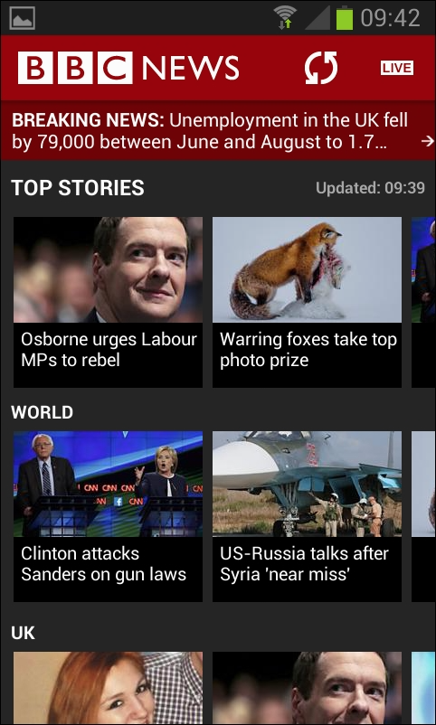
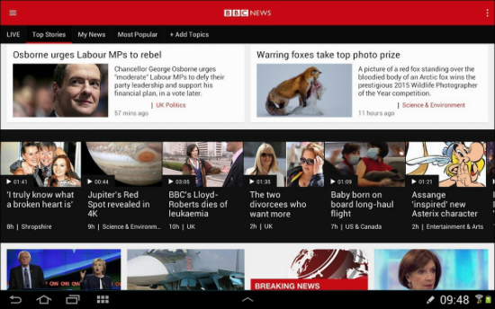

Большинство из приложений, которые мы создавали, были разработаны и протестированы на телефоне.

Конечно, в реальном мире наши приложения должны хорошо работать на любом устройстве и должны быть способны обрабатывать портретный или альбомный режим.

Кроме того, бывает недостаточно, чтобы наши приложения просто работали и выглядели нормально на разных устройствах. Часто наши приложения должны вести себя по-разному и отображаться со значительно отличающимся пользовательским интерфейсом в зависимости от того, является ли устройство телефоном, планшетом или при разной ориентации (альбомной/портретной).

> Так же Android поддерживает приложения для телевизоров с большим экраном, умные часы через Wear API, виртуальную и дополненную реальность, а также штуковины для Интернета вещей.

Посмотрите на скриншот приложения BBC news, работающего на телефоне Android в портретной ориентации. Обратите внимание, что категории новостей (Top Stories, World, UK) все видны и позволяют пользователю прокручивать, чтобы увидеть больше категорий:

А теперь посмотрите на точно такое же приложение, работающее на планшете в альбомной ориентации:

Обратите внимание, данные идентичны, но макет (слой представления) сильно отличается. Пользователю не только предоставляется возможность выбора категорий из меню вкладок в верхней части приложения; ему также предлагается добавить свои собственные вкладки с помощью опции Add Topic.

Android позволяет нам создавать реальные приложения, подобные этому, где не только макет отличается для различных типов устройств/ориентаций/размеров, но и поведение. Секретное оружие Android, которое делает это возможным - фрагменты.

Мы можем создать несколько различных макетов в разных XML-файлах. Мы также можем определять ориентацию устройства и разрешение экрана в коде, поэтому мы можем принимать решения о макете динамически.

Давайте попробуем это сделать с помощью обнаружения устройств, а затем мы впервые посмотрим на фрагменты.
