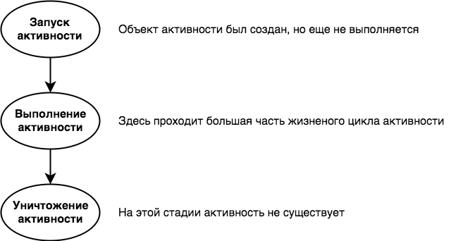

Много ли пользы от приложения, которое сбрасывается в исходное состояние при повороте устройства?

Почему же поворот экрана нарушил работу приложения? Давайте внимательнее присмотримся к тому, что произошло на самом деле.

## Что произошло?

1. Пользователь запускает приложение и щелкает на кнопке Start, чтобы секундомер заработал. Метод onTick() начинает увеличивать число секунд, выводимое в надписи timeView.

2. Пользователь поворачивает устройство. Android видит, что ориентация и размер экрана изменились, и уничтожает
активность вместе с переменными, которые использовались.

3. MainActivity создается заново. Метод onCreate() выполняется заново, и вызывается метод setSeconds(0). Так же создается новый таймер обратного отчетаCountDownTimer timer.

### Поворот экрана изменяет конфигурацию устройства

При запуске активности в начале работы приложения Android принимает во внимание конфигурацию устройства. Под этим термином понимается как конфигурация физического устройства (размер экрана, ориентация экрана, наличие клавиатуры), так и параметры конфигурации, заданные пользователем (например, локальный контекст).

Система Android должна знать конфигурацию устройства при запуске активности, потому что эта информация может повлиять на ресурсы, необходимые приложению. Например, в горизонтальной ориентации может использоваться другой макет, а при выборе русского локального контекста может потребоваться другой набор строковых ресурсов.

При изменении конфигурации устройства все компоненты приложения, отображающие пользовательский интерфейс, должны быть обновлены в соответствии с новой конфигурацией. Если повернуть устройство, Android замечает, что ориентация и размеры экрана изменились, и интерпретирует этот факт как изменение конфигурации устройства. Текущая активность уничтожается и создается заново, чтобы приложение могло выбрать ресурсы, соответствующие новой конфигурации.

<!-- возможно пример с применением другого макета при смене ориентации -->

## Состояния активности
При создании и уничтожении активность переходит между несколькими состояниями.

Главным состоянием активности является состояние выполнения (или активное состояние). Активность в состоянии выполнения находится на переднем плане экрана, обладает фокусом и доступна для взаимодействия с пользователем. Большую часть своего срока жизни активность пребывает в этом состоянии. Активность переходит в состояние выполнения от момента запуска и до того момента, когда она уничтожается.

На пути активности от запуска к уничтожению срабатывают ключевые методы жизненного цикла активности: onCreate() и onDestroy(). Ваша активность наследует эти методы жизненного цикла и может переопределить их при необходимости. 

Метод onCreate() вызывается сразу же после запуска активности. В этом методе выполняется вся обычная подготовка активности, например вызов setContentView(). Всегда переопределяйте этот метод. Если вы не переопределите его, то не сможете сообщить Android, какой макет должна использовать ваша активность.

Метод onDestroy() вызывается непосредственно перед уничтожением активности. Существует немало ситуаций, в которых активность может уничтожаться, — например, если она получила приказ завершиться, если она создается заново из-за изменений в конфигурации устройства или если Android решает уничтожить активность для экономии памяти.

Сейчас мы подробнее рассмотрим, какое место эти методы занимают в состояниях активности и подчиним наш секундомер.
