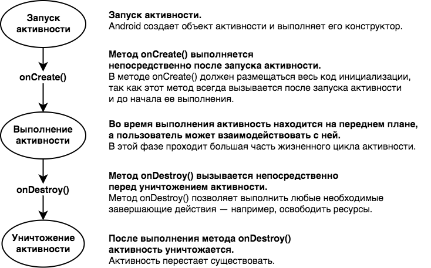
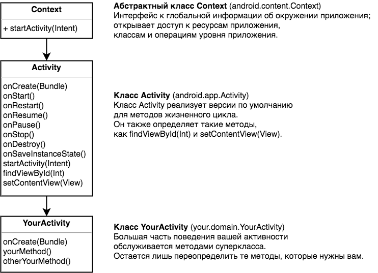
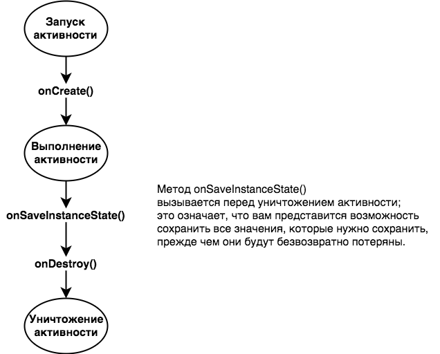
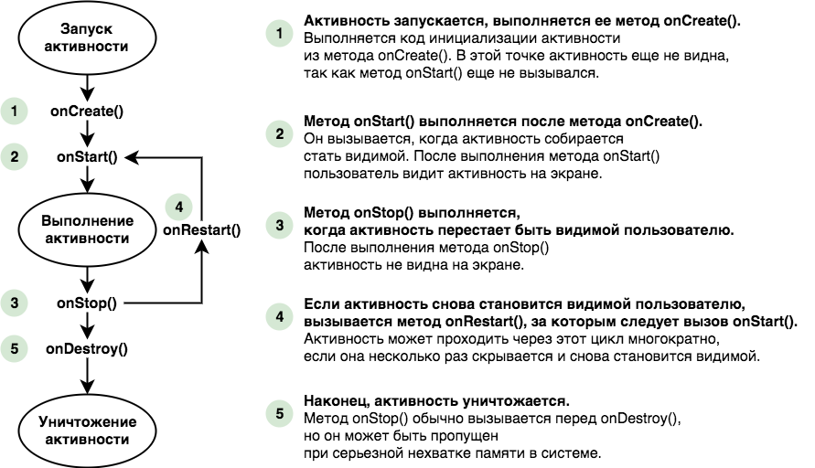
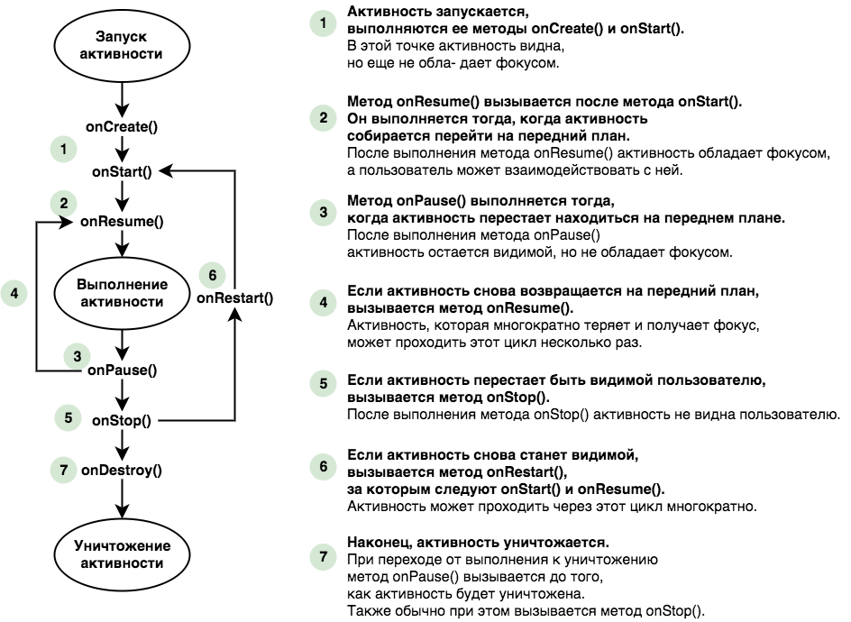

Ниже приведен обзор жизненного цикла активности от запуска до уничтожения. Некоторые подробности были опущены, сейчас нас интересуют только методы onCreate() и onDestroy().



## Активность наследует свои методы жизненного цикла

Как было сказано ранее, ваша активность расширяет класс android.app.Activity. Именно этот класс предоставляет активности доступ к методам жизненного цикла Android:



## Что делать при изменении конфигурации?
Как вы видели, при повороте экрана у нашего приложения начались проблемы. Активность была уничтожена и создана заново, а это означает, что локальные переменные активности были потеряны. Что же делать в таких случаях? Как справиться с такими изменениями конфигурации устройства, как изменение ориентации экрана? Есть два варианта: 
- запретить Android перезапуск активности, 
- сохранить текущее состояние, чтобы активность могла воссоздать себя в том же состоянии. 

Рассмотрим эти два варианта более подробно.

### Запрет повторного создания активности
Первый вариант — запретить Android перезапуск активности при изменениях в конфигурации. Хотя мы покажем, как это делается, учтите, что это почти всегда не лучший вариант. Дело в том, что при повторном создании активности Android выбирает правильные ресурсы, соответствующие новой конфигурации. Если вы пропустите этот шаг, возможно, вам придется написать немалый объем кода, чтобы обработать изменение конфигурации вручную.

Чтобы запретить Android заново создавать активность из-за изменений конфигурации, добавьте строку в элемент activity в файле AndroidManifest.xml:
```xml
android:configChanges="изменение_конфигурации"
```
где изменение_конфигурации — вид изменения конфигурации. В нашем случае система Android должна обойти изменение ориентации и размера экрана, поэтому в файл AndroidManifest.xml нужно будет добавить следующую строку:
```xml
<activity 
    android:name=".MainActivity"
    android:configChanges="orientation|screenSize"> <!-- Знак | означает, что игнорируются оба вида изменения конфигурации. -->
    <intent-filter>
        <action android:name="android.intent.action.MAIN" />

        <category android:name="android.intent.category.LAUNCHER" />
    </intent-filter>
</activity>
```

Обнаружив такое изменение конфигурации, Android будет вызывает метод onConfigurationChanged(Configuration) вместо того, чтобы создавать активность заново:
```java
public void onConfigurationChanged(Configuration config) {  
}
```
При необходимости вы можете реализовать этот метод, для выполнения какой-нибудь своей логики.

### Сохранение текущего состояния
Более правильный способ обработки изменений конфигурации, который вы будете применять чаще всего, — сохранение текущего состояния активности и ее последующее воссоздание в методе onCreate(). 

Чтобы сохранить текущее состояние аткивности, необходимо реализовать метод onSaveInstanceState().



Метод onSaveInstanceState() получает один параметр типа Bundle. Тип Bundle позволяет объединить разные типы данных в один объект:
```java
public void onSaveInstanceState(Bundle savedInstanceState) {
}
```
Метод onCreate() так же получает параметр Bundle. Таким образом, если вы добавите значения переменных seconds в Bundle, метод onCreate() сможет восстановить их при повторном создании активности. 

Для включения пар «имя/значение» в Bundle используются методы Bundle, которые имеют следующую форму:
```java
bundle.put*("name", value)
```
где bundle — имя объекта Bundle, * — тип сохраняемого значения, а name и value — имя и значение в сохраняемых данных.

Например, для включения в Bundle значения seconds типа int используется следующая команда:
```java
bundle.putInt("seconds", seconds);
```
В Bundle можно сохранить сколько угодно пар данных «имя/значение».

После того как значения переменных были сохранены в Bundle, их можно будет использовать в методе onCreate(). 

Как упоминалось ранее, метод onCreate() получает один параметр Bundle. Если активность создается с нуля, то этот параметр содержит null. Но если активность создается заново, а созданию предшествовал вызов onSaveInstanceState(), активности передается объект Bundle, использованный в onSaveInstanceState()

Значения из Bundle читаются методами вида:
```java
bundle.get*("name");
```
где bundle — имя объекта Bundle, * — тип значения, которое вы хотите прочитать, а name — имя из пары имя/значение

Например, для получения из Bundle значения seconds типа int используется команда:
```java
int seconds = bundle.getInt("seconds");
```

Если собрать воедино все сказанное, метод onCreate() принимает следующий вид:
```java
protected void onCreate(Bundle savedInstanceState) {
    super.onCreate(savedInstanceState);
    setContentView(R.layout.activity_stopwatch);

    int seconds = (savedInstanceState != null) ? savedInstanceState.getInt("seconds") : 0;
    setSeconds(seconds);
}
```

<!-- video  -->

## Жизнь активности не ограничивается созданием и уничтожением
До настоящего момента мы рассмотрели фазы создания и уничтожения в жизненном цикле; также вы узнали, как обрабатываются изменения конфигурации — например, изменение ориентации экрана. Однако в жизни приложения существуют и другие события, обработка которых поможет вам добиться того, чтобы приложение работало так, как вам нужно. Например, предположим, что во время работы секундомера поступил телефонный звонок. Хотя секундомер и не виден на экране, он будет продолжать работу. Но что, если вы хотите, чтобы секундомер на это время останавливался и запускался снова, когда приложение снова становится видимым? 

### Старт, остановка и перезапуск
К счастью, использование правильных методов жизненного цикла позволяет легко обрабатывать действия, связанные с видимостью приложения. Кроме методов onCreate() и onDestroy(), связанных с началом и завершением всего жизненного цикла активности, также существуют другие методы жизненного цикла, связанные с видимостью активности. Есть три ключевых метода жизненого цикла, связанных с переходами активности в видимое или невидимое состояние. Это методы onStart(), onStop() и onRestart(). Как и методы onCreate() с onDestroy(), они наследуются от класса Android Activity.

Метод onStart() вызывается, когда активность становится видимой для пользователя.

Метод onStop() вызывается, когда активность перестает быть видимой для пользователя. Это может произойти из-за того, что она полностью закрывается другой активностью, отображаемой поверх нее, или из-за того, что активность готовится к уничтожению. Если метод onStop() вызывается из-за того, что активность готовится к уничтожению, перед onStop() вызывается метод onSaveInstanceState(). 

Метод onRestart() вызывается перед тем, как активность, ставшая невидимой, снова должна появиться на экране.

Далее разберемся, какое отношение эти методы имеют к методам onCreate() и onDestroy().



## Реализация остановки/запуска секундомера, когда приложение невидимо/видимо
Чтобы обновить приложение Stopwatch, необходимо сделать две вещи. Во-первых, необходимо реализовать метод onStop() активности, чтобы отсчет времени останавливался, если приложение стало невидимым. Когда это будет сделано, необходимо реализовать метод onStart(), чтобы отсчет времени возобновлялся, когда приложение становится видимым. Начнем с метода onStop().

Переопределите метод onStop() в классе Android Activity, добавив в активность следующий метод:
```java
@Override
protected void onStop() {
    super.onStop();
    timer.cancel();
}
```
Каждый раз, когда вы переопределяете один из методов жизненного цикла Android, важно начать с вызова версии метода из класса родителя: super.onStop();

Для этого есть пара причин. Во-первых, нужно позаботиться о том, чтобы активность выполнила все действия метода жизненного цикла суперкласса. Во-вторых, Android не простит попытки обойти этот шаг — будет сгенерировано исключение.

Теперь секундомер останавливается, когда активность становится невидимой. Теперь нужно сделать следующий шаг — снова
запустить отсчет времени, когда активность станет видимой.

```java
@Override
protected void onStart() {
    super.onStart();
    if (running) {
        timer.start();
    }
}
```

## А если приложение видимо только частично?
Итак, теперь вы знаете, что происходит при создании и уничтожении активности, а также когда активность скрывается и снова становится видимой. Однако существует еще одна важная ситуация: когда активность видима, но не обладает фокусом.

Если активность видима, но не имеет фокуса, она приостанавливается (paused). Это может произойти, если поверх нее отображается другая активность, которая занимает лишь часть экрана или частично прозрачна. Верхняя активность имеет фокус, но нижняя остается видимой — а следовательно, приостанавливается.

С приостановкой активности и ее последующим переходом в активное состояние связаны два метода жизненного цикла: onPause() и onResume(). Метод onPause() вызывается тогда, когда ваша активность видима, но фокус принадлежит другой активности. Метод onResume() вызывается непосредственно перед тем, как ваша активность начинает взаимодействовать с пользователем. Если ваше приложение должно как-либо реагировать на приостановку активности, вы должны реализовать эти методы.

Дополним диаграмму жизненного цикла, приводившуюся ранее в этой главе, методами onResume() и onPause()



## Прекращение отсчета времени при приостановке активности
Пока что наш секундомер останавливается, если приложение Stopwatch становится невидимым, и снова запускается,
когда приложение снова оказывается на экране. Давайте в дополнение к этому сделаем так, чтобы отсчет времени
прекращался при приостановке активности и запускался снова при продолжении ее работы. Какие же методы жизненного цикла для этого следует реализовать?

Следует использовать методы onPause() и onResume()

```java
@Override
protected void onPause() {
    super.onPause();
    timer.cancel();
}

@Override
protected void onResume() {
    super.onResume();
    if (running) {
        timer.start();
    }
}
```
Посмотрим снова на диаграмму жизненного цикла, вызовы onPause() и onResume() производятся внутри onStop() и onStart() при каждой остановке и старте активности. Так как содержимое методов у нас одинаковое, мы можем удалить переопределение onStop() и onStart(), при этом работа приложения не изменится.

## Изменение конфигурации, когда активность приостановлена

А что произойдет, если на момент поворота активность приостановлена? Пройдет ли она через те же методы жизненного цикла?

Исходная активность проходит все свои методы жизненного цикла, от onCreate() до onDestroy(). Новая активность создается при уничтожении исходной. Так как новая активность не находится на переднем плане, вызываются только методы жизненного цикла onCreate() и onStart():

<!-- возможно нужна диаграмма этих переходов -->

Активности могут переходить прямо от onStart() к onStop(), обходя вызовы onPause() и onResume().

Если ваша активность видима, но никогда не находится на переднем плане и никогда не получает фокус, методы onPause() и onResume() никогда не вызываются.

Метод onResume() вызывается тогда, когда активность появляется на переднем плане и обладает фокусом. Если активность видима только за другими активностями, метод onResume() не вызывается.

Аналогичным образом метод onPause() вызывается тогда, когда активность уходит с переднего плана. Если активность никогда не находится на переднем плане, то и метод вызываться не будет.
