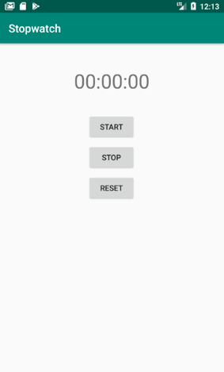
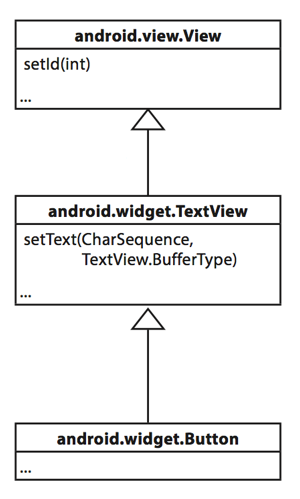
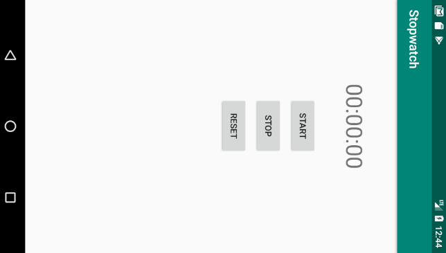

У вас уже достаточно опыта, чтобы построить макет приложение без особой помощи. Создайте новый проект Android и постройте следующий макет. 



Макет состоит из надписи, в которой выводится прошедшее время, кнопки Start для запуска секундомера, кнопки Stop для его остановки и кнопки Reset для остановки и обнуления значения секундомера.

Макет использует три строковых значения, для текста на каждой кнопке. Помните, что мы их в кнопках не хардкодим, а используем стоковые ресурсы.

## Как заставить кнопку вызвать метод
Если вы добавляете в макет кнопку, то скорее всего, когда пользователь щелкает на этой кнопке, в приложении что-то должно происходить. Но для этого необходимо, чтобы при щелчке на кнопке вызывался некий метод вашей активности.

Чтобы щелчок на кнопке приводил к вызову метода активности, необходимо:
- в файле макета указать, какой метод активности должен вызываться при щелчке на кнопке
- в файле активности написать метод, который будет вызываться

Начнем с макета.

## onClick и метод, вызываемый при щелчке

Чтобы сообщить Android, какой метод должен вызываться при щелчке на кнопке, достаточно всего одной строки разметки XML. Все, что для этого нужно — добавить атрибут android:onClick в элемент Button и указать имя вызываемого метода.

Посмотрим, как это делается. Откройте файл макета activity_main.xml и добавьте в элемент кнопки Start новую строку XML, которая сообщает, что при щелчке на кнопке должен вызываться метод onClickStart()
```xml
 <Button
    <!-- ... -->
    android:onClick="onClickStart" />
```
Теперь макет знает, какой метод активности следует вызвать; но мы еще должны написать сам метод. Давайте посмотрим, как выглядит активность.

## Как выглядит код активности
В процессе создания проекта для приложения мы приказали мастеру сгенерировать простейшую активность. Код этой активности хранится в файле MainActivity.java.

Откройте этот файл. 
```java
public class MainActivity extends AppCompatActivity {

    @Override
    protected void onCreate(Bundle savedInstanceState) {
        super.onCreate(savedInstanceState);
        setContentView(R.layout.activity_main);
    }
}
```
Этот код — все, что необходимо для создания простейшей активности. Как видите, в нем создается класс, который расширяет класс androidx.appcompat.app.AppCompatActivity и реализует метод onCreate().

Все активности должны расширять класс Activity. Класс Activity содержит набор методов, которые превращают обычный класс Java в полноценную активность Android.

Все активности также должны реализовать метод onCreate(). Метод onCreate() вызывается при создании объекта активности и используется для настройки основных параметров — например, выбора макета, с которым связывается активность. Это делается при помощи метода setContentView(). В нашем случае вызов setContentView(R.layout.activity_main) сообщает Android, что эта активность использует макет activity_main.

В макете мы уже добавили атрибут onClick к кнопке Start и присвоили ему значение onClickStart. Теперь нужно добавить этот метод в активность, чтобы он вызывался при нажатии кнопки. Таким образом, активность будет реагировать на нажатия пользователем кнопки в интерфейсе.

## Добавление в активность метода onClickStart()

Метод onClickStart() должен иметь строго определенную сигнатуру; в противном случае он не будет вызываться при щелчке на кнопке, указанной в макете. Он имеет следующую форму:

```java
public void onClickStart (View view) {
}

```
- Метод должен быть объявлен открытым (модификатор public)
- Метод должен возвращать void
- Метод должен иметь один параметр с типом View

Если метод имеет другую сигнатуру, он не будет реагировать на прикосновение пользователя к кнопке. Дело в том, что Android незаметно для пользователя ищет открытый метод, возвращающий void, имя которого совпадает с именем метода, указанного в разметке XML макета. 

Параметр View на первый взгляд кажется несколько странным, но для его присутствия имеется веская причина. Он определяет компонент графического интерфейса, инициировавший вызов метода (в данном случае это кнопка). Компоненты графического интерфейса — такие, как кнопки и надписи, — все являются специализациями View.



Итак, добавим в код активности метод onClickStart(). Так же по аналогии, сделаем с кнопками Stop и Reset.

## Методы onClickStart(), onClickStop() и onClickReset() должны что-то делать

У нас есть подключенные методы. Далее нужно позаботиться о том, чтобы при выполнении этих методов что-то происходило. 

Для отслеживания состояния секундомера будем использовать приватную переменную seconds типа int, в ней будет хранится количество секунд, прошедших с момента запуска секундомера.
```java
private int seconds;
```
Так же сразу заведем метод setSeconds(), который будет устанавливать значение переменной seconds.
```java
public void setSeconds(int value) {
    this.seconds = value;
}
```
И вызовем его в методе onCreate() со значением 0, чтобы при создании активности, обнулить значение переменной seconds
```java
@Override
protected void onCreate(Bundle savedInstanceState) {
    super.onCreate(savedInstanceState);
    setContentView(R.layout.activity_main);

    setSeconds(0);
}
```

### Создание таймера с помощью CountDownTimer
Нам необходимо увеличивать значение seconds на 1 каждую секунду, когда таймер запущен. Для создания таймера есть множество способов с различной реализацией, мы воспользуемся [CountDownTimer](https://developer.android.com/reference/android/os/CountDownTimer) и создадим таймер обратного отчета.
```java
private CountDownTimer timer = new CountDownTimer(Long.MAX_VALUE, 1000) {

    public void onTick(long millisUntilFinished) {
        setSeconds(++seconds); // операция инкремент в префиксной записи возвращает значение своего операнда после вычисления выражения
    }

    public void onFinish() {
    }
};
```
CountDownTimer принимает два параметра, первый количество милисекунд до окончания работы таймера (мы задали максимально возможное), второй количество милисекунд, через которое будет вызываться метод onTick.

В методе onTick(), вызовем setSeconds() для установки нового значения seconds.

CountDownTimer timer создается с помощью синтаксиса анонимного класса. Представляющий из себя создание объекта безымянного типа наследника родительского класса (либо реализация интерфейса) с последующим написанием за ним в фигурных скобках тела анонимного класса — наследника, которое обеспечивает реализацию абстрактных методов при создании нового объекта. 

Теперь обновим методы onClickStart(), onClickStop() и onClickReset(), добавим в них управление таймером timer и свойством seconds.

```java
public void onClickStart(View view) {
    timer.start();
}

public void onClickStop(View view) {
    timer.cancel();
}

public void onClickReset(View view) {
    timer.cancel();
    setSeconds(0);
}
```

Приложение должно выводить количество прошедших секунд в формате hh:mm:ss. Для этого необходимо сначала получить ссылку на компонент графического интерфейса в макете — надпись (TextView). С помощью этой ссылоки мы сможем вывести требуемый нам текст в надписи.

### Использование findViewById() для получения ссылки на компонент

Для получения ссылки на компонент графического интерфейса можно воспользоваться методом findViewById(). Метод findViewById() получает идентификатор компонента в виде параметра и возвращает объект View. Далее остается привести возвращаемое значение к правильному типу компонента (в нашем случае TextView).

```java
TextView timeView = (TextView) findViewById(R.id.time);
```
R.java — специальный файл Java, который генерируется инструментарием Android при создании или построении приложения. Он находится в папке app/build/generated/source/r/debug вашего проекта — внутри папки, имя которой совпадает с именем пакета приложения. Android использует R для отслеживания ресурсов, используемых в приложении; среди прочего, этот класс позволяет получать ссылки на компоненты графического интерфейса из кода активности.

### Получив ссылку на объект View, вы можете вызывать его методы

Метод findViewById() предоставляет Java-версию компонента графического интерфейса. Это означает, что вы можете читать и задавать свойства компонента при помощи методов, предоставляемых классом Java.

Допустим. вы хотите, чтобы в надписи time отображался текст "00:00:00". Класс TextView содержит метод setText(), используемый для задания свойства text. Он используется следующим образом:

```java
time.setText("00:00:00"); 
```
Осталось сделать так, чтобы текст задавался в соответствии со значением свойства seconds. Для этого в активности сделаем отдельный метод updateTimeView()
```java
public void updateTimeView() {
    int ss = seconds % 60;
    int minutes = seconds / 60;
    int mm = minutes % 60;
    int hours = minutes / 60;
    String timeString = String.format("%02d:%02d:%02d", hours, mm, ss);

    TextView timeView = (TextView) findViewById(R.id.time);
    timeView.setText(timeString);
}
```

и будем вызывать этот метод при изменени переменной seconds, т.е. поместим его в метод setSeconds()
```java
public void setSeconds(int value) {
    this.seconds = value;
    updateTimeView();
}
```

Запустим приложение в эмуляторе, и посмотрим как оно работает. В процессе работы поизменяйся ориентацию виртуального устройства, нажимая кнопки


Вроде приложение работает в точности так, как и ожидалось.

А теперь запустим приложение на реальном устройстве и после того, как вы запустили секундомер и время пошло, поверните устройство.



Упс!

В мире Android приложения на удивление часто "ломаются" при повороте устройства. Но прежде чем решать проблему, стоит получше разобраться с ее причинами.
