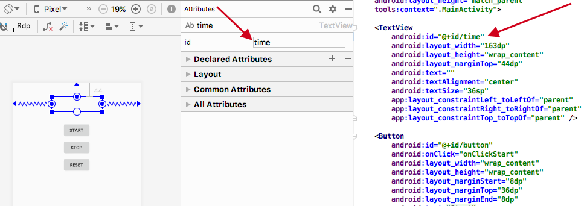

У вас уже достаточно опыта, чтобы построить макет приложение без особой помощи. Создайте новый проект Android и постройте следующий макет. 


Макет состоит из надписи, в которой выводится прошедшее время, кнопки Start для запуска секундомера, кнопки Stop для его остановки и кнопки Reset для остановки и обнуления значения секундомера.

Макет использует три строковых значения, для текста на каждой кнопке. Помните, что мы их в кнопках не хардкодим, а используем стоковые ресурсы.

## Как выглядит код активности
В процессе создания проекта для приложения мы приказали мастеру сгенерировать простейшую активность. Код этой активности хранится в файле MainActivity.java.

Откройте этот файл. 
```java
public class MainActivity extends AppCompatActivity {

    @Override
    protected void onCreate(Bundle savedInstanceState) {
        super.onCreate(savedInstanceState);
        setContentView(R.layout.activity_main);
    }
}
```
Этот код — все, что необходимо для создания простейшей активности. Как видите, в нем создается класс, который расширяет класс androidx.appcompat.app.AppCompatActivity и реализует метод onCreate().

Все активности должны расширять класс Activity. Класс Activity содержит набор методов, которые превращают обычный класс Java в полноценную активность Android.

Все активности также должны реализовать метод onCreate(). Метод onCreate() вызывается при создании объекта активности и используется для настройки основных параметров — например, выбора макета, с которым связывается активность. Это делается при помощи метода setContentView(). В нашем случае вызов setContentView(R.layout.activity_main) сообщает Android, что эта активность использует макет activity_main.

## Начало реализации
У нашего приложения есть состояние, количество секунд, прошедших с момента запуска секундомера. Это состояние надо где-то хранить. Заведем для этого приватную переменную seconds типа int. 
```java
private int seconds;
```
Так же сразу заведем сеттер (метод для установки значения поля) setSeconds(), который будет устанавливать значение переменной seconds.
```java
public void setSeconds(int value) {
    seconds = value;
}
```
И вызовем этот сеттер с параметром 0 в методе onCreate(), так как в начале работы нашего приложения значение seconds должно быть 0.

Казалось бы, в чем разница? Мы так же можем присвоить значение переменной напрямую, без использования метода.
```java
seconds = 0;
```
Разница в том, что сеттер — это полноценный метод. А в методе, в отличие от простого присваивания полю значения, мы можем заложить дополнительную необходимую логику. Скоро мы это увидим.

Приложение должно выводить количество прошедших секунд в формате hh:mm:ss. Получить такую строку на основе переменной seconds, для вас не составит труда. А вот как получившуюся строчку вывести в текстовый компонент?

Для этого необходимо сначала получить ссылку на компонент графического интерфейса в макете — надпись (TextView). А дальше, с помощью этой ссылоки, мы сможем вывести требуемый нам текст в надписи.

## Использование findViewById() для получения ссылки на компонент
Для получения ссылки на компонент графического интерфейса можно воспользоваться методом findViewById().
```java
findViewById(<идентификатор ресурса>);
``` 
Метод findViewById() получает идентификатор ресурса в виде параметра и возвращает объект View. 
### Как получить нужный идентификатор в коде?
Для задания всех идентификаторов ресурсов в вашем проекте, используется класс R. R.java — специальный файл Java, который генерируется инструментарием Android при создании или построении приложения.

В классе R находятся идентификаторы для всех ресурсов в каталоге res/. Для каждого типа ресурсов предусмотрен подкласс R (например, R.layout для макетов), а для каждого ресурса указанного типа существует статическая целочисленная переменная (например, R.layout.activity_main). Эта переменная как раз и служит идентификатором ресурса, которую можно использовать для его получения из кода.

### Указание идентификатора ресурса в компонентах
Идентификатор прописывается в атрибутах компонента, в графическом, либо текстовом представлении layout-файлов, смотря где вам удобнее редактировать ваши макеты. 



Для id существует четкий формат - @+id/name, где + означает, что это новый ресурс и он должен добавиться в R.java класс, если его там еще нет.

Например, у необходимого нам компонента, id равет "@+id/time", значит, для получения ссылки на компонент мы будем передавать R.id.time
```java
TextView timeView = (TextView) findViewById(R.id.time);
```
Для приведения возвращаемое значение к правильному типу (в нашем случае TextView), используется операцию приведения типа.
<!-- TODO: поставить ссылку на приведение типа -->
### Получив ссылку на объект View, вы можете вызывать его методы
Метод findViewById() предоставляет Java-версию компонента графического интерфейса. Это означает, что вы можете читать и задавать свойства компонента при помощи методов, предоставляемых классом Java.

Допустим. вы хотите, чтобы в надписи time отображалась строка "00:00:00". Класс TextView содержит метод setText(), используемый для задания свойства text. Он будет использоваться следующим образом:
```java
timeView.setText("00:00:00"); 
```
### Coding time
Вооружившись этими знаниями, сделайте так, чтобы текст задавался в соответствии со значением переменной seconds в формате hh:mm:ss. Для этого в активности лучше сделать отдельный метод, например updateTimeView(), внутри которого написать необходимую реализацию.
```java
public void updateTimeView() {
    // your implementation
}
```
а затем вызывать этот метод при изменени переменной seconds, для чего у нас есть подходящий сеттер - setSeconds()
```java
public void setSeconds(int value) {
    seconds = value;
    updateTimeView();
}
```
В результате, всякий раз, когда изменяется значение seconds c помощью сеттера setSeconds(), будет соответственно меняться строка в компоненте TextView.

<!-- видео реализации -->

## Как заставить кнопку вызвать метод
Если вы добавляете в макет кнопку, то скорее всего, когда пользователь щелкает на этой кнопке, в приложении что-то должно происходить. Но для этого необходимо, чтобы при щелчке на кнопке вызывался некий метод вашей активности.

Чтобы щелчок на кнопке приводил к вызову метода активности, необходимо:
- в файле макета указать, какой метод активности должен вызываться при щелчке на кнопке
- в файле активности написать метод, который будет вызываться

Начнем с макета.

### onClick и метод, вызываемый при щелчке

Чтобы сообщить Android, какой метод должен вызываться при щелчке на кнопке, достаточно всего одной строки разметки XML. Все, что для этого нужно — добавить атрибут android:onClick в элемент Button и указать имя вызываемого метода.

Посмотрим, как это делается. Откройте файл макета activity_main.xml и добавьте в элемент кнопки Start новую строку XML, которая сообщает, что при щелчке на кнопке должен вызываться метод onClickStart()
```xml
 <Button
    <!-- ... -->
    android:onClick="onClickStart" />
```
Теперь макет знает, какой метод активности следует вызвать; но мы еще должны написать сам метод.

### Добавление в активность метода onClickStart()

Метод onClickStart() должен иметь строго определенную сигнатуру; в противном случае он не будет вызываться при щелчке на кнопке, указанной в макете. Он имеет следующую форму:
```java
public void onClickStart (View view) {
}
```
- Метод должен быть объявлен открытым (модификатор public)
- Метод должен возвращать void
- Метод должен иметь один параметр с типом View

Если метод имеет другую сигнатуру, он не будет реагировать на прикосновение пользователя к кнопке. Дело в том, что Android незаметно для пользователя ищет открытый метод, возвращающий void, имя которого совпадает с именем метода, указанного в разметке XML макета. 

Параметр View на первый взгляд кажется несколько странным, но для его присутствия имеется веская причина. Он определяет компонент графического интерфейса, инициировавший вызов метода (в данном случае это кнопка). Компоненты графического интерфейса — такие, как кнопки и надписи, — все являются специализациями View.


Итак, добавим в код активности метод onClickStart(). Так же по аналогии, сделаем с кнопками Stop и Reset.

<!-- video реализации -->

## Методы onClickStart(), onClickStop() и onClickReset() должны что-то делать

У нас есть подключенные методы. Далее нужно позаботиться о том, чтобы при выполнении этих методов что-то происходило. 

### Создание таймера с помощью CountDownTimer
Нам необходимо увеличивать значение seconds на 1 каждую секунду, когда таймер запущен. Значит нам нужен таймер.

Для создания таймера есть множество способов с различной реализацией, мы воспользуемся [CountDownTimer](https://developer.android.com/reference/android/os/CountDownTimer) и создадим таймер обратного отчета.
```java
private CountDownTimer timer = new CountDownTimer(Long.MAX_VALUE, 1000) {

    public void onTick(long millisUntilFinished) {
    }

    public void onFinish() {
    }
};
```
CountDownTimer принимает два параметра, первый количество милисекунд до окончания работы таймера (мы задали максимально возможное), второй количество милисекунд, через которое будет вызываться метод onTick.

CountDownTimer timer создается с помощью синтаксиса анонимного класса. Представляющий из себя создание объекта безымянного типа наследника родительского класса (либо реализация интерфейса) с последующим написанием за ним в фигурных скобках тела анонимного класса — наследника, которое обеспечивает реализацию абстрактных методов при создании нового объекта. 

Раз метод onTick() будет вызываться каждые 1000 милисекунд, в нем поместим вызов setSeconds() для установки нового значения seconds, которое должно быть больше на 1.
```java
    setSeconds(++seconds); // операция инкремент в префиксной записи возвращает значение своего операнда после вычисления выражения
```
Отлично сам таймер есть, осталось его запускать и останавливать в нужный момент. Для этого у CountDownTimer есть пара удобных методов start() и сancel().

Обновим наши методы-обработчики onClickStart(), onClickStop() и onClickReset(), добавив в них управление таймером timer и свойством seconds.

```java
public void onClickStart(View view) {
    timer.start();
}

public void onClickStop(View view) {
    timer.cancel();
}

public void onClickReset(View view) {
    timer.cancel();
    setSeconds(0);
}
```

<!-- video реализация -->

## Запуск и тестирование
Запустим приложение в эмуляторе, и посмотрим как оно работает. В процессе работы поизменяйте ориентацию виртуального устройства, нажимая кнопки


Вроде приложение работает в точности так, как и ожидалось. Но если мы запустим секундомер, и убедившись, что время пошло, повернем устройство.


Упс!

В мире Android приложения на удивление часто "ломаются" при повороте устройства. Но прежде чем решать проблему, стоит получше разобраться с ее причинами.
