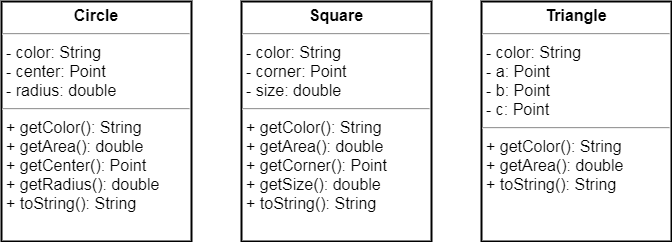
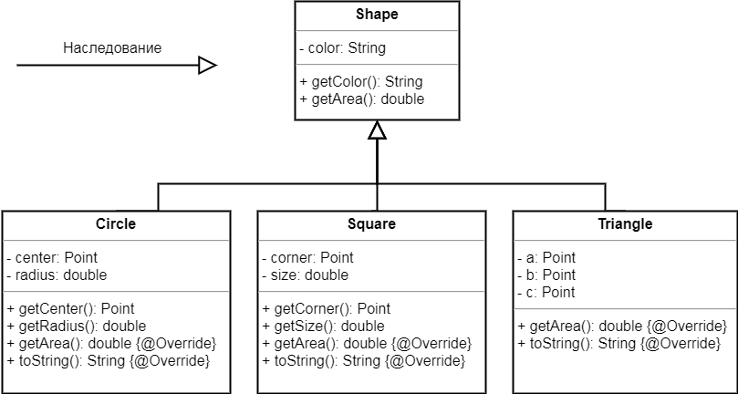

Одна из фундаментальных концепций ООП это наследование. Речь идет о том, чтобы классы создавать не с нуля, а наследуя или расширяя другие классы.



При проектировании с использованием наследования вы помещаете общий код в один абстрактный класс и объявляете его родителем для других, более специфических классов. Когда один класс наследует другой, это означает, что дочерний класс наследует родительский.



В Java мы говорим, что дочерний класс расширяет родительский. Подобные отношения подразумевают, что дочерний класс наследует члены родительского класса. Когда мы говорим "член класса", мы имеем в виду переменные экземпляра и методы.  
Например, если **Circle** - потомок **Shape**, то класс **Circle** автоматически наследует переменные экземпляра и методы, общие для всех фигур, включая цвет - **color**, умение его возвращать - метод **getColor** и умение возвращать площадь - метод **getArea**. Но дочерний класс **Circle** может иметь собственные переменные экземпляра и методы. Кроме того, методы можно переопределять, т.е. в классе-наследнике можно завести метод с таким же именем и параметрами как в базовом классе. 

Переменные экземпляра не переопределяются, так как в этом нет необходимости. Они не описывают специфическое поведение, дочерний класс и так может присвоить им любые значения. 

Наследование в Java обозначается ключевым словом extends. Наследоваться можно только от одного класса.
```java
class Circle extends Shape {
    // ...
}
```

