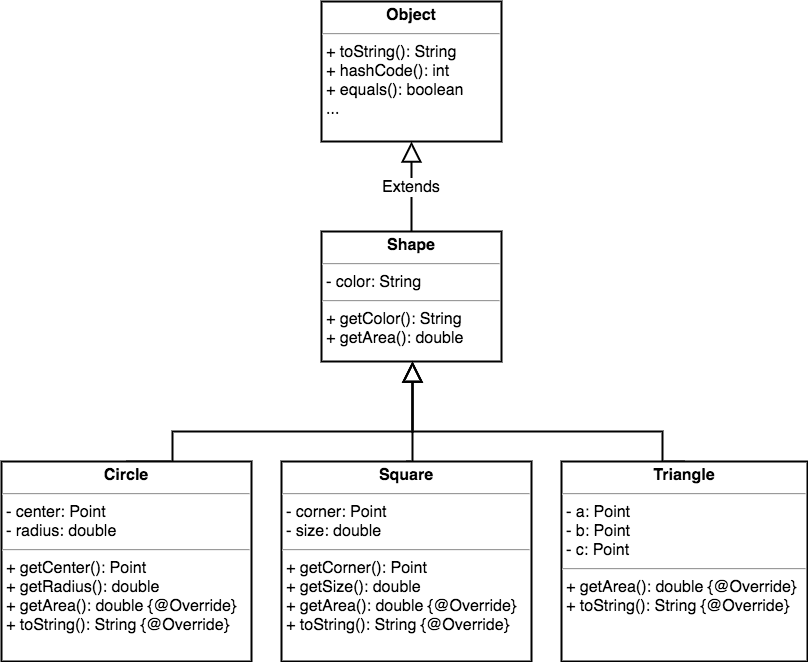

Когда один класс наследует другой, мы говорим, что дочерний класс расширяет родительский. Если вы хотите узнать, расширяет ли одна сущность другую, проведите проверку на соответствие - **IS-A** (является).

- треугольник - это фигура
- кошка - представитель семейства кошачьих
- ванна расширяет ванную комнату

Чтобы узнать, правильно ли вы спроектировали свои типы, спросите себя: "Можно ли сказать, что тип X представляет собой тип Y"? Если ответ отрицательный, значит, вы что-то не так сделали. Поэтому проверив на соответствие ванну (класс Tub) и ванную комнату (класс Bathroom), вы определенно получите false.

Эти понятия связаны между собой, но не через наследование. Такая связь выражается отношением **HAS-A** (содержит). Разве не логично сказать, что ванная комната содержит ванну? Если ответ положительный, значит, класс Bathroom имеет переменную типа Tub, или класс Bathroom содержит ссылку на класс Tub, но не расширяет его.

<!-- В UML для отношений has-a используются обозначения взаимосвязей объектов классов:

 -->

<!-- описание связи Point и Unit -->

## IS-A работает в любой части иерархии
Проверка на соответствие IS-A работает в любой части иерархии наследования. Если ваша иерархия спроектирована должным образом, то проверка на соответствие будет иметь смысл в контексте любого родительского класса и любых его подклассов.

Если класс B расширяет класс A, то класс B соответствует классу A. Если класс С расширяет B, то он проходит проверку на соответствие обоим классам - B и A.

При такой иерархии наследования, как показана на рисунке, вы всегда можете сказать: **Circle** расширяет **Shape** или **Circle** соотвествует **Shape**.

Раз класс **Circle** соответствует **Shape** он может делать все, что может делать **Shape**. Класс **Triangle** также соответствует **Shape**, поэтому он тоже может делать все, на что способен класс **Shape**".

Старайтесь использовать проверку на соответствие. Если X соответствует Y, значит, оба класса (X и Y), скорее всего, должны находиться в одной иерархии наследования. Вероятно, они ведут себя одинаково или дублируют функции друг друга.

## IS-A работает только в одном направлении!
Не забывайте, что отношение IS-A работает только в одном направлении.

*Треугольник - это фигура*. Выражение имеет смысл, поэтому треугольник расширяет фигуру. Но если поменять их местами: *фигура - это треугольник*, то будет нелогично. Поэтому класс **Triangle** расширяет **Shape**, а не наоборот. 

Помните, отношение IS-A подразумевает, что если X соответствует Y, то X может делать все, что может делать Y (а иногда и больше).

<!-- отметьте отношения, которые имеют смысл -->
