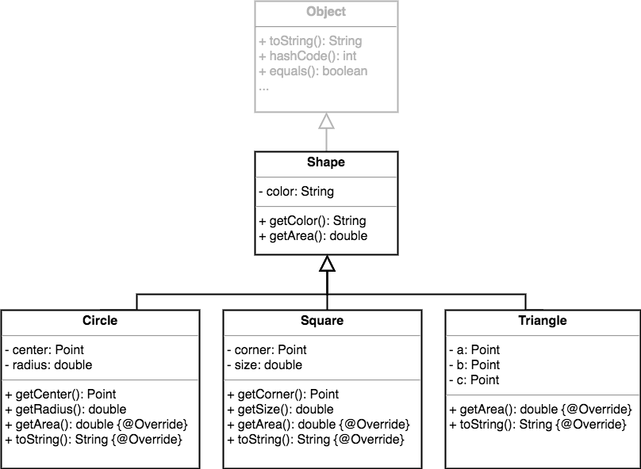

Любой класс, который явно не расширяет другой класс, на самом деле неявно унаследован от класса **Object**.
```java
class Shape /* extends Object */ {
  // ...
}
```


Класс **Object** это корень всей иерархии наследования, прародитель всех остальных ссылочных типов.  
Из этого следует, что абсалютно все классы в Java содержат методы объявленные в классе **Object**.

Что же находится в этом ультра-супер-мега-классе?
Там около десятка методов, но самые часто используемые - это **toString**, **equals**, **hashCode**.

## toString()
Метод **toString** преобразует объект в строку. Он вызывается когда мы например выводим объект в консоль, при помощи ```System.out.println()``` или когда конкатенируем строку с объектом. Разумеется, его можно вызвать и явно, используя в своих целях. 
```java
class Foo {

}

public class Main {
    public static void main(String[] args) {
        Foo foo = new Foo();
        
        System.out.println(foo);                    //  Foo@77459877
        System.out.println(foo + " other string");  //  Foo@77459877 other string
        System.out.println(foo.toString());         //  Foo@77459877
    }
}
```
Реализация метода **toString** в **Object** формирует строку вида <полное имя класса>@16-ричный hashCode. 

Достаточно часто классы переопределяют его для возврата чего-то более осмысленного.
```java
class Foo {
    //...
    
    @Override
    public String toString() {
        return "some useful information";
    }
}
```

## equals()
Метод **equals** сообщает вам, считаются ли два объекта идентичными.  
```java
Foo f = new Foo();
Foo f2 = new Foo();
if (f.equals(f2)) {
    System.out.println("true");
}
```

Реализация метода в **Object**, проверяет на идентичность только ссылки
```java
//java.lang.Object
public class Object {
    //...
    public boolean equals(Object obj) {
        return (this == obj);
    }
    //...
```
То есть, если метод возвращает true, две ссылки указывают на один объект в памяти.

## hashCode()
Метод **hashCode** возвращает хэш-код (пока думайте о нем как об уникальном идентификаторе объекта)


