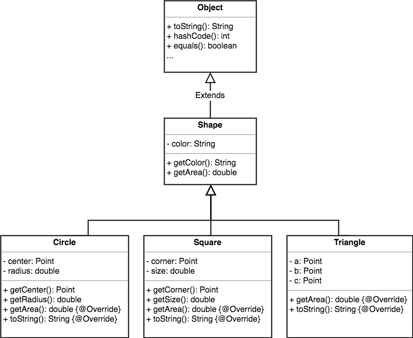

Используя при проектировании наследование, вы получаете множество возможностей ООП.

1. Вы избавляетесь от дублирования код абстрагируя общее поведение для группы классов и помещая его в один класс-родитель. 

Если вам понадобится изменить такой код, то придется сделать это только один раз и в одном месте, и изменения магическим образом отразятся на всех классах, наследующих это поведение. И все. Не нужно трогать дочерние классы!  
Конечно, магия здесь ни при чем :)

2. Вы определяете общий протокол для группы классов.

Благодаря наследованию вы можете гарантировать, что все классы, сгруппированные под одним родительским типом, содержат все методы этого типа. Другими словами, вы определяете общий протокол для набора классов, связанных наследованием.

Определяя в родительском классе методы, которые могут быть унаследованы дочерними классами, вы сообщаете другому коду о существовании протокола, в котором говорится: "Все мои подтипы (т.е. дочерние классы) могут делать **это** благодаря методам, которые выглядят вот так..."  
Если говорить кратко, вы заключаете контракт.



Класс **Shape** устанавливает общий протокол для всех своих подтипов. Это говорит всем, что любой **Shape** может выполнить действия **getColor** и **getArea**.  
Когда мы говорим *любой Shape*, то имеем в виду класс **Shape** и любой другой класс, который его наследует. Что также означает любой класс, относящийся к **Shape** в каком-либо участке иерархии наследования.

3. Самое интересное - **Полиморфизм**   

Когда вы объявляете общий тип для группы классов, вы можете заменять родительский класс дочерним везде, где предполагается его присутствие.

Простите, что?

Не волнуйтесь, объяснение только началось :)

## Как работает полиморфизм
Чтобы понять работу полиморфизма, нужно немного вернуться назад и вспомнить, как обычно объявляются ссылки и создаются объекты
```java
     (1)      (3)   (2)
Circle myCircle = new Circle();
```
1. Объявляем ссылочную переменную. Говорим JVM, что она должна выделить место в памяти для ссылочной переменной и назвать ее ```myCircle```. Ссылочная переменная навсегда получает тип **Circle**. Иными словами, создаем пульт управления, у которого есть кнопки для работы с объектом **Circle**, а не **Cat**, **Button** или **Socket**.
2. Создаем объект. Говорим JVM выделить память в куче для объекта **Circle** и создает его.
3. Связываем объект и ссылку. Присваиваем ссылочной переменной ``myCircle`` новый объект типа **Circle**. Другими словами, связываем пульт управления с конкретным объектом.

Важно отметить, что типы ссылки и объекта совпадают. И ссылка и объект имеют тип **Circle**.

Однако, полиморфизм допускает, что ссылка и объект могут иметь разные типы.
```java
Shape myShape = new Circle();
```
Благодаря полиморфизму тип ссылки может быть родительским для типа самого объекта.  
При объявлении ссылочной переменной ей можно присвоить любой объект, который проходит проверку на соответствие для типа этой ссылки. Иными словами, все, что расширяет тип объявленной ссылочной переменной, может быть ей присвоено.

Это позволяет создавать такие объекты, как, например, полиморфные массивы.
```java
Shape[] shapes = new Shape[3]; // (1)

shapes[0] = new Circle();
shapes[1] = new Triangle(); // (2)
shapes[2] = new Square();

for (int i = 0; i < shapes.length; i++) {
    System.out.println(shapes[i].getArea()); // (3)
}
```
1. Объявляем массив типа **Shape**, то есть массив, который будет хранить объекты типа **Shape**.
2. Но посмотрите, что происходит... Мы можем поместить экземпляр любого потомка **Shape** в массив типа **Shape[]**!
3. Проходясь в цикле по массиву, вызываем методы класса **Shape**, и каждый объект делает все как положено!

## Полиморфные аргументы и типы возвращаемых значений
Если вы можете объявить ссылочную переменную родительского типа (например Shape) и присвоить ей объект дочернего типа (скажем Circle), то подумайте, как это может сработать, когда ссылка представляет собой аргумент для метода...
```java
    public static void main(String[] args) {
        Circle circle = new Circle();
        Square square = new Square();
        
        printArea(circle);
        printArea(square);
    }

    public static void printArea(Shape s) {
        System.out.println("Площадь фируры = " + s.getArea());
    }
```
<!-- написать код и изменить Vet -->
Параметр типа **Shape** может принимать в качестве аргумента любой **Shape** (класс **Shape** и любой другой класс, который его наследует).

Благодаря полиморфизму можно писать код, который не придется менять с появлением в программе новых типов дочерних классов.

## Приведение типов
Дословно полиморфизм означает *много форм*.  
Вы можете относится к **Circle** как к **Circle** или как к **Shape** или как к **Object**.

Ссылочная переменная - это пульт управления, и он принимает все больше и больше кнопок, когда вы двигаетесь вниз по иерархии наследования. 

Пульт типа **Object** имеет несколько кнопок - для публичных методов класса **Object**. Однако пульт типа **Shape** включает в себя все кнопки класса **Object**, а также новые кнопки класса **Shape**. Чем больше у класса особенностей, тем больше у него может быть кнопок.

Имея на руках экземпляр класса **Circle**, мы может присвоить его в переменную базового класса **Shape** или **Object**.
```java
Circle myCircle = new Circle();
Shape myShape = myCircle;
Object myObject = myCircle;
```
Такое присваивание всегда возможно и не требует оператора приведения типа.

При этом объект находящийся по ссылке никак не меняется, он продолжает оставаться экземпляром **Circle**. Просто мы начинаем c ним работать через ссылку более общего типа.

Через эту ссылку нельзя вызывать ничего специфичного для класса **Circle**, но можно вызывать все, что объявлено на уровне класса **Shape** или его родителей.

Приведение типа в обратную сторону от базового класса к классу наследника возможно только явно, при помощи оператора приведения типа. В представленном примере *(Circle)*
```java
Circle myCircle = new Circle();
Shape myShape = myCircle;
Object myObject = myCircle;

Circle myCircle2 = (Circle) myObject;
```
Причем если мы не угадали с типом объекта, т.е. указали класс не являющийся классом наследником, то произойдет ошибка во время исполнения программы.
