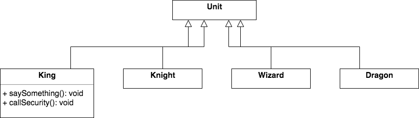
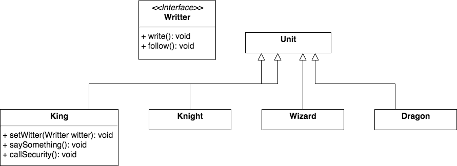
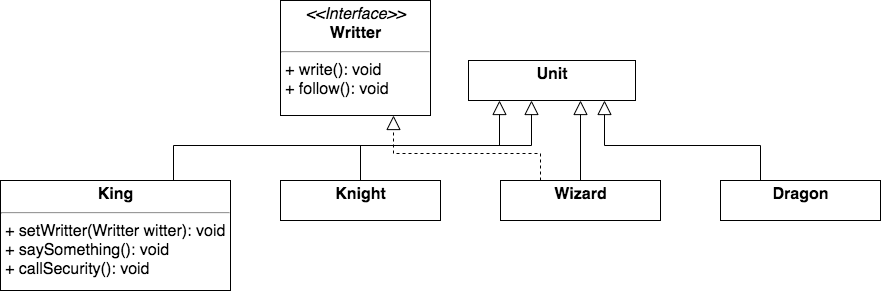
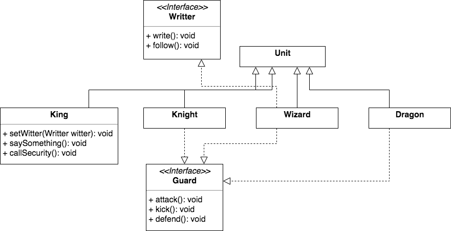

Думаю, что тот, кто ввел понятие интерфейса, возможно и не подозревал, какое фантастическое по своим возможностям сотворил явление. В любом случае понятие интерфейса раздвинуло возможности ООП весьма сильно, потому, что с помощью интерфейсов отношения между объектами становятся более гибкими, что позволяет строить архитектуру приложений из еще более независимых блоков.

Интерфейс — это описание голой функциональности без каких либо привязок к особенностям класса. Служит для объявления контракта объекта по отношению к внешнему миру, т.е. это описание того, какие методы должны присутствовать в классах, которые намереваются реализовывать этот интерфейс.

Если выражаться немного образно, то классы получили возможность иметь профессии — отправитель почты, управляющий транзакциями, распределитель страниц, контроллер и т.д.  
По сути вас не волнует пол, цвет глаз, возраст и рост человека, который работает водителем, электриком или программистом. Вам важно, что он умеет делать эту работу и умеет делать ее хорошо (в какой-то степени). Что еще важно отметить — как человек может обладать несколькими профессиями, так и класс может реализовывать несколько интерфейсов. Если вернуться к теме наследования, то как известно класс может наследоваться **только от одного** класса. А вот интерфейсов у него может быть достаточно много.

Перейдем от слов к делу. Рассмотрим следующую диаграмму.



У нас есть король (King), иногда он изрекает какую-нибудь "умную мысль", хорошо бы эту мысль сразу записать, чтобы не забылась, ну или вообще записывать для истории.  
Назначим королю летописца. Но нам же неважно, кто это будет, главное, чтобы умел записывать и следовать везде за августейшей особой.  
Объявим интерфейс Writter, с действиями (методами), которые должен уметь летописец. И добавим королю возможность устанавливать летописца.



Для объявления интерфейса используется ключевое слово interface.
```java
public interface Writter {
    void write();
    void follow();
}
```
Все методы интерфейса, по определению публичные и абстрактные, поэтому явно писать данные модификаторы не требуется. Можно сказать, что интерфейс — это полностью абстрактный класс.

```java
public class King extends Unit {
    //...
    Writter writter;

    public void setWritter(Writter writter) {
        this.writter = writter;
    }
    //...
}
```
В Java допускается объявлять переменные интерфейсного типа, т.е. переменные, хранящие ссылки на интерфейс. Такая переменная может ссылаться на любой объект, реализующий ее тип интерфейса.

Поправим метод saySomething, чтобы всякий раз, когда король что-нибудь говорит, летописец за ним записывает, если он назначен конечно.
```java
public class King extends Unit {
    //...
    Writter writter;

    public void setWritter(Writter writter) {
        this.writter = writter;
    }

    public void saySomething() {
        //..
        if (writter != null) {
            writter.write();
        }
        //..
    }
}
```
Теперь любой персонаж, кто реализует интерфейс Writter, может быть приставлен к королю как летописец. А за наличие требуемых умений отслеживает компилятор.  
Сделаем так, чтобы класс Wizard реализовывал интерфейс Writter



```java
public class Wizard extends Unit implements Writter {
    @Override
    public void write() {
        double r = Math.random();
        if (r > 0.5) {
            System.out.println("Wizard: Хм..., видимо важно, запишу.");
        } else {
            System.out.println("Wizard: WTF!");
        }
    }

    @Override
    public void follow() {
        //...
    }
}
```
Реализуемые классом интерфейсы перечисляются после ключевого слова implements через запятую, т.е. класс может реализовывать несколько интерфейсов. Заметьте, класс может реализовывать интерфейсы в дополнение к наследованию.

Волшебник, умеющий быть летописцем готов, осталось только назначить его к королю и запустить программу. 
```java
public static void main(String[] args) {
    King king = new King();
    Wizard wizard = new Wizard();

    king.setWritter(wizard);
    king.saySomething(); // Wizard: WTF!
    king.saySomething(); // Wizard: WTF!
    king.saySomething(); // Wizard: Хм..., видимо важно, запишу.
}
```

Помимо чего-нибудь говорения, король может делать и другие полезные действия, например позвать охрану, метод callSecurity().

По аналогии с летописцем, самым правильным, будет использовать интерфейс. В результате ваш код не привязывается к конкретным классам и становится гибким, и король получает возможность иметь в охранниках разных персонажей.




