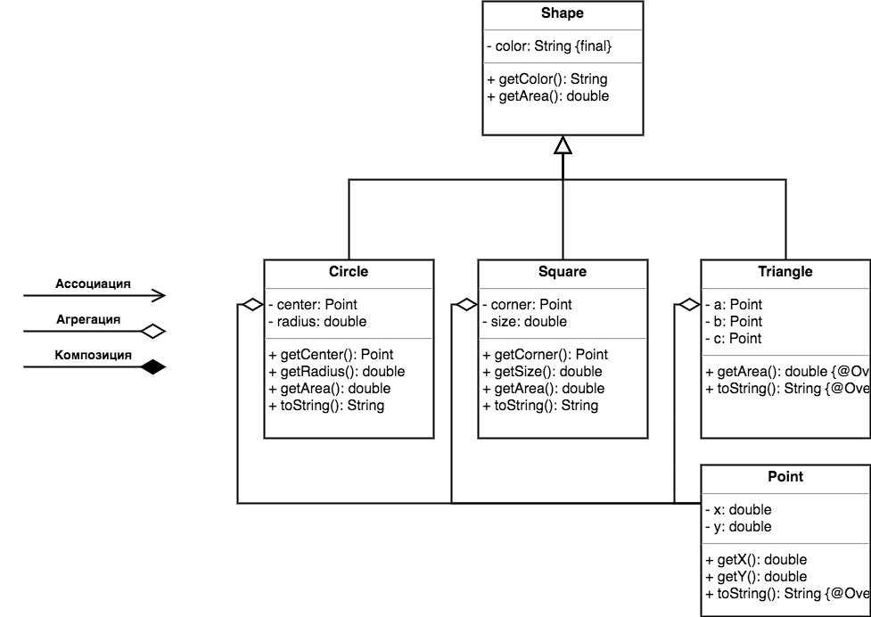

Тема достаточно сложна для понимания, хотя и не очень объемна.  
Перед тем, как погружаться в нее, вспомним и разберем подробнее про отношения HAS-A.

Отношения «является частью» (HAS-A) обычно выражаются в том, что класс целого содержит поля своих составных частей. 



Самым базовым типом отношений является ассоциация (association), это означает, что два класса как-то связаны между собой, и мы пока не знаем точно, в чем эта связь выражена и собираемся уточнить ее в будущем. Обычно это отношение используется на ранних этапах дизайна, чтобы показать, что зависимость между классами существует, и двигаться дальше.

Агрегация и композиция являются частными случаями ассоциации. Это более конкретизированные отношения между объектами. Грань между ними достаточно тонкая, но важная, и заключается она в том, что в случае композиции целое явно контролирует время жизни своей составной части (часть не существует без целого), а в случае агрегации целое хоть и содержит свою составную часть, время их жизни не связано (например, составная часть передается через параметры конструктора).


> ромбик всегда находится со стороны целого, а простая линия со стороны составной части;

Square для управления своими составными частями использует композицию, а Circle – агрегацию. 

Думаю стало не сильно понятнее, поэтому стоит посмотреть еще и на код
```java
class Circle extends Shape {
    private Point center;
    private double radius;

    public Circle(Point center, double radius, String color) {
        super(color);
        this.center = center;
        this.radius = radius;
    }

    // ...
}

class Square extends Shape {
    private Point corner;
    private double size;

    public Square(double size, String color) {
        super(color);
        this.corner = new Point(1,1);
        this.size = size;
    }

    // ...
}

public static void main(String[] args) {
    Point point = new Point(2, 1);

    Circle c = new Circle(point, 1, "green");
    Square s = new Square(1, "blue");

    // ...
    c = null;
    s = null;
    // ...
}
```
В Circle составная часть создается вне экземпляра класса и затем передается аргументом в конструктор.  
В случае Square, при создании экземпляра, в конструкторе создается объект класса Point. В результате экземпляр сам управляет жизнью объекта класса Point. Если удалить экземпрял, удалиться и составная часть.

При проектировании отношений типа композиция широко используются вложенные классы.

В Java есть четыре типа классов, именуемых внутренними или вложенными классами (inner or nested classes).
- Статические вложенные классы (static nested classes)
- Внутренние классы (inner classes)
- Локальные классы (local classes)
- Анонимные классы (anonymous classes)
