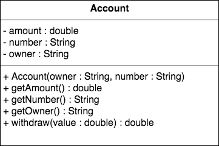
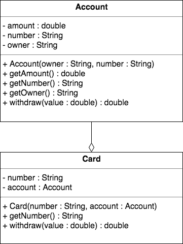
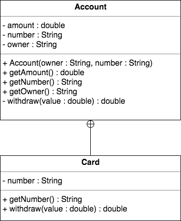

Эти классы объявляются внутри внешних (окружающих) классов без ключевого слова static и они существенно отличаются от вложенных статических классов.

Если статический вложенный класс является аналогом поля или метода класса, то внутренний класс является аналогом поля или метода экземпляра.

Определение внутреннего класса выглядит так
```java
class OuterClass {
    class NestedClass {
    }
}
```
Но чтобы хорошенько понять зачем нам это, пойдем от проблемы к решению.

Сегодня мы с вами будем разрабатывать задачу с банковским аккаунтом. У нас есть аккаунт в банке, и нам нужно его описать. Как обычно, мы будем строить класс.



> поле amount - сумма; метод withdraw() - снять какую-то сумму

Но у нас в задаче есть еще одно условие. К каждому аккаунту можно создать определенное число банковских карт. Личная карта владельца, карта жены, карта ребенка. И все это шарится с одним банковским аккаунтом. Если кто-то снимает деньги с карты или переводит, это все делается в рамках одного и того же банковского аккаунта. 



Здесь есть проблемка, даже две.  
Если мы посмотрим на наши карточки, которые должны снимать с этого аккаунта и на сам аккаунт, то увидим, что наш аккаунт имеет публичный доступ снять денежки. Иными словами не только карточки могут снимать, но вообще все в этом мире могут снять денежки при помощи этого метода withdraw().  
Нет никакой возможности, привязать конкретную карту к конкретному аккаунту. Если вдруг, по какой-то причине, как от другого аккаунта станет вдруг указывать на этот аккаунт, все поломается. Эта карта сможет списывать деньги с чужого аккаунта. 

Иными словами в этой реализации есть большое поле для потенциальных багов. 

Для решения этой проблемы, нам нужен механизм, который жестко привяжет инстанс аккаунта к инстансу карты. Причем связь здесь один ко многим. Один аккаунт должен иметь много карт. В обратную сторону это всегда один к одному, одна карта должна иметь один аккаунт и не более. 

И тут на помощь приходят внутренние классы (вложенные нестатические).  
В класс Account в самом низу мы вкладываем нестатический класс.
```java
public class Account {
    private double amount;
    private String number;
    private String owner;

    // ...
    public class Card {
       // ...
    }
}
```
Главное отличие вложенного статического класса (nested static) от внутреннего (inner), в том, что каждый экземпляр внутреннего класса связан с экземпляром класса, внутри которого он определен (то есть каждый экземпляр внутреннего класса связан с экземпляром его окружающего класса). Вы не можете создать экземпляр внутреннего класса без привязки к экземпляру внешнего класса. То есть сперва должен быть создан экземпляр внешнего класса Account, а только затем уже вы можете создать экземпляр внутреннего класса Card.

Но самое интересное, что все методы внутри нашего внутреннего класса Card могут обращаться к переменным и методам внешнего экземпляра класса Account.

Для большего понимания, рассмотрим получившуюся диаграмму и код :)



Во-первых, нам больше не нужна в классе Card ссылка (reference) на экземпляр Account, потому что класс Card вложен в Account и он уже имеет ссылку на тот инстанс, который использовался для создания аккаунта. 
Во-вторых, метод withdraw() в классе Account стал c минусиком, что означает private. Теперь никто за рамками этого класса не может вызывать этот метод. Однако, поскольку вложенный класс Card, находится внутри, то он может прекрасно вызывать private-метод.  
```java
public class Account {
    private double amount;
    private String number;
    private String owner;

    // ...

    public double withdraw(double value) {
        amount -= value;
        return value;
    }

    public class Card {
        private String number;

        public Card(String number) {
            this.number = number;
        }

        public double withdraw(double value) {
            return Account.this.withdraw(value);
        }
    }
}
```
Теперь никто, кроме карточек, не может снимать деньги с аккаунта, и для создания карточки необходим экземпляр Account, а значит всегда гарантируется, что карта будет привязана именно к этому экземпляру. 

Обратите внимание на метод withdraw() класса Card.  
У нас появилась очень интересная запись Account.this.withdraw(value);  
Дело в том, что если мы указываем просто this, он указывает на текущий экземпляр, т.е. на экземпляр класса Card. Но если мы хотим указать на this внешнего экземпляра, мы используем запись Account.this. Этот this будет указывать на экземпляр Account, внутри которого мы созданы. Соответственно, у данного экземпляра я вызываю метод снять денежки.

Теперь рассмотрим как можно создавать карточки.  
Как мы уже говорили, для создания карточки нужен экземпляр Account. Соответственно создание происходит немножко не так, как создание всех других классов. 
```java
public class Main {
    public static void main(String[] args) {

        Account myAccount = new Account("Big Mazzy", "e89b-12d3-a456");
        Account.Card myCard = myAccount.new Card("1034-9383-3948-3498");
    }
}
```
Мы используем первым элементом экземпляр Account (myAccount), затем оператор доступа "." и new , не просто так new, а new из код конкретного инстанса аккаунта и после него указываем класс Card.  
Вот таким образом мы создаем карточку аккаунта, которая будет привязана к myAccount. 

Немного запутано, но, думаю осилить можно :)

Ну и давайте добавим еще одну карту и посмотрим, что деньги вносятся и снимаются с одного аккаунта.
```java
public class Main {
    public static void main(String[] args) {

        Account myAccount = new Account("Big Mazzy", "e89b-12d3-a456");
        Account.Card myCard = myAccount.new Card("1034-9383-3948-3498");
        Account.Card wifeCard = myAccount.new Card("4893-8333-1341-9893");

        System.out.println(myAccount.getAmount());  // 0.0

        myCard.withdraw(-1000);
        wifeCard.withdraw(3000);

        System.out.println(myAccount.getAmount());  // -2000.0
    }
}
```


