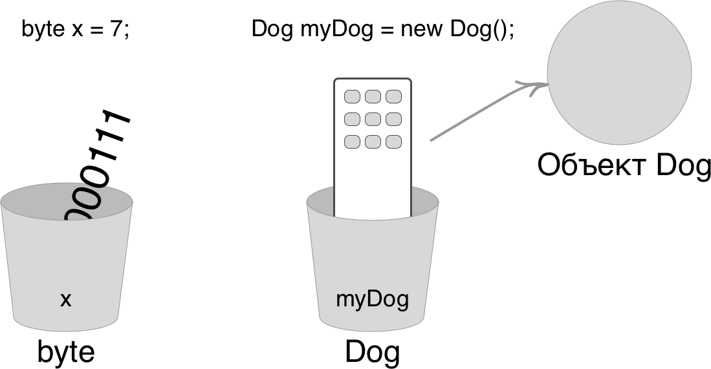
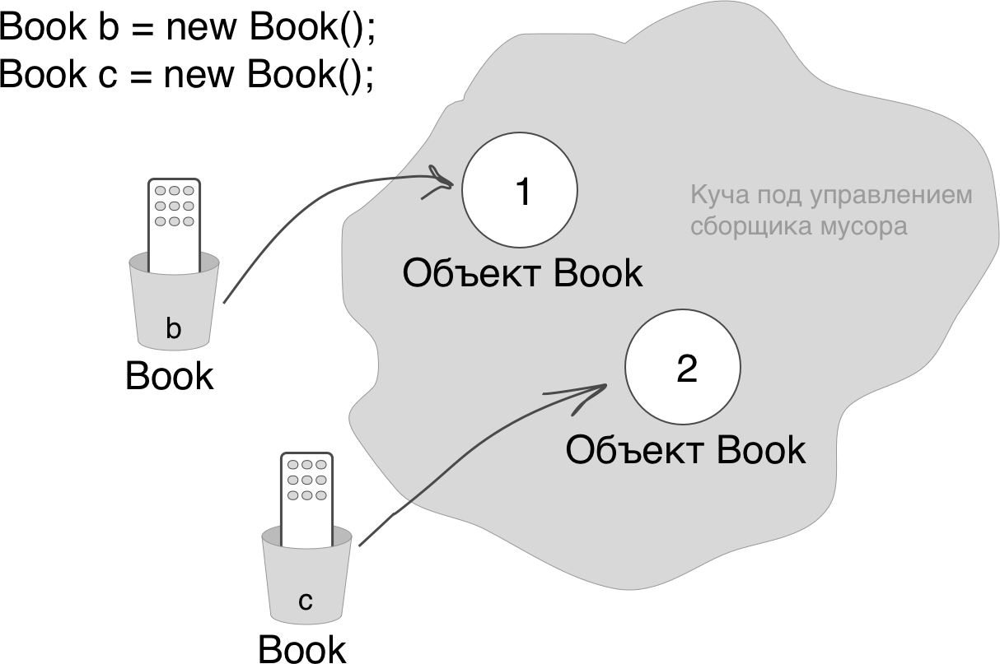

Вы знаете, что происходит при объявлении переменной простого типа и присвоении ей значение. А что будет с непростыми переменными, то есть с объектами?

Нельзя вложить объект в переменную. Мы часто думаем об этом что-то вроде "я поместил новый объект Foo в переменную под названием myFoo".  
На самом деле это не так. Нет гигантских расширяемых контейнеров, которые могут подстоиться под размер любого объекта. Объект существует лишь в одном месте - в куче, управляемой сборщиком мусора.

Хотя переменные простых типов состоят из битов и действительно представляют свои значения, ссылочные переменные содержат биты, которые описывают способ получения объекта.

Вы использовали оператор доступа "." в сочетании со ссылочной переменной, чтобы сказать: "Используй элемент перед точкой, чтобы дать мне элемент, находящийся после точки". Например, команда:
```java
myDog.bark();
```
означает: "Используй объект, на который ссылается переменная myDog, чтобы вызвать метод bark()". Когда вы и используете оператор доступа "." (точка) в сочетании со ссылкой на объект, думайте об этом, как о нажатии кнопок на пульте дистанционного управления объектом.


### Ссылка на объект - всего лишь еще одно значение переменной.

Нечто такое, что храниться вутри "чашки". Только в данном случае значение - это пульт дистанционного управления.



Переменная простого типа: byte x = y;  
Биты, представляющие число 7, хранятся в переменной.

Ссылочная переменная: Dog myDog = new Dog();  
Биты, описывающие способ получить объект Dog, хранятся в переменной. Но сам по себе объект Dog не в переменной!

Нам не важно, сколько нулей и единиц хранится в ссылочной переменной. Это может зависеть от конкретной JVM или от фазы Луны.

### Три шага на пути к объявлению, созданию и инициализации объекта.

```java
   (1)   (3)   (2)
Dog myDog = new Dog();
```
1. Объявляем ссылочную переменную. **Dog myDog** = new Dog();   
Это говорит JVM, что она должна выделить место в памяти для ссылочной переменной и назвать ее myDog. Ссылочна переменная навсегда получает тип Dog. Иными словами, это пульт управления, у которого есть кнопки для работы именно с объектом Dog, а не Cat, Button или Socket.

2. Создаем объект. Dog myDog = **new Dog();**  
Здесь JVM получает приказ выделить память в куче для объекта Dog и создает его.

3. Связываем объект и ссылку. Dog myDog **=** new Dog();  
Присваиваем ссылочной переменной myDog новый объект типа Dog. Другими словами, связываем пульт с конкретным объектом.

### Жизнь в куче под управлением сборщика мусора



Объявляем две ссылки типа Book. Создаем два новых объекта Book. Присваиваем ссылочным переменным объекты типа Book. Два объекта Book теперь находяться в куче.
- Ссылок: 2
- Объектов: 2


Объявляем новую ссылку типа Book. Вместо того чтобы создавать новый, третий объект типа Book, присваемваем ссылке значение переменной с. Мы как бы говорим: "Возьми биты из c, скопируй их и помести эту копию в d".  
Переменные c и d ссылаются на один и тот же объект. Ссылки c и d хранят две разные копии одного и того же значения. Два пульта управления для одного объекта типа Book.  
- Ссылок: 3
- Объектов: 2


Берем значение переменной b и присваиваем его переменной c. Сейчас вам уже известно, что это означает. Биты внутри переменной b копируются, и новая копия помещается в переменную c.  
И b, и c ссылаются на один и тот же объект.  
- Ссылок: 3
- Объектов: 2

### Жизнь и смерть в куче


Объявляем две ссылки типа Book. Создаем два новых объекта Book. Присваиваем эти объекты ссылочным переменным.
- Активных ссылок: 2
- Доступных объектов: 2


Берем значение переменной c и присваиваем его переменной b. Биты внитри переменной c копируются, и новая копия помещается в переменную b. Обе переменные хранят одинаковые значения.  
И b, и c ссылаются на один и тот же объект. Объект 1 становится недоступным и пригоден для обработки сборщиком мусора.
- Активных ссылок: 2
- Доступных объектов: 1
- Недоступных объектов: 1
Первый объект, на который ссылалась переменная b, больше не имеет ссылок. Он недоступен.


Присваиваем переменной c значение null. Это превращает ее в нулевую ссылку, то есть она больше ни на что не ссылается. Но это по-прежнему ссылочная переменная типа Book и ей еще можно присвоить другой объект типа Book.  
Объект 2 еще имеет активную ссылку b, значит, он не может быть отдан на обработку сборщику мусора.
- Активных ссылок: 1
- Нулевых ссылок: 1
- Доступных объектов: 1
- Недоступных объектов: 1

## Массивы - тоже объекты
```java
int[] nums; // (1)
nums = new int[7]; // (2)

nums[0] = 6;   // (3)
nums[1] = 19;
...
nums[6] = 1;
```
1. Объявляем переменную целочисленного массива. **int[] nums**  
Переменная массива - это пульт управления объектом типа Array.
2. Создаем новый целочисленный массив с семью элементами и присваиваем его ранее объявленной переменной nums с типом int[]. **nums = new int[7];**
3. Присваиваем каждому элементу массива целочисленное значение. Помните, что элементы целочисленного массива - это всего лишь переменные типа int.


Не упустите ключевой момент, массив - это всегда объект, даже если он хранит элементы простых типов.

Каждый элемент в массиве - всего лишь переменная. Иначе говоря, это один из восьми простых типов, или ссылочная переменная. Все, что вы можете поместить в переменную, может быть присвоено элементу массива того же типа. В массиве типа int (int[]) каждый элемент имеет тип int. В массиве типа Dog (Dog[]) каждый элемент может хранить... объект Dog? Нет, вспомните, что ссылочные переменные хранят всего лишь ссылки (пульты управления), а не сами объекты. Поэтому в массиве типа Dog каждый элемент может хранить пульт для управления объектом Dog.  


1. Объявляем переменную массив Dog. **Dog[] pets;**
2. Создаем новый массив типа Dog длинной 7 и присваиваем его ранее объявленной переменной pets с типом Dog[]. **pets = new Dog[7];**

Мы имеем массив ссылок типа Dog, а не самих объектов.


Создаем новые объекты Dog и присваиваем их элементам массива. Элементы в массиве - это всего лишь ссылки типа Dog. Нам все еще нужны сами объекты.

### Java заботится о типах
Объявив массив, вы можете разместить в нем элементы только такого же типа, что и у самого массива.  
К примеру, вы не вправе поместить ссылку на объект Cat в массив типа Dog, как нельзя поместить переменную double в массив типа int (произойдет переполнение, помните?). Однако можно поместить в такой массив переменную типа byte, так как этот тип помещается в контейнере размера int (произойден неявное приведение типов). Подробности будут позже, а пока запомните, что компилятор не позволит вам поместить неподходящий элемент в массив исходя из объявленного типа.


