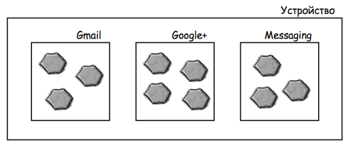
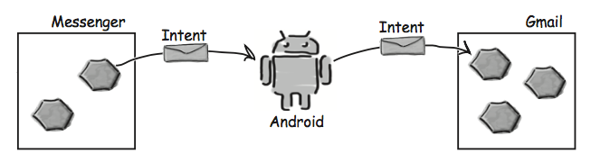
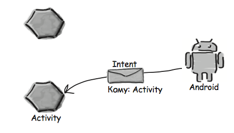
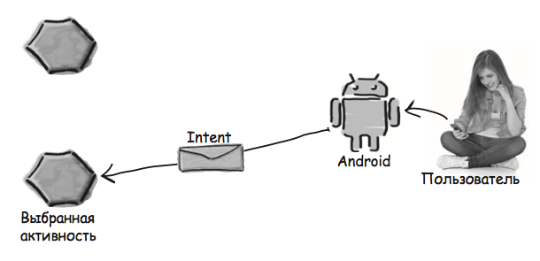
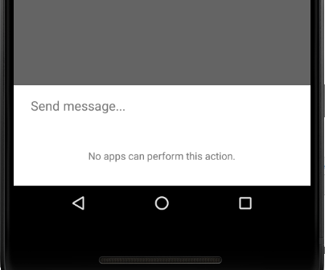

<!-- # Неявные интенты -->
## Как работают приложения Android
Как вам уже известно, Android­-приложения состоят из одной или не­скольких активностей. Каждая активность представляет одну четко определенную операцию, ко­торая может выполняться пользователем. Например, такие приложения, как Gmail, Google+, Facebook и Twitter, содержат активности, позволяющие отправлять сообщения, хотя в каждом приложении эта операция выполняется по­своему.



## Интенты могут запускть активности из других приложений
Вы уже видели, как использовать интент для запуска второй актив­ности из того же приложения. Первая активность передает интент Android; Android проверяет интент, а затем приказывает второй активности запуститься.
Этот принцип относится и к активностям других приложений. Ак­тивность вашего приложения передает интент Android, Android проверяет его, а затем приказывает второй активности запуститься — несмотря на то, что эта активность находится в другом приложении. Например, можно воспользоваться интентом для запуска активности Gmail, отправляющей сообщения, и передать ей текст, который нуж­но отправить. Вместо того, чтобы писать собственные активности для отправки электронной почты, можно воспользоваться готовым приложением Gmail.



## Но мы не знаем, какие приложения установлены на устройстве
Прежде чем вызывать активности из других приложений, необходимо ответить на три вопроса:
- Как узнать, какие активности доступны на устройстве пользователя?
- Как узнать, какие из этих активностей подходят для того, что мы собираемся сделать?
- Как узнать, как использовать эти активности?

К счастью, все эти проблемы решаются при помощи действий (actions). Действия — стандартный механизм, при помощи которого Android узнает о том, какие стандартные операции могут выполняться активностями. Например, Android знает, что все активности, зарегистрированные для действия send, могут отправлять сообщения.

А теперь нужно научиться создавать интенты, использующие действия для получения набора активностей, которые могут использоваться для выполнения стандартных функ­ций — например, для отправки сообщений.

## Создание интента с указанием действия
Ранее вы видели, как создать интент для запуска конкретной активности командой вида
```java
Intent intent = new Intent(this, ReceiveMessageActivity.class);
```
Такие интенты называются явными; вы явно сообщаете Android, какой класс должна запустить система.

Если требуется выполнить некоторое действие и вас не интересует, какой активностью оно будет выполнено, создайте неявный интент. При этом вы сообщаете Android, какое действие нужно выполнить, а все подробности по выбору активности, выполняющей это действие, поручаются Android.

### Как создать интент
Для создания интента с указанием действия применяется следующий синтаксис:
```java
Intent intent = new Intent(действие);
```
где действие — тип действия, выполняемого активностью.  
Android предоставляет [целый ряд](https://developer.android.com/reference/android/content/Intent.html#constants_2) стандартных вариантов действий.

Например, действие Intent.ACTION_DIAL используется для набора номера, Intent.ACTION_WEB_SEARCH — для выполнения веб-поиска, а Intent.ACTION_SEND — для отправки сообщений.

если вы хотите создать интент для отправки сообщения, используйте команду следующего вида:
```java
Intent intent = new Intent(Intent.ACTION_SEND);
```

### Добавление дополнительной информации
После определения действия в интент можно включить дополнительную информацию. Допустим, вы хотите добавить текст, который образует тело отправляемого сообщения. Задача решается следующим образом:
```java
intent.setType("text/plain"); // сообщает Android, что активность должна уметь обрабатывать данные с типом данных MIME "text/plain"
intent.putExtra(Intent.EXTRA_TEXT, текст);
```
Если потребуется добавить несколько видов дополнительной информации, используйте многократные вызовы метода putExtra().
Например мы хотим указать еще и тему сообщения:
```java
intent.putExtra(Intent.EXTRA_SUBJECT, тема);
```

## Что происходит при выполнении кода c использованием неявного интента


Создается интент. Интенту назначается действие ACTION_SEND и тип MIME text/plain. Метод startActivity() передает интент Android. 


Android видит, что интент может передаваться только активностям, способным обрабатываь действие ACTION_SEND и данные text/plain. Android проверяет все активности и ищет среди них те, которые смогут обработать интент. Если ни одно действие не способно обработать интент инициируется исключение ActivityNotFoundException.



Если только одна активность способна обработать интент, Android приказывает этой активности запуститься и передает ей интент.


Если найдется несколько активностей, способных обработать интент, Android открывает диалоговое окно для выбора активности и предлагает пользователю выбрать.

 

Когда пользователь выберет активность, которую он хочет использовать, Android приказывает активности запуститься и передает ей интент.
Активность выводит дополнительный текст, содержащийся в интенте, в теле нового сообщения.



## Фильтр интентов
При получении интента система Android должна определить, какая активность (или активности) может этот интент обработать. Этот процесс называется разрешением интента. 

При использовании явного интента процесс разрешения тривиален: в самом интенте явно указано, для какого компонента он предназначен, поэтому у Android имеются четкие инструкции, что с ним делать.

При использовании неявного интента система Android использует информацию, содержащуюся в интенте, для определения того, какие компоненты могут его получить. Для этого Android проверяет фильтры интентов, содержащиеся в экземплярах AndroidManifest.xml всех приложений.
```xml
<activity android:name="ShareActivity">
  <intent-filter>
    <action android:name="android.intent.action.SEND"/> <!-- Сообщает Android, что активность может обрабатывать ACTION_SEND -->
    <category android:name="android.intent.category.DEFAULT"/>
    <data android:mimeType="text/plain"/>
    <data android:mimeType="image/*"/> <!-- Типы данных, которые могут обрабатываться активностью -->
  </intent-filter>
</activity>
```
Фильтр интентов также включает категорию. Категория предоставляет дополнительную информацию об активности: например, может ли она запускаться браузером или является ли она главной точкой входа приложения. Фильтр интентов должен включать категорию android.intent.category.DEFAULT, если он собирается принимать неявные интенты. Если активность не имеет фильтра интентов или не включает категорию с именем android.intent.category.DEFAULT, это означает, что активность не может запускаться неявным интентом. Она может быть запущена только явным интентом с указанием полного имени компонента.

## Как Android использует фильтр интентов ?
Получив неявный интент, Android сравнивает информацию из интента с информацией, содержащейся в фильтрах интентов из файла AndroidManifest.xml каждого приложения.

Сначала Android рассматривает фильтры интентов, включающие категорию android.intent.category.DEFAULT. Фильтры интентов без этой категории пропускаются, так как они не могут получать неявные интенты.

Затем Android сопоставляет интенты с фильтрами интентов, сравнивая действия и тип MIME из интента с указанными в фильтрах.

Если тип MIME в интенте не указан, то Android пытается вычислить его на основании данных, содержащихся в интенте.

После того как сравнение интента с фильтрами интентов, назначенных компонентам, будет завершено, Android смотрит, сколько совпадений удалось
найти. Если найдено только одно совпадение, Android запускает компонент (в нашем случае это активность) и передает ему интент. Если будет найдено несколько совпадений, Android просит пользователя выбрать один из вариантов.

## Хочу, чтобы пользователь ВСЕГДА выбирал активность?
При обнаружении на устройстве нескольких активностей, способных принять интент, Android автоматически предлагает выбрать нужную активность. Пользователь даже может указать, когда должна использоваться эта активность — всегда или только в данном случае. Однако у этого стандартного поведения есть один недостаток: а что если вы хотите гарантировать, что пользователь сможет выбрать активность при каждом щелчке на кнопке Send Message? Например, если он приказал всегда использовать Gmail, то в следующий раз Android уже не предложит ему выбрать Twitter. К счастью, у этой проблемы есть обходное решение. Вы можете создать окно выбора, в котором пользователю будет предложено выбрать активность без каких-либо возможностей всегда использовать именно ее.
###  Вывод диалогового окна выбора
В этом вам поможет метод Intent.createChooser(). Он получает уже созданный интент и «упаковывает» его в диалоговое окно выбора. Главная отличительная особенность этого метода — он не предоставляет возможности выбора активности по умолчанию, то есть пользователю придется каждый раз выбирать нужную активность.
```java
Intent chosenIntent = Intent.createChooser(intent, "Send message...");
```
Метод получает два параметра: интент и необязательный заголовок диалогового окна выбора в формате String.

createChooser() возвращает новый объект Intent. Он представляет собой новый явный интент, предназначенный для активности, выбранной пользователем. Он содержит всю дополнительную информацию, передававшуюся в исходном интенте, включая весь текст.



### Если подходящих активностей НЕТ
Если на устройстве не обнаружено ни одной активности, способной отправлять сообщения, метод createChooser()
выводит соответствующее сообщение. 



Это еще одно из преимуществ метода createChooser(). Метод createChooser() корректно справляется с ситуацией, в которой указанное действие не может быть выполнено ни одной активностью.
