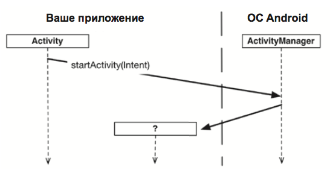
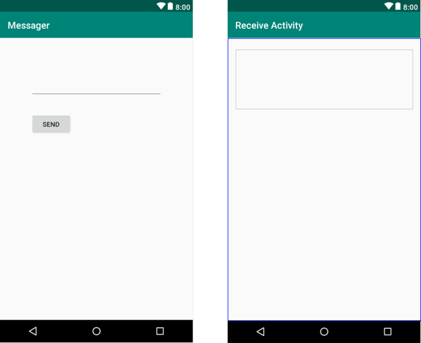

# Множественные активности
До настоящего момента мы рассматривали приложения с одной активностью; для совсем простых приложений это нормально. Однако в более сложной ситуации одна активность попросту не справляется со всеми делами и превращается в "годзилу". Поэтому, мы разберем как строить приложения с несколькими активностями и как организовать взаимодействие между активностями с использованием интентов. Также узнаем, как использовать интенты за границами приложения и как выполнять действия при помощи активностей других приложений на вашем устройстве.

Ранее мы обсуждали, что активность — одна четко определенная операция, которая может выполняться пользователем. Например, отображение списка контактов. Обычно пользователю требуется выполнять более одной операции, не только выводить список контактов, но и добавлять их. В таких случаях в приложении используются разные активности: одна для отображения списка, а другая для добавления.

## Запуск активности
Чтобы запустить одну активность из другой, проще всего воспользоваться методом startActivity(), вот его сигнатура:
```java
public void startActivity(Intent intent)
```
Когда активность вызывает startActivity(Intent), этот вызов передается ОС, точнее, он передается компоненту ОС, который называется ActivityManager.



При получении интента Acti­vityManager, убедившись в том, что все правильно, создает экземпляр Activity и вызывает его метод onCreate(Bundle). Если найти активность не удалось, инициируется исключение ActivityNotFoundException. 

Откуда ActivityManager узнает, какую активность следует запустить? Эта информация передается в параметре Intent.

## Передача информации через интенты
Интент (intent) — объект, который может использоваться компонентом для взаимодействия с ОС. Пока что из компонентов нам встречались только активности, но еще существуют службы (services), широковещательные приемники (broadcast receivers) и поставщики контента (content providers).

Интенты представляют собой многоцелевые средства передачи информации (разновидность сообщений), а класс Intent предоставляет разные конструкторы в зависимости от того, для чего должен использоваться интент.

Может показаться странным, что две активности внутри приложения должны взаимодействовать через компонент ActivityManager, находящийся вне приложения. Тем не менее такая схема необходима по двум основным причинам:
- ActivityManager поддерживает стек возврата (back stack) и этот стек не ограничивается активностями только вашего приложения. Он совместно используется активностями всех приложений
- позволяет активности одного приложения легко работать с активностью другого приложения

## Приложение Messager
Чтобы лучше понять что к чему, мы построим приложение Messager.



Приложение будет состоять из двух активностей и двух макетов.
В начале работы приложения запускается активность MainActivity. Первая активность позволяет ввести текст сообщения. Щелчок на кнопке Send в первой активно­сти, запускает активность ReceiveActivity, которой передается введенное сообщение. Далее вторая активность выводит полученное сообщение.
